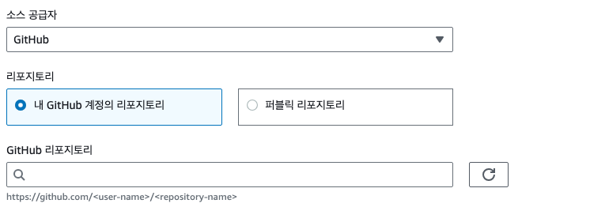

# Code Build 생성

`CodeBuild > 빌드 프로젝트 > 빌드 프로젝트 생성`

## 프로젝트 구성

프로젝트 이름과 설명, Tags를 기입

## 소스

저는 GitHub을 Source로 하였습니다.  


## 환경

기존에 사용하시는 IAM의 역할이 있다면 기존을 선택하시고 아니면 새 서비스 역할을 선택하면 됩니다.  

환경변수를 이 부분에서 text로 기입하였습니다.


## buildspec

buildspec.yml 파일은 직접 작성해도 되고 git의 root폴더에 넣어도 됩니다.  
본인이 편한 방식을 사용하시면 될 것 같습니다.


### buildspec.yaml

[상세를 보려면 여기로 이동하세요](/aws/code-pipeline/code-build/buildspec)

### buildspec 작성

- frontend를 build하여 backend에서 static 파일을 serving하는 구조 입니다.
- build 도중 메모리가 부족한 현상이 있어 `npm install`을 2개 부분으로 분리하고 bakend의 build에 추가 옵션을 사용하였습니다.

:::details 상세코드

```yaml
phases:
  pre_build:
    commands:
      - |
        cat > ./Dockerfile << EOF
        # Frontend 빌드
        FROM node:20.11.1-alpine as frontend-build
        WORKDIR /front

        COPY frontend/package.json  ./  
        RUN npm install --package-lock-only --quiet
        RUN npm ci --quiet
        COPY frontend/ .
        RUN npm run build
        RUN npm prune --production

        # Backend 빌드
        FROM node:20.11.1-alpine as backend-build
        WORKDIR /backend

        COPY backend/package.json ./
        RUN apk add --no-cache python3 make g++ && ln -sf python3 /usr/bin/python
        RUN npm install -g pm2
        RUN npm install --package-lock-only --quiet
        RUN npm ci --quiet
        COPY backend/ .
        COPY --from=frontend-build /front/dist /backend/front
        RUN NODE_OPTIONS=--max-old-space-size=4096 npm run build
        RUN npm prune --production

        CMD ["pm2-runtime", "start", "ecosystem.config.js"]
        EOF

  build:
    commands:
      - echo Logging in to private docker account ...
      - echo $DOCKER_PASS | docker login --username $DOCKER_ID --password-stdin # docker 로그인
      - echo Building the Docker image...
      - docker build -t $IMAGE_REPO_NAME:$IMAGE_TAG . # docker 이미지 빌드
      - docker tag $IMAGE_REPO_NAME:$IMAGE_TAG $ECR_REPOSITORY_URI:$IMAGE_TAG # docker tag 변경
  post_build:
    commands:
      - echo Logging in to Amazon ECR...
      - aws ecr get-login-password --region $AWS_DEFAULT_REGION | docker login --username AWS --password-stdin $ECR_REPOSITORY_URI # ecr 로그인
      - echo Pushing the Docker image...
      - docker push $ECR_REPOSITORY_URI:$IMAGE_TAG # docker 이미지 푸시
      - echo Writing image definitions file...
      - printf '{"name":"%s","imageUri":"%s"}' $CONTAINER_NAME $ECR_REPOSITORY_URI:$IMAGE_TAG > imagedefinitions.json # 결과파일생성

artifacts:
  files:
    - imagedefinitions.json
    - appspec.yml # code deploy에서 사용
    - scripts/* # code deploy에서 쓸것들
```

:::

## 아티팩트

아티팩트는 build의 결과물을 말합니다.  
S3에 버킷을 하나 만들어주고 진행하시면 됩니다.  
처음 테스트하는 경우는 잘 되었나 보기위해 패키징을 없음으로 하시면 될것 같습니다.

## 권한

프로젝트가 만들어지고 ECR을 이용할 것이기 때문에 추가 권한을 넣어줘야 합니다.  
`CodeBuild > 빌드 프로젝트 > subcrm-build-pie > 서비스 역할`  
서비스 역할에 들어가시면 권한 정책이 있는데 선택하시고 편집 버튼 눌러주시면 됩니다.

그리고 맨 아래에 권한을 추가해 줍니다.

```json
{
  "Effect": "Allow",
  "Action": [
    "ecr:GetAuthorizationToken",
    "ecr:BatchCheckLayerAvailability",
    "ecr:InitiateLayerUpload",
    "ecr:UploadLayerPart",
    "ecr:CompleteLayerUpload",
    "ecr:PutImage"
  ],
  "Resource": "*"
}
```
