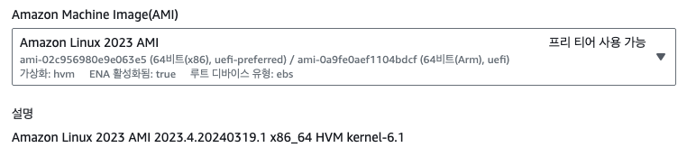
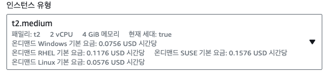

# EC2 생성

## 이름 및 태그

이름 및 태그는 본인이 원하는 방식으로 자유롭게 생성하면 됩니다.

## OS 이미지

이미지는 여러가지 있지만 보통 unbuntu를 많이 사용하는 것 같습니다. 
저는 회사에서 많이 사용하는 Amazon Linux를 선택하였습니다.

## 인스턴스 유형

서비스를 원활하게 하기 위해서는 t2.medium 이상이 필요하다 판단되어 t2.medium을 선택하였습니다.

## 키 페어

ssh 접속을 위한 키 페어를 RSA, pem 파일로 생성합니다.  
이름은 편하게 만드시면 됩니다.  
파일은 중요하니 잘 보관하시길 바랍니다.

## 네트워크 설정

보안그룹은 새롭게 생성하셔도 되고 기존 보안 그룹을 선택하셔도 됩니다.  
인터넷에서 HTTPS 트래픽 허용를 체크할 경우 443포트의 트레픽이 허용됩니다.  
인터넷에서 HTTP 트래픽 허용을 체크할 경우 80포트의 트래픽이 허용됩니다.  
<LinkNewTab href="aws/vpc/virtual-private-cloud/create-vpc" text="링크"><template #header>따로 생성하시려면 </template>를 참조하세요.</LinkNewTab>

## 스토리지 구성

스토리지는 범용 ssd 30gb로 선택하였습니다.
