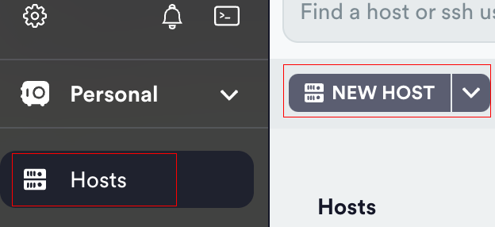
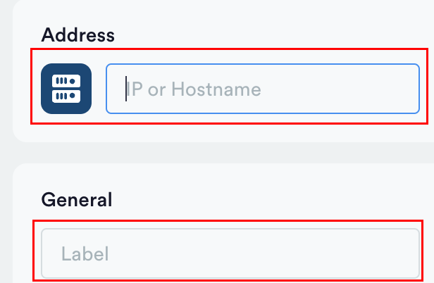
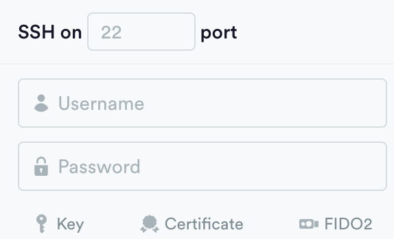

# Setting

이번에는 배포를 위해서 EC2를 세팅을 해보겠습니다.  
저는 Docker와 Code Pipeline을 사용해서 배포를 하기 때문에 관련된 세팅을 해보겠습니다.

## 탄력적 IP(Elastic IP addresses)

<LinkNewTab href="/aws/ec2/networkNsecurity/elastic-ip-addresses" text="탄력적 IP 할당"></LinkNewTab>

## ssh

ec2에 접속하기 위해서 기본 터미널을 이용할 수도 있지만  
저는 [Termius](https://termius.com/)를 사용합니다.


1. Hosts - NEW HOST
2. Address에 ec2의 퍼블릭 ip 주소 입력, Label에 표시될 제목 입력
   
3. ssh에 username에 `ec2-user`
4. key를 클릭하고 원하는 이름으로 키 생성
   
5. import를 클릭하고 pem키를 가져와서 넣어준다.
6. connect 클릭

## zsh

개인적으로 zsh를 선호하여 zsh를 설치하겠습니다.  
bash를 쓰시려면 이부분은 그냥 넘어가셔도 됩니다.

### zsh 설치

```sh
sudo yum install git zsh util-linux-user -y
sudo passwd ec2-user # 비밀번호 생성
chsh -s $(which zsh) # 이후 재접속
echo $SHELL # 재접속 0 선택
```

### oh my zsh 설치

```sh
wget https://github.com/robbyrussell/oh-my-zsh/raw/master/tools/install.sh -O - | zsh
vi ~/.zshrc
ZSH_THEME="agnoster" # vi로 들어가서 테마를 바꿈
source ~/.zshrc # 적용
```

### auto suggestions and syntax highlighting

```sh
git clone https://github.com/zsh-users/zsh-autosuggestions ~/.oh-my-zsh/custom/plugins/zsh-autosuggestions
git clone https://github.com/zsh-users/zsh-syntax-highlighting.git ~/.oh-my-zsh/custom/plugins/zsh-syntax-highlighting
vi ~/.zshrc
plugins=(git zsh-autosuggestions zsh-syntax-highlighting) # vi로 들어가서 plugin 추가
source ~/.zshrc # 적용
```

## docker 설치

```sh
sudo yum install docker -y
sudo systemctl enable docker
sudo systemctl start docker
sudo systemctl status docker
sudo usermod -aG docker $USER # 실행 후 재접속
```

### docker network 생성

```sh
docker network create [이름]
```

nginx와 배포되는 container가 docker의 이름으로 연결되기 위해서 같은 network에 위치하게 둡니다.

### nginx

#### nginx 설치 및 세팅

docker compose를 이용해도 되는데  
저는 nginx를 따로 설치하여 미리 세팅했습니다.

```sh
mkdir ~/conf.d
vi ~/conf.d/default.conf
```

#### default.conf

mount 할 파일을 미리 만들어줍니다.

```sh{4,7}
server {
    listen       80;
    listen       [::]:80;
    server_name  [domain];

    location / {
      proxy_pass http://[배포 docker container name]:[port];
      proxy_redirect off;
      charset utf-8;

      proxy_set_header X-Real_IP $remote_addr;
      proxy_set_header X-Forwarded-For $proxy_add_x_forwarded_for;
      proxy_set_header X-Forwarded-Proto $scheme;
      proxy_set_header X-NginX-Proxy true;
    }

    error_page 404 /404.html;
    location = /404.html {
    }

    error_page 500 502 503 504 /50x.html;
    location = /50x.html {
    }
}
```

#### nginx 실행

```sh
docker run -d --name nginx --network [생성한 네트워크 이름] -p 80:80 -v ~/conf:/etc/nginx/conf.d nginx:stable-alpine
```

그냥 실행해보시려면 network와 volumn을 빼고 실행해보시면 됩니다.

## CodeDeploy agent 설치

<LinkNewTab href="/aws/code-pipeline/code-deploy/codedeploy-agent" text="CodeDeploy agent 설치" style="margin-top: 16px"></LinkNewTab>

## Code Deploy와 EC2의 연결을 위한 사용자 생성과 인증

<LinkNewTab href="/aws/iam/access-management/user" text="Code Deploy와 EC2의 연결을 위한 사용자 생성과 인증" style="margin-top: 16px"></LinkNewTab><br/>
EC2에 사용자 인증을 해줍니다.

```sh
sudo aws configure
AWS Access Key ID [None]: [사용자 acceess key]
AWS Secret Access Key [None]:LinkNewTab [사용자 secret access key]
Default region name [None]: ap-northeast-2
Default output format [None]: json
```

## Deploy를 위한 EC2 IAM 역할 생성

<LinkNewTab href="/aws/iam/access-management/role#ec2-배포를-위한-역할-설정" text="EC2 배포를 위한 역할 설정" style="margin-top: 16px"></LinkNewTab>
