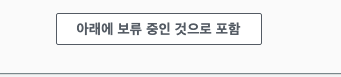
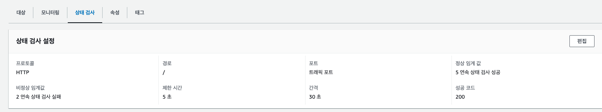

# 대상 그룹 (Target Group)

대상 그룹은 로드밸런서가 트래픽을 전달할 수 있는 서버 또는 컨테이너의 집합입니다. 로드밸런서는 설정된 규칙(예: URL 경로, 호스트 이름)에 따라 들어오는 요청을 대상 그룹에 할당하고, 이 그룹 내의 대상(예: EC2 인스턴스, IP 주소, Lambda 함수 등)들에게 트래픽을 분산시킵니다.

각 대상 그룹은 특정 유형의 요청을 처리하기 위해 구성될 수 있으며, ALB나 NLB를 사용할 때는 각 로드밸런서 리스너 규칙에 따라 특정 대상 그룹으로 트래픽을 라우팅할 수 있습니다. 예를 들어, 하나의 ALB가 다른 경로('/api'와 '/user')에 대한 요청을 서로 다른 대상 그룹으로 라우팅할 수 있습니다.

이렇게 AWS의 로드 밸런싱 솔루션은 애플리케이션의 가용성과 확장성을 높이는 데 중요한 역할을 합니다. 사용자는 서비스의 요구사항과 트래픽 패턴에 따라 적절한 유형의 로드밸런서와 대상 그룹을 선택하여 구성할 수 있습니다.

## 인스턴스 대상그룹 생성

`EC2 > 대상 그룹 > 대상 그룹 생성`

- 대상유형을 인스턴스
- 대상그룹이름은 원하는 것으로
- **생성**

### 대상 등록

- 사용 가능한 인스턴스에서 로드벨런싱될 인스턴스 선택
  
- 아래에 보류 중인 것으로 포함
  
- 보류 중인 대상 등록 선택

### 상태검사 확인

대부분 \/ 경로로 상태검사를 보내면 정상상태가 됩니다.  
하지만 프로젝트 구조상 \/ 경로가 없는 경우는 제대로 Get 받을 수 있는 경로로 수정하거나  
\/ 경로를 만들어서 배포해주시면 됩니다.
