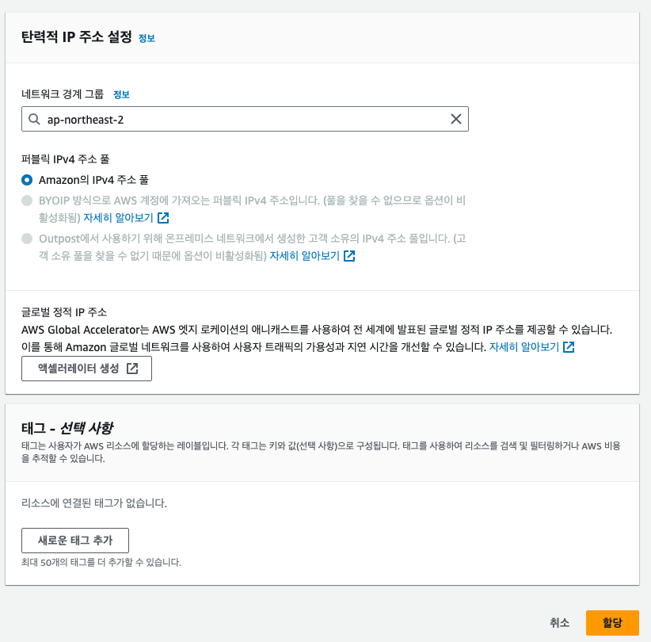
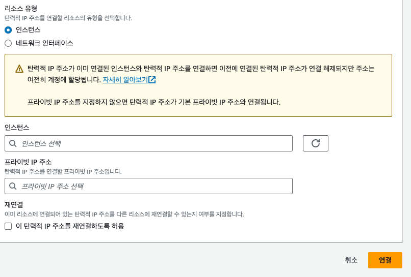

# 탄력적 IP(Elastic IP Addresses)

탄력적 IP를 설정하면 EC2가 고정아이피를 갖게 됩니다.

## 탄력적 IP 주소 할당

바로 할당 클릭 하면 됩니다.

## 탄력적 IP 주소 연결

바로 IP가 할당된 것을 볼수 있는데 할당된 아이피로 들어 갑니다.  

탄력적 IP주소 연결을 클릭 합니다.   

연결할 인스턴스를 선택하고 연결 합니다.
