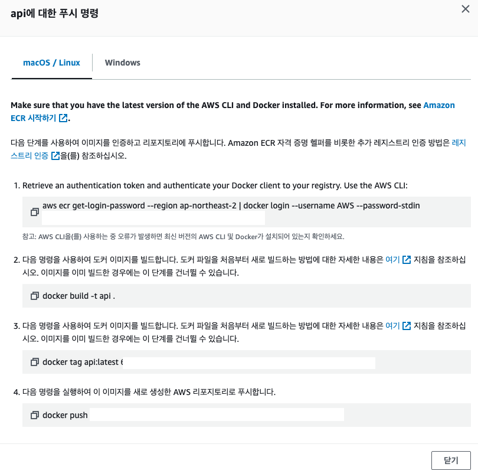

# Elastic Container Repository

docker hub를 이용하는 방법도 있지만 실제로는 ECR을 많이 이용함으로 ECR로 해봅니다.

## 생성

Amazon Elastic Container Registry > 리포지토리 생성 > 이름 만들고 생성 하면 끝  
취향따라 옵션을 변경해도 될 것 같습니다.

## 이미지 Push



리포지토리에 들어가서 오른쪽위에 보면 푸쉬명령보기라고 나와 있습니다.  
순서대로 따라하면 이미지가 Push 됩니다.

## IAM

AmazonEC2ContainerRegistryFullAccess 권한이 필요합니다.

```sh
aws sts get-caller-identity
aws iam list-attached-user-policies --user-name example-user
```

위 명령어로 권한이 충분한지 확인합니다.
