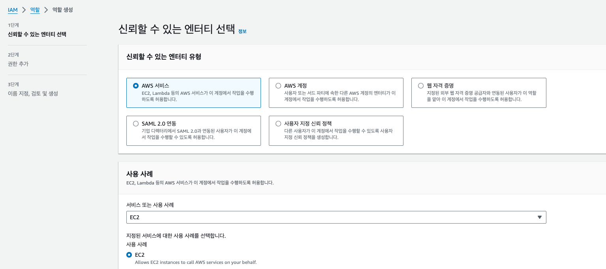
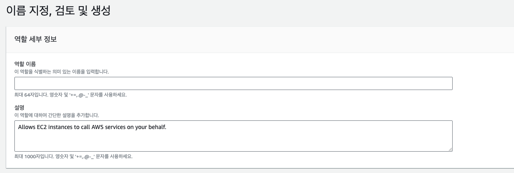

# Role

## EC2 배포를 위한 역할 설정

`IAM - 역할 - 역할생성`

### 역할 생성

### 권한정책 검색에 검색하여 추가할 권한

- AWSCodeDeployFullAccess
- AWSCodeDeployRole
- CloudWatchLogsFullAccess
- AmazonS3FullAccess

### 검토 및 생성

역할 이름 및 태그 작성 뒤 생성

### Ec2 역할 할당

해당 ec2를 선택하고 IAM 역할 수정을 통하여  
배포를 위해 만든 역할을 할당해 줍니다.

## CodeDeploy를 위한 역할 설정

`IAM - 역할 - 역할생성`

## 권한정책 검색에 검색하여 추가할 권한

- AWSCodeDeployRole
