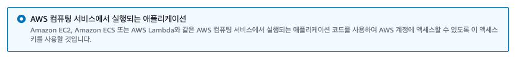

# 사용자

## 사용자 그룹 생성

`IAM - 액세스 관리 - 사용자 그룹 - 그룹 생성`

### 사용자 그룹을 생성하기 이전 필요한 권한을 가진 정책 생성

<LinkNewTab href="/aws/iam/access-management/policy" text="Code Deploy를 위한 정책 생성" style="margin: 16px 0"></LinkNewTab>

## 사용자 생성

`IAM - 액세스 관리 - 사용자 그룹 - 사용자 생성`

위에서 만들어준 사용자 그룹에 넣어준다.

### access key

만들어진 사용자에 들어가서 엑세스키 만들기를 클릭 합니다.
  
AWS 컴퓨팅 서비스에서 실행되는 애프리케이션을 선택하고 다음을 선택 합니다.
  

태그를 만들고 엑세스키를 만듭니다.
엑스키는 다시 볼수 있는데 secret access key는 지금 아니면 확인할 수 없으니 잘 보관해 둡니다.
