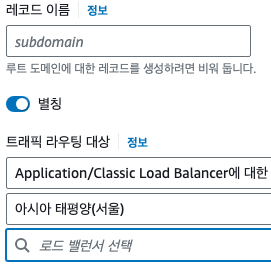

# 호스팅 영역

## 호스팅 영역 생성

- Route 53에서 도메인을 구매했으면 이미 호스팅 영역이 존재할 겁니다.
- 만약 다른 곳에서 도메인을 구매했다면 구매한 도메인을 입력해줍니다.

## 도메인을 다론 곳에서 구매하셨다면..

### GCP에서 구매한 도메인의 경우

- Route 53에서 만든 호스팅 영역으로 들어가 봅니다.
- 호스팅 영역에 보면 NS(Name Space)가 있습니다. 이걸 잘 적어둡니다.
- <LinkNewTab href="/gcp/network-service/cloud-domains" text="Cloud Domain" style="margin: 0">의 커스텀 도메인으로 DNS 관리를 변경하여 상단의 NS를 기재해 줍니다.</LinkNewTab>

### 또 다른 곳..

GCP의 경우와 비슷하게 name space를 변경해주시면 됩니다.

## A 레코드 생성

- 호스팅 영역 내부에서 레코드 생성을 클릭 합니다.
- 알맞은 레코드를 기재합니다.
- 별칭을 활성화 합니다.
- 알맞는 트래픽 라우팅 대상을 선택합니다.
  
  - ec2와 연결된 로드밸런서를 선택해줍니다.
