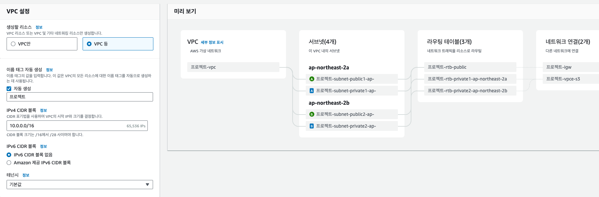
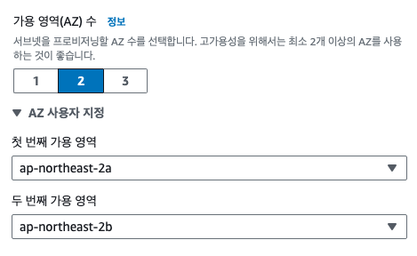
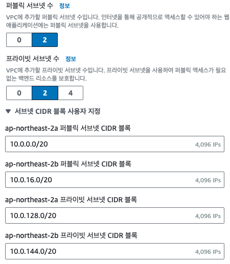

# VPC 생성

## VPC 설정

- 생성할 리소스
  - VPC만과 VPC등을 선택할 수 있습니다.
  - 어차피 서브넷, 라우팅 테이블 다 만들어야 되는데 VPC등을 선택합니다.
- 태그는 자동생성
- IPv4 CIDR 블록도 지정된데로 하거나 원하는데로 변경하셔도 됩니다. 링크를 참고하세요.  
  [VPC CIDR 블록](https://docs.aws.amazon.com/ko_kr/vpc/latest/userguide/vpc-cidr-blocks.html)
  ::: details CIDR 주소 범위 예시

  - `/32` 표기법은 단일 IP 주소를 나타냅니다. 예를 들어, `192.168.1.1/32`는 오직 `192.168.1.1` 하나의 IP 주소만을 포함합니다.

  - `/31` 표기법은 2개의 IP 주소를 가집니다. 그러나, 이는 주로 링크 구성에 사용되며 일반적인 호스트용으로는 사용되지 않습니다.

  - `/30` 표기법은 4개의 IP 주소를 가지며, `192.168.1.0/30`의 경우, `192.168.1.0`부터 `192.168.1.3`까지의 주소를 포함합니다. 이 중 `192.168.1.0`은 네트워크 주소, `192.168.1.3`은 브로드캐스트 주소로 사용되므로, 실제 호스트용 주소는 `192.168.1.1`과 `192.168.1.2`입니다.

  - `/24` 표기법은 256개의 IP 주소를 가지며, `192.168.1.0/24`의 경우, `192.168.1.0`부터 `192.168.1.255`까지의 주소를 포함합니다. 네트워크 주소인 `192.168.1.0`과 브로드캐스트 주소인 `192.168.1.255`를 제외하고, `192.168.1.1`부터 `192.168.1.254`까지가 실제 사용 가능한 호스트 주소입니다.

  - `/16` 표기법은 65,536개의 IP 주소를 가지며, `192.168.0.0/16`의 경우, `192.168.0.0`부터 `192.168.255.255`까지의 주소를 포함합니다. 여기서도 네트워크 주소와 브로드캐스트 주소를 제외한 나머지 주소가 호스트용입니다.

  :::

- 가용역역
  

  - 목적은 고가용성을 제공하는 것입니다. 하나의 가용 영역에 문제가 발생해도 다른 가용 영역에 있는 리소스를 통해 애플리케이션을 계속 운영할 수 있습니다.

- 서브넷
  

  - 목적은 네트워크 관리와 보안을 강화하는 것입니다. 서브넷을 다르게 구성함으로써, 특정 리소스에 대한 접근 제어를 세밀하게 조정할 수 있습니다.

- NAT 게이트웨이
  

  - NAT 게이트웨이는 프라이빗 서브넷 내의 인스턴스가 인터넷에 접근할 수 있도록 해주는 VPC 구성요소입니다. 이를 통해 인스턴스는 인터넷에서 요청을 시작할 수 있지만, 인터넷에서 직접적으로 인스턴스로 접근하는 것은 차단됩니다.

- VPC 엔드포인트
  

  - VPC 엔드포인트는 VPC와 AWS 서비스 간의 프라이빗 연결을 제공합니다. 이는 인터넷 게이트웨이나 NAT 게이트웨이를 사용하지 않고 AWS 서비스에 접근할 수 있게 해주므로, 보안을 강화할 수 있습니다.

- DNS 옵션 (전 다 체크)
  - DNS 호스트 이름 활성화 (Enable DNS Hostnames)
    - 이 설정을 활성화하면 VPC 내의 인스턴스에 대해 DNS 호스트 이름이 자동으로 할당됩니다.
    - **목적**: 인스턴스를 쉽게 식별하고 접근하기 위해 사용됩니다. 특히, 인스턴스 간의 통신이나 외부에서 인스턴스로의 접근 시 유용합니다.
  - DNS 확인 활성화 (Enable DNS Resolution)
    - 이 설정을 활성화하면 VPC의 DNS 서버가 인스턴스의 DNS 이름을 IP 주소로 해석할 수 있게 됩니다.
    - **목적**: 인스턴스나 AWS 리소스에 대한 DNS 쿼리를 통해 네트워킹을 용이하게 합니다. 이는 내부 통신 및 인터넷에서의 리소스 접근을 원활하게 해줍니다.

## 정리

위와 같이 VPC를 생성하시면 됩니다.
