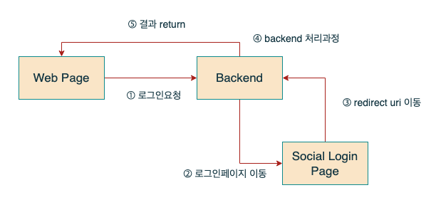

# Socail Login

## 설명

이번에는 구글, 네이버, 카카오 로그인을 해보려고 합니다.  
기본적인 세팅은 인터넷에 검색해보시면 쉽게 찾아 보실 수 있습니다.  
대부분 clientID, ClientSecret, RedirectUri를 설정하는 부분입니다.  
실제로 서비스에 적용하려면 네이버, 카카오는 심사를 받아야 합니다.  
구현은 모두 api를 이용해서 만들었습니다.

## 구조

기본적인 세팅 구조가 좀 다를 뿐 구조는 3사 다 유사합니다.
백엔드로 로그인 요청이 오면 로그인 페이지로 이동시켜주고 제대로 로그인 되면 redirect uri로 code를 보내줍니다.  
해당 코드로 backend에서 추가 처리 이후 결과를 return 해주는 형식 입니다.

## 구현

[Github Link](https://github.com/gornoba/nestjs-describe/tree/5eaf934409daaf8491c9741f4b7c9fba42e594ad)  
구현은 hbs를 통해서 간단하게 페이지를 만들어 진행하였습니다.  
src/login/social 폴더에 보시면 관련하여 코드를 구현해 놓았으니 필요하신 분들은 사용하면 될 것 같습니다.

## referrence

### Google

https://developers.google.com/identity/protocols/oauth2/web-server?hl=ko 
https://cloud.google.com/docs/authentication/token-types?hl=ko

### Naver

https://developers.naver.com/docs/login/devguide/devguide.md#%EB%84%A4%EC%9D%B4%EB%B2%84%20%EB%A1%9C%EA%B7%B8%EC%9D%B8-%EA%B0%9C%EB%B0%9C%EA%B0%80%EC%9D%B4%EB%93%9C

### Kakao

https://developers.kakao.com/docs/latest/ko/kakaologin/rest-api
