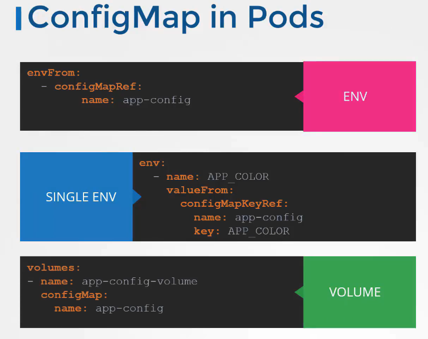

# Kubernetes에서 Configuration Data 다루기

많은 파드 정의 파일을 관리할 때, 이 파일들 내의 환경 데이터를 관리하기 어려워질 수 있습니다. 이러한 정보를 파드 정의 파일에서 분리하여 **Config Maps**를 사용해 중앙에서 관리할 수 있습니다.

## Config Maps란?

Config Maps는 key-value 쌍의 형태로 구성 데이터를 Kubernetes에 전달하는 데 사용됩니다. 파드 생성 시, Config Map을 파드에 주입하여 컨테이너 내의 애플리케이션에서 환경 변수로 key-value 쌍을 사용할 수 있습니다.

## Config Maps 구성하기

Config Maps를 구성하는 데는 두 단계가 있습니다:

1. Config Map 생성
2. 파드에 주입하기

Config Map을 생성하는 방법은 크게 두 가지입니다:

- **명령형 방식:** Config Map 정의 파일을 사용하지 않고, 필요한 인자들을 명시하여 `kubectl create configmap` 명령어를 사용합니다.
- **선언형 방식:** Config Map 정의 파일을 사용합니다.

### 명령형 방식 예시

```sh
kubectl create configmap <config-name> --from-literal=<key>=<value>
kubectl create configmap app-config --from-literal=APP_COLOR=blue --from-literal=APP_MOD=prod

kubectl create configmap <config-name> --from-file=<path-to-file>
kubectl create configmap <config-name> --from-file=app_config.properties
```

### 선언형 방식 예시

```yaml
apiVersion: v1
kind: ConfigMap
metadata:
  name: app-config
data:
  APP_COLOR: "blue"
  APP_MODE: "prod"
```

위 YAML 파일을 적용하기 위한 명령어:

```
kubectl apply -f configmap.yaml
```

## 파드에 Config Map 주입하기

파드 정의 파일에 `envFrom` 속성을 추가하여 환경 변수로 Config Map을 주입할 수 있습니다.

```yaml
apiVersion: v1
kind: Pod
metadata:
  name: webapp
spec:
  containers:
    - name: webapp-container
      image: nginx
      envFrom:
        - configMapRef:
            name: app-config
```

## Config Maps 확인하기

생성된 Config Maps를 확인하기 위한 명령어:

```sh
kubectl get configmaps
kubectl describe configmap app-config

kubectl get cm
kubectl describe cm app-config
```

## 정리



## K8s Reference Docs

https://kubernetes.io/docs/tasks/configure-pod-container/configure-pod-configmap/
https://kubernetes.io/docs/tasks/configure-pod-container/configure-pod-configmap/#define-container-environment-variables-using-configmap-data
https://kubernetes.io/docs/tasks/configure-pod-container/configure-pod-configmap/#create-configmaps-from-files
