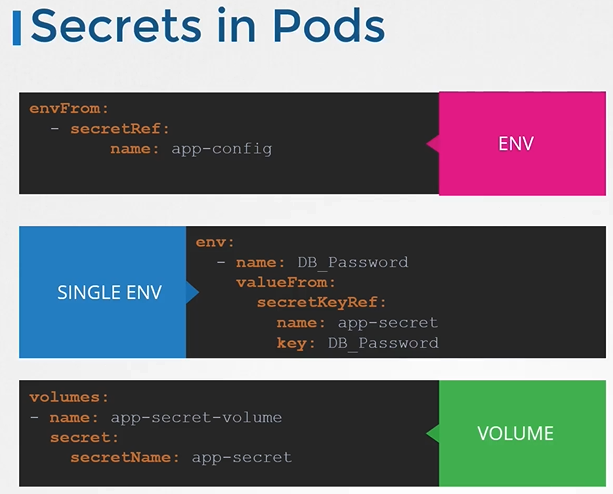

# Kubernetes에서 Secrets 다루기

**Secrets**는 패스워드, 키와 같은 민감한 정보를 저장하는 데 사용됩니다. ConfigMaps와 유사하지만, 인코딩된 형식으로 저장된다는 차이가 있습니다. Secrets를 사용하면 민감한 정보를 안전하게 관리할 수 있습니다.

## Secrets를 만드는 2단계

1. secret를 생성합니다.
2. pod에 secret를 주입합니다.

## Secrets 생성하기

Secrets를 생성하는 데는 두 가지 방법이 있습니다:

1. **명령형 방식:** Secret 정의 파일을 사용하지 않고, `kubectl create secret generic` 명령어로 직접 생성합니다.
2. **선언형 방식:** Secret 정의 파일을 사용하여 생성합니다.

### 명령형 방식 예시

```sh
kubectl create secret generic <secret-name> --from-literal=<key>=<value>
kubectl create secret generic app-secret --from-literal=DB_host=MySQL

kubectl create secret <secret-name> --from-file=<path-to-file>
kubectl create secret <secret-name> --from-file=app_secret.properties
```

### 선언형 방식 예시

먼저, 민감한 데이터를 base64로 인코딩합니다.

```sh
echo -n 'MySQL' | base64
```

인코딩된 데이터를 사용하여 Secret 정의 파일을 작성합니다.

```yaml
apiVersion: v1
kind: Secret
metadata:
  name: app-secret
data:
  DB_Host: (여기에 base64 인코딩된 값)
```

이 YAML 파일을 적용하기 위한 명령어:

```sh
kubectl apply -f secret.yaml
```

## 파드에 Secrets 주입하기

Secrets를 환경 변수로 파드에 주입하기 위해서는 파드 정의 파일 내에 `envFrom` 속성을 추가합니다.

```yaml
apiVersion: v1
kind: Pod
metadata:
  name: my-application
spec:
  containers:
    - name: my-application-container
      image: nginx
      envFrom:
        - secretRef:
            name: app-secret
```

## Secrets 확인 및 디코딩

생성된 Secrets를 확인하기 위한 명령어:

```sh
kubectl get secrets
kubectl get secrets app-secret -o yaml
kubectl describe secret app-secret
```

Secret 값을 디코딩하기 위한 명령어:

```sh
echo '(base64 인코딩된 값)' | base64 --decode
```

## 정리



## 주의 사항

- Secrets는 인코딩되어 있지만 암호화되지는 않습니다. 따라서, etcd에 저장될 때 기본적으로 암호화되지 않으므로, 저장소에 암호화를 설정하는 것을 고려해야 합니다.
- 같은 네임스페이스에 있는 파드 또는 배포에서 Secrets를 사용할 수 있으므로, 역할 기반 접근 제어(RBAC)를 구성하여 접근을 제한하는 것이 중요합니다.
- 외부 시크릿 제공자(AWS, Azure, GCP 또는 Vault)를 사용하여 Secrets를 관리하는 것을 고려해 보세요.
- est Practices
  - **소스 코드 저장소에 Secret 객체 정의 파일을 저장하지 않기**
  - **ETCD에서 Secrets를 암호화된 형태로 저장하기 위해 Rest 시 암호화(Encryption at Rest)를 활성화하기.**
- Kubernetes가 Secrets를 다루는 방식
  - 필요한 노드에만 Secret이 전송됩니다.
  - Kubelet은 Secret을 tmpfs에 저장하여 디스크 저장소에 기록되지 않도록 합니다.
  - Secret이 필요한 Pod가 삭제되면, Kubelet은 해당 Secret 데이터의 로컬 복사본도 삭제합니다.
- 민감한 데이터를 다루기 위한 더 나은 도구들이 있습니다. 예를 들어, Helm Secrets, HashiCorp Vault와 같은 도구를 사용할 수 있습니다.

## K8s Reference Docs

https://kubernetes.io/docs/concepts/configuration/secret/
https://kubernetes.io/docs/concepts/configuration/secret/#use-cases
https://kubernetes.io/docs/tasks/inject-data-application/distribute-credentials-secure/
https://www.youtube.com/watch?v=MTnQW9MxnRI
