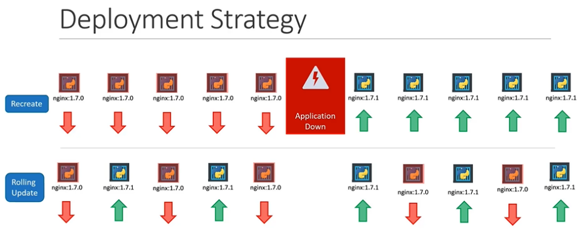

# Rolling Updates and Rollbacks in Kubernetes

## 요약

Deployment를 처음 생성하면 rollout이 트리거되고, 애플리케이션이 업그레이드될 때마다 새로운 rollout이 발생하여 새로운 Deployment revision이 생성됩니다. 이는 Deployment의 변경 사항을 추적하고 필요한 경우 이전 버전으로 롤백할 수 있게 해줍니다.

## 초보자를 위한 추가 정보

- **Rollouts**와 **versioning**을 이해하는 것은 Kubernetes에서 애플리케이션을 관리하는 데 중요합니다.
- 업그레이드나 롤백 시 **kubectl rollout status**와 **kubectl rollout history** 명령어를 사용하여 현재 상태와 이력을 확인할 수 있습니다.

```sh
kubectl rollout status deployment/myapp-deployment
kubectl rollout history deployment/myapp-deployment
```

## YAML 파일 및 CLI 명령어

### Deployment 업데이트 예시



```yaml
apiVersion: apps/v1
kind: Deployment
metadata:
  name: myapp-deployment
  labels:
    app: nginx
spec:
  template:
    metadata:
      name: myap-pod
      labels:
        app: myapp
        type: front-end
    spec:
      containers:
        - name: nginx-container
          image: nginx:1.7.1
  replicas: 3
  selector:
    matchLabels:
      type: front-end
```

Deployment를 업데이트하기 위해 기존의 Deployment 정의 파일을 수정한 후 `kubectl apply` 명령어를 사용하여 변경사항을 적용할 수 있습니다.

```bash
kubectl apply -f deployment-definition.yml
```

또는, 다음과 같이 `kubectl set image` 명령어로 이미지를 직접 업데이트할 수 있습니다.

```bash
$ kubectl set image deployment/myapp-deployment nginx=nginx:1.9.1
```

### 롤백 명령어

```bash
kubectl rollout undo deployment/myapp-deployment
```

## Deployment Strategies

Kubernetes에서는 두 가지 Deployment 전략을 제공합니다: **Recreate**와 **RollingUpdate**. 기본 설정은 RollingUpdate이며, 이는 애플리케이션을 업데이트하는 동안 서비스가 중단되지 않도록 합니다.

- **Recreate**: 모든 인스턴스를 한 번에 중단하고 새 버전으로 교체합니다. 이 방법은 일시적으로 서비스가 중단됩니다.
- **RollingUpdate**: 인스턴스를 점진적으로 업데이트하여 언제나 서비스를 유지합니다.

## 정리

Kubernetes에서의 업데이트와 롤백은 애플리케이션의 지속적인 가용성을 보장하며, 변경사항 관리를 용이하게 합니다. RollingUpdate 전략을 사용하면 서비스 중단 없이 애플리케이션을 업데이트할 수 있으며, 문제가 발생했을 때는 롤백을 통해 이전 상태로 쉽게 복귀할 수 있습니다.

```sh
kubectl create -f deployment-definition.yaml
kubectl get deployments
kubectl apply -f deployment-definition.yaml
kubectl set image deployment/myapp-deployment nginx=nginx:1.9.1
kubectl rollout status deployment/myapp-deployment
kubectl rollout history deployment/myapp-deployment
kubectl rollout undo deployment/myapp-deployment
```

## K8s Reference Docs

https://kubernetes.io/docs/concepts/workloads/controllers/deployment
https://kubernetes.io/docs/tasks/run-application/run-stateless-application-deployment
