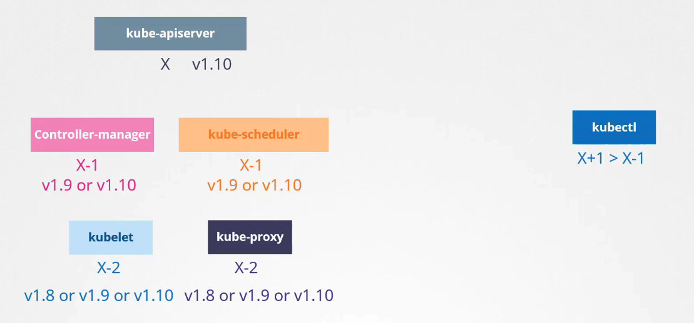
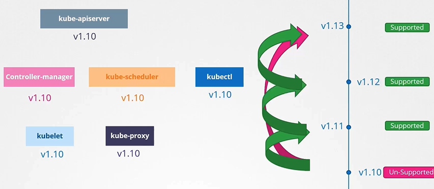

# 쿠버네티스 클러스터 업그레이드 과정

쿠버네티스 클러스터를 업그레이드하는 과정은 컴포넌트의 버전 관리를 포함하며, 이는 클러스터의 안정성과 기능성을 유지하기 위해 필수적입니다. 이 강의에서는 업그레이드 과정의 중요한 측면을 다룹니다.

## 버전 호환성



- **kube-apiserver**: 다른 모든 컨트롤 플레인 컴포넌트들은 `kube-apiserver`보다 버전이 높아서는 안 됩니다.
- **controller-manager와 scheduler**: `kube-apiserver`보다 최대 한 버전 낮을 수 있습니다.
- **kubelet과 kube-proxy**: `kube-apiserver`보다 최대 두 버전 낮을 수 있습니다.
- **kubectl**: `kube-apiserver`보다 한 버전 높거나 같거나 낮을 수 있습니다.

## 업그레이드 타이밍


쿠버네티스는 최근 세 개의 마이너 버전을 지원합니다. 예를 들어, 1.13이 최신 버전이라면 1.12, 1.11, 1.10이 지원됩니다.

## 업그레이드 방법

- **단계적 업그레이드**: 한 번에 한 마이너 버전씩 업그레이드하는 것이 권장됩니다.
- **클러스터 설정**: 관리형 클러스터 또는 `kubeadm`을 사용한 클러스터는 업그레이드 프로세스가 다릅니다.
- **마스터 노드 업그레이드 후 워커 노드 업그레이드**: 마스터 노드를 먼저 업그레이드한 후, 워커 노드를 업그레이드합니다.

## 업그레이드 전략

1. **모든 워커 노드를 한 번에 업그레이드**: 빠르지만 일시적인 다운타임이 발생할 수 있습니다.
2. **노드별 업그레이드**: 워커 노드를 순차적으로 업그레이드하여 다운타임을 최소화합니다.
3. **새 노드 추가 후 교체**: 새로운 버전의 노드를 추가하고, 워크로드를 이전한 후, 오래된 노드를 제거합니다.

## 실습 명령어

### repository 연결

```bash
echo "deb [signed-by=/etc/apt/keyrings/kubernetes-apt-keyring.gpg] https://pkgs.k8s.io/core:/stable:/v1.28/deb/ /" | sudo tee /etc/apt/sources.list.d/kubernetes.list
curl -fsSL https://pkgs.k8s.io/core:/stable:/v1.28/deb/Release.key | sudo gpg --dearmor -o /etc/apt/keyrings/kubernetes-apt-keyring.gpg
sudo apt-get update
```

v1.28에 Upgrade 하는 버전을 기재하여 연결

### kubeadm - upgrade master node

- **hint**: 다음 명령어로 upgrade에 대한 도움을 받을 수 있습니다. upgrade하는 버전정보를 확인
  ```bash
  sudo kubeadm upgrade plan
  ```
- **실행**

  ```bash
  sudo apt update
  sudo apt-cache madison kubeadm

  sudo apt-mark unhold kubeadm && \
  sudo apt-get update && sudo apt-get install -y kubeadm=1.29.0-1.1 && \
  sudo apt-mark hold kubeadm
  sudo kubeadm upgrade apply v1.29.0

  sudo apt-mark unhold kubelet kubectl && \
  sudo apt-get update && sudo apt-get install -y kubelet=1.29.0-1.1 kubectl=1.29.0-1.1 && \
  sudo apt-mark hold kubelet kubectl

  kubectl uncordon <node-to-uncordon>
  ```

- `kubectl get nodes` 명령을 실행하면 이전 버전을 볼 수 있습니다. 이는 명령의 출력에 API 서버 자체의 버전이 아니라 API 서버에 등록된 각 노드의 kubelets 버전이 표시되기 때문입니다.

### kubeadm - upgrade worker node

- ssh로 node로 이동하여 상단과 동일
  ```bash
  ssh <node-name>
  ```

## K8s Reference Docs

https://kubernetes.io/docs/tasks/administer-cluster/kubeadm/kubeadm-upgrade/
https://kubernetes.io/docs/reference/setup-tools/kubeadm/kubeadm-upgrade/
