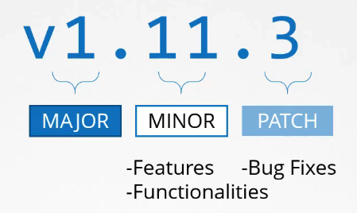

# 쿠버네티스 릴리스와 버전 이해하기

쿠버네티스 클러스터를 설치할 때 특정 버전의 쿠버네티스를 설치합니다. `kubectl get nodes` 명령어를 실행하면 현재 클러스터의 쿠버네티스 버전을 확인할 수 있습니다. 예를 들어, 버전이 1.11.3일 수 있습니다. 쿠버네티스 프로젝트는 소프트웨어 릴리스를 어떻게 관리하는지 이 강의에서 살펴보겠습니다.

## 버전 번호

쿠버네티스 릴리스 버전은 세 부분으로 구성됩니다.

1. **주 버전(Major version)**
2. **부 버전(Minor version)**
3. **패치 버전(Patch version)**

부 버전은 몇 개월마다 새로운 기능과 기능성이 추가되어 릴리스되고, 패치 버전은 더 자주 중요한 버그 수정사항이 포함되어 릴리스됩니다.

## 릴리스 유형

- **안정 버전(Stable releases)**: 새로운 기능과 개선사항을 포함하여 몇 개월마다 출시됩니다. 첫 번째 주요 버전 1.0은 2015년 7월에 출시되었습니다. 이 강의가 녹음된 시점에서 최신 안정 버전은 1.13.0입니다.
- **알파(Alpha) 및 베타(Beta) 릴리스**: 모든 버그 수정과 개선사항은 먼저 알파 릴리스에 태그되며, 이 릴리스에서는 기능이 기본적으로 비활성화되어 있고 버그가 있을 수 있습니다. 그 후 베타 릴리스로 이동하여 코드가 잘 테스트되고 새 기능이 기본적으로 활성화됩니다. 마지막으로, 안정 릴리스로 이동합니다.

## 컴포넌트 버전

쿠버네티스의 제어 플레인 내 다른 컴포넌트들, 예를 들어 etcd 클러스터와 CoreDNS 서버는 자체 버전을 가집니다. 이들은 별도의 프로젝트이기 때문입니다. 각 릴리스 노트는 etcd와 CoreDNS 같은 외부 의존 애플리케이션의 지원되는 버전에 대한 정보를 제공합니다.

## 실습 및 참조

쿠버네티스 GitHub 저장소의 릴리스 페이지에서 모든 릴리스를 확인하고 `Kubernetes.tar.gz` 파일을 다운로드하여 쿠버네티스 컴포넌트의 실행 파일을 찾을 수 있습니다.

## References

https://blog.risingstack.com/the-history-of-kubernetes/
https://kubernetes.io/docs/setup/release/version-skew-policy/
