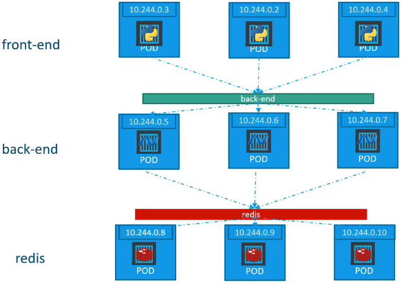

# Kubernetes ClusterIP Service

ClusterIP Servie는 Kubernetes 클러스터 내의 서로 다른 Pod 간의 통신을 가능하게 하는 중요한 메커니즘입니다.

## ClusterIP Servie란?



- ClusterIP Servie는 Kubernetes 클러스터 내에서만 접근 가능한 내부 IP를 제공합니다.
- 이 Servie를 통해 Pod 그룹에 대한 단일 접근점을 생성하며, Servie 요청은 Servie 아래의 Pod 중 하나로 무작위로 전달됩니다.
- 예를 들어, Frontend 서버는 Backend 서버와 통신해야 하며, Backend는 MySQL 또는 Redis와 같은 Servie와 통신해야 합니다.

## ClusterIP Servie의 필요성

- Pod는 동적으로 생성되고 소멸되므로, 고정 IP 주소에 의존하는 내부 통신은 신뢰할 수 없습니다.
- ClusterIP Servie를 사용하면, Pod들을 그룹화하고 이 그룹에 대한 단일 인터페이스를 제공하여, 안정적인 내부 통신을 보장할 수 있습니다.

## ClusterIP Servie 생성 예시

### YAML 파일 예시

ClusterIP Servie를 정의하는 기본 YAML 파일의 예시입니다.

```yaml
apiVersion: v1
kind: Service
metadata:
  name: back-end
spec:
  type: ClusterIP
  selector:
    app: myapp
    type: back-end
  ports:
    - protocol: TCP
      port: 80
      targetPort: 80
```

이 YAML 파일은 `app=backend` 레이블을 가진 Pod들로 트래픽을 전달하는 ClusterIP Servie를 정의합니다. Servie와 Pod 간의 연결은 `selector`를 통해 이루어집니다.

### CLI 명령어 예시

YAML 파일을 생성하지 않고 직접 ClusterIP Servie를 생성하기 위한 `kubectl` CLI 명령어 예시입니다.

```bash
kubectl create service clusterip backend --tcp=80:80 --dry-run=client -o yaml > backend-service.yaml
```

이 명령어는 `backend`라는 이름의 ClusterIP Servie를 생성하되, 실제로 생성하는 대신 해당 Servie의 YAML 정의를 `backend-service.yaml` 파일로 출력합니다.

## 요약

- ClusterIP Servie는 클러스터 내 Pod 간 안정적인 통신을 위한 중요한 구성 요소입니다.
- Servie는 Pod가 속한 그룹에 대한 단일 접근점을 제공하며, Servie 이름 또는 클러스터 IP를 통해 접근할 수 있습니다.
- YAML 파일과 `kubectl` CLI를 사용하여 Servie를 쉽게 생성하고 관리할 수 있습니다.

## K8s Reference Docs:

https://kubernetes.io/docs/concepts/services-networking/service/
https://kubernetes.io/docs/tutorials/kubernetes-basics/expose/expose-intro/
