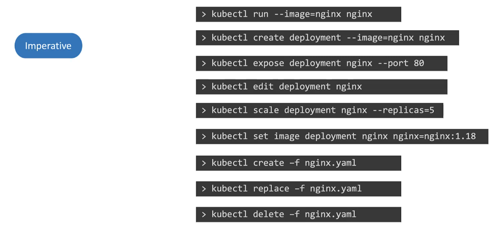

# Kubernetes의 명령형(Imperative)과 선언형(Declarative) 접근 방식

Kubernetes에서 리소스를 관리하는 두 가지 주요 방법은 **명령형(Imperative)** 과 **선언형(Declarative)** 접근 방식입니다. 이 두 방식의 차이를 이해하는 것은 Kubernetes를 효과적으로 사용하는 데 중요합니다.

## 명령형 접근 방식 (Imperative)

명령형 접근 방식에서는 개별 작업을 직접 지정하여 Kubernetes 리소스를 관리합니다. 이 방식은 구체적인 단계를 실행하여 원하는 상태를 달성하는 데 초점을 맞춥니다.

### 예시: Pod 생성



### 장단점

- **장점**: 빠른 테스트와 실험에 유리합니다.
- **단점**: 복잡한 설정이 어렵고, 변경 사항을 추적하기 어렵습니다.

## 선언형 접근 방식 (Declarative)

선언형 접근 방식에서는 원하는 최종 상태를 파일로 정의하고, Kubernetes가 현재 상태에서 필요한 모든 변경을 자동으로 결정하게 합니다.

### 예시: YAML 파일을 사용한 Pod 생성


```yaml
apiVersion: v1
kind: Pod
metadata:
  name: nginx-pod
spec:
  containers:
    - name: nginx-container
      image: nginx
```

```sh
kubectl apply -f pod.yaml
```

### 장단점

- **장점**: 구성이 파일로 관리되어 변경 사항 추적과 버전 관리가 용이합니다.
- **단점**: 초기 학습 곡선이 더 높을 수 있습니다.

## 명령형 vs. 선언형

| 접근 방식 | 장점                | 단점                  |
| --------- | ------------------- | --------------------- |
| 명령형    | 빠른 실행           | 변경 사항 추적 어려움 |
| 선언형    | 구성 변경 추적 용이 | 초기 학습 곡선        |

## 유용한 옵션

Kubernetes를 사용할 때 주로 선언형 접근 방식(정의 파일 사용)을 사용하지만, 명령형 명령어는 일회성 작업을 빠르게 수행하거나 정의 템플릿을 쉽게 생성하는 데 도움이 될 수 있습니다. 특히 시험에서는 이 방법이 시간을 상당히 절약할 수 있습니다.

- `--dry-run=client`: 명령어를 실행하면 리소스가 즉시 생성됩니다. 명령어를 테스트하려면 `--dry-run=client` 옵션을 사용하세요. 이 옵션은 리소스를 생성하지 않고 명령어가 올바른지 알려줍니다.
- `-o yaml`: 이 옵션은 화면에 리소스 정의를 YAML 형식으로 출력합니다.

이 두 옵션을 조합하여 빠르게 리소스 정의 파일을 생성한 다음, 필요에 따라 수정하여 리소스를 생성할 수 있습니다. 처음부터 파일을 생성하는 대신에 이 방법을 사용하세요.

## 명령어 예시

### Pod 생성

```sh
kubectl run nginx --image=nginx
kubectl run hazelcast --image=hazelcast/hazelcast --labels="app=hazelcast,env=prod"
k run httpd --image=httpd:alpine --port=80 --expose=true # 서비스와 동시에 생성
```

### Pod Manifest YAML 파일 생성 (-o yaml, --dry-run)

```sh
kubectl run nginx --image=nginx --dry-run=client -o yaml
```

### Deployment 생성

```sh
kubectl create deployment --image=nginx nginx
```

### Deployment YAML 파일 생성 (-o yaml, --dry-run)

```sh
kubectl create deployment --image=nginx nginx --dry-run=client -o yaml
```

### 4개의 복제본이 있는 Deployment 생성

```sh
kubectl create deployment nginx --image=nginx --replicas=4
```

### Deployment 확장

```sh
kubectl scale deployment nginx --replicas=4
```

또는 YAML 정의 파일을 파일로 저장하고 복제본 수 또는 다른 필드를 수정한 후 Deployment를 생성합니다.

```sh
kubectl create deployment nginx --image=nginx --dry-run=client -o yaml > nginx-deployment.yaml
```

### 서비스 생성

- ClusterIP 서비스 생성하여 Pod 노출하기

```sh
kubectl expose pod redis --port=6379 --name=redis-service --dry-run=client -o yaml
```

아래와 같이 할 경우 pod label을 selecotr로 사용하지 않고 selector를 app=redis로 가정합니다.  
selector를 옵션으로 전달할 수 없어서 pod에 다른 label 세트가 있는 경우 잘 작동하지 않습니다.  
따라서 서비스를 생성하기 전에 파일을 생성하고 selector를 수정하세요.

```sh
kubectl create service clusterip redis --tcp=6379:6379 --dry-run=client -o yaml
```

- NodePort 서비스 생성하여 Pod 노출하기

아래와 같이 하면 자동으로 pod의 label이 selector로 사용되지만 nodeport는 지정할 수 없습니다.  
pod로 서비스를 생성하기 전에 정의 파일을 생성한 다음 nodeport를 수동으로 추가해야 합니다.

```sh
kubectl expose pod nginx --type=NodePort --port=80 --name=nginx-service --dry-run=client -o yaml
```

또는 아래와 같이 하면 pod label이 seletor로 사용되지 않습니다.

```sh
kubectl create service nodeport nginx --tcp=80:80 --node-port=30080 --dry-run=client -o yaml
```

서비스를 생성할 때는 `kubectl expose` 명령어를 사용하는 것이 좋습니다. 노드 포트를 지정해야 하는 경우 정의 파일을 생성한 후 수동으로 노드 포트를 입력하고 서비스를 생성하세요.

## `kubectl apply`의 작동 방식

`kubectl apply`는 세 가지 주요 요소를 비교합니다:

- **로컬 구성 파일**: 개발자가 작성한 YAML 파일입니다.
- **실시간 객체 정의**: Kubernetes 클러스터 상의 실제 객체 상태입니다.
- **마지막 적용된 구성**: 이전에 `kubectl apply`로 적용된 객체의 구성입니다.

### 작동 예시

1. **객체 생성**: 객체가 존재하지 않을 때, `kubectl apply`를 실행하면 객체가 생성됩니다.
2. **객체 업데이트**: 이미 존재하는 객체를 업데이트할 때, 로컬 파일, 실시간 객체, 마지막 적용된 구성을 비교하여 필요한 변경 사항을 결정합니다.
   - 예를 들어, 로컬 파일에서 nginx 이미지를 1.19로 업데이트하고 `kubectl apply`를 실행하면, 실시간 객체가 업데이트됩니다.
3. **필드 삭제**: 로컬 파일에서 특정 필드를 삭제하고 `kubectl apply`를 실행하면, 마지막으로 적용된 구성과 비교하여 해당 필드가 실시간 객체에서도 삭제됩니다.

### 저장 위치

- **마지막 적용된 구성**은 Kubernetes 클러스터 내 객체의 `annotation`으로 저장됩니다.

## `kubectl apply` 사용 시 주의 사항

- `kubectl apply`를 사용한 후에는, 이 명령어를 계속 사용하여 객체를 관리해야 합니다.
- `kubectl create` 또는 `kubectl replace`와 같은 명령어를 혼합하여 사용하지 않는 것이 좋습니다. 이는 마지막 적용된 구성을 기반으로 하는 `kubectl apply`의 비교 로직과 충돌할 수 있습니다.

## 실습 팁

- YAML 파일 작성이나 CLI 명령어를 사용하여 리소스 정의를 빠르게 생성할 때 `--dry-run=client`와 `-o yaml` 옵션을 함께 사용하세요. 이를 통해 실제로 리소스를 생성하지 않고도 YAML 파일을 생성할 수 있습니다.

  ```sh
  kubectl run nginx --image=nginx --dry-run=client -o yaml > nginx-pod.yaml
  ```

## Reference:

https://kubernetes.io/docs/reference/generated/kubectl/kubectl-commands

https://kubernetes.io/docs/reference/kubectl/conventions/
