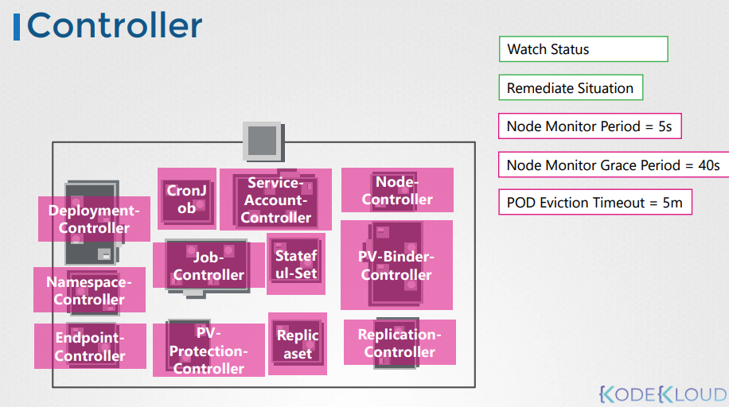
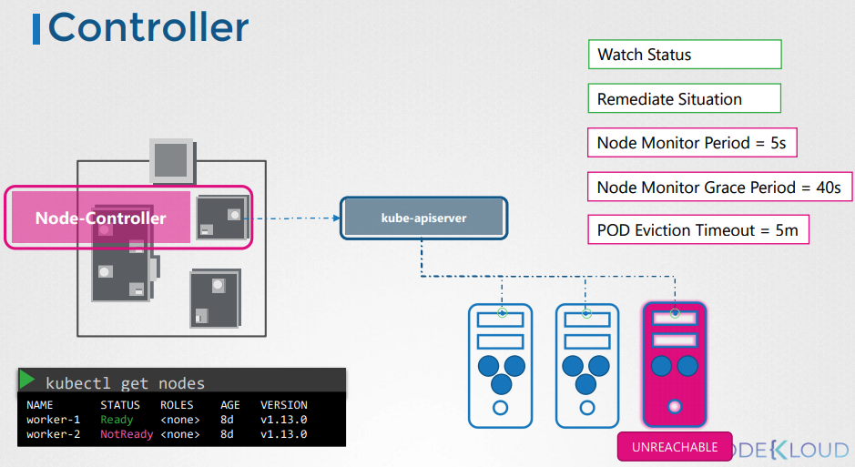
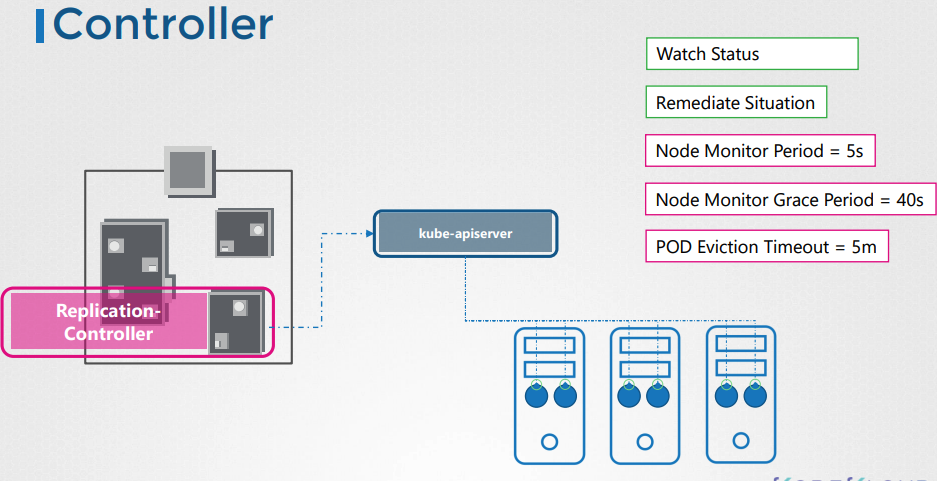

# Kube Controller Manager 소개



## Kube Controller Manager란?

Kube Controller Manager는 Kubernetes의 다양한 컨트롤러를 관리하는 컴포넌트입니다. 컨트롤러는 시스템 내의 다양한 구성 요소의 상태를 지속적으로 모니터링하며, 시스템을 원하는 상태로 유지하기 위해 작업을 수행합니다.

### 컨트롤러의 예

- **노드 컨트롤러(Node Controller)**: 노드의 상태를 모니터링하고, 필요한 조치를 취해 애플리케이션을 실행 상태로 유지합니다.
  
- **복제 컨트롤러(Replication Controller)**: Replica Set의 상태를 모니터링하고, 설정된 파드의 수를 유지합니다.
  

## 컨트롤러의 기능

- Kubernetes의 다양한 기능(배포, 서비스, 네임스페이스, 영구 볼륨 등)은 이러한 컨트롤러를 통해 구현됩니다.
- 컨트롤러는 Kubernetes의 "두뇌" 역할을 하며, 클러스터의 다양한 작업을 조정합니다.

## Kubernetes Controller Manager 설치 및 확인 방법

- **Kube Controller Manager 설치**: Kubernetes 릴리스 페이지에서 Kube Controller Manager를 다운로드하고, 서비스로 실행합니다.
- **옵션 설정**: 실행 시 다양한 옵션을 제공하여 컨트롤러를 사용자 정의할 수 있습니다. 예를 들어, 노드 모니터링 주기, 유예 기간, 추방 시간 제한 등을 옵션으로 설정할 수 있습니다.
- **활성화된 컨트롤러 확인**: `controllers` 옵션을 사용해 활성화할 컨트롤러를 지정할 수 있습니다. 기본적으로 모든 컨트롤러가 활성화되어 있으나, 선택적으로 활성화할 수도 있습니다.

## Kube Controller Manager의 구성 옵션 확인

- **Kubeadmin을 사용한 설정**: Kubeadmin 도구를 사용하면 `kube-system` 네임스페이스에 Kube Controller Manager가 파드로 배포됩니다. `etc/kubernetes/manifests` 폴더에 위치한 파드 정의 파일에서 옵션을 확인할 수 있습니다.
  ```sh
  cat /etc/systemd/system/kube-controller-manager.service
  cat /etc/kubernetes/manifests/kube-controller-manager.yaml
  ```
- **수동 설정**: 수동 설정 시 `etc/systemd/system/` 디렉토리에 위치한 Kube Controller Manager 서비스를 통해 옵션을 검사할 수 있습니다. 또한, 마스터 노드에서 프로세스를 나열하여 실행 중인 Kube Controller Manager의 옵션을 확인할 수 있습니다.
  ```sh
  wget https://storage.googleapis.com/kubernetes-release/release/v1.13.0/bin/linux/amd64/kube-controller-manager
  cat /etc/systemd/system/kube-controller-manager.service
  ```

:::tip
Kube Controller Manager는 Kubernetes 클러스터의 핵심 관리 역할을 수행합니다. 클러스터를 효과적으로 관리하려면 이 컴포넌트의 작동 방식과 구성 옵션을 이해하는 것이 중요합니다.
:::

## K8s Reference Docs:

- https://kubernetes.io/docs/reference/command-line-tools-reference/kube-controller-manager/
- https://kubernetes.io/docs/concepts/overview/components/
