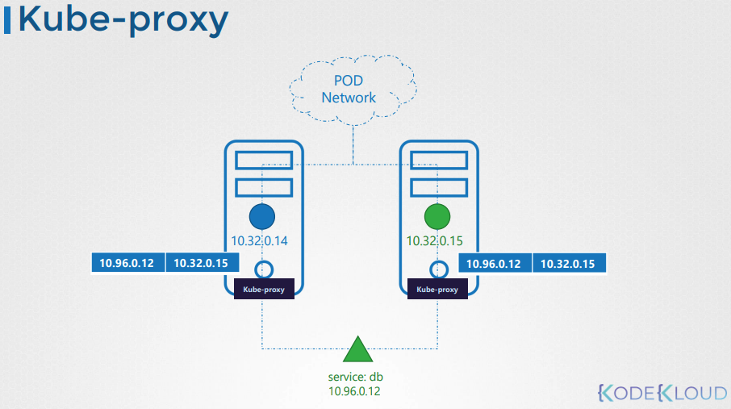

# Kube-Proxy 소개



## Kube-Proxy란?

Kube-proxy는 Kubernetes 클러스터 내의 각 노드에서 실행되는 프로세스로, 서비스에 대한 트래픽을 백엔드 파드로 전달하는 규칙을 생성하는 역할을 합니다.

### 주요 기능

- **서비스 발견**: 새로운 서비스가 생성될 때마다, kube-proxy는 각 노드에 적절한 전달 규칙을 설정합니다.
- **트래픽 전달**: 서비스의 IP나 이름을 사용하여 접근하는 트래픽을 백엔드 파드로 전달합니다. 이는 주로 iptables 규칙을 사용하여 수행됩니다.

## 서비스와의 연관성

- **파드 간 통신**: 클러스터 내 모든 파드는 내부 가상 네트워크를 통해 서로 통신할 수 있습니다. 서비스는 이 네트워크 상에서 백엔드 파드에 대한 접근점을 제공합니다.
- **서비스 IP와 DNS**: 서비스는 고유한 IP 주소를 할당받으며, 이를 통해 클러스터 내 어디서나 접근할 수 있습니다. kube-proxy는 서비스 IP로 들어오는 트래픽을 적절한 파드로 전달하는 규칙을 설정합니다.

## Kube-Proxy 설치 및 확인 방법

- **Kube-Proxy 설치**: Kubernetes 릴리스 페이지에서 kube-proxy 바이너리를 다운로드하고 서비스로 실행합니다.

```sh
wget https://storage.googleapis.com/kubernetes-release/release/v1.13.0/bin/linux/amd64/kube-proxy
```

- **kubeadm을 사용한 배포**: kubeadm은 kube-proxy를 DaemonSet으로 배포하여, 클러스터 내 모든 노드에 자동으로 kube-proxy 파드가 배치되도록 합니다.

```sh
kubectl get pods -n kube-system
```

:::tip
Kube-proxy는 Kubernetes 클러스터에서 서비스를 통한 통신을 가능하게 하는 중요한 구성 요소입니다. 클러스터 내의 서비스가 백엔드 파드로 트래픽을 정확하게 전달할 수 있도록 kube-proxy가 각 노드에 필요한 규칙을 설정합니다.
:::

kube-proxy는 클러스터 내 서비스 통신의 핵심 역할을 하며, 클러스터의 네트워킹 구성 요소 중 하나입니다.

## K8s Reference Docs:

- https://kubernetes.io/docs/reference/command-line-tools-reference/kube-proxy/
- https://kubernetes.io/docs/concepts/overview/components/
