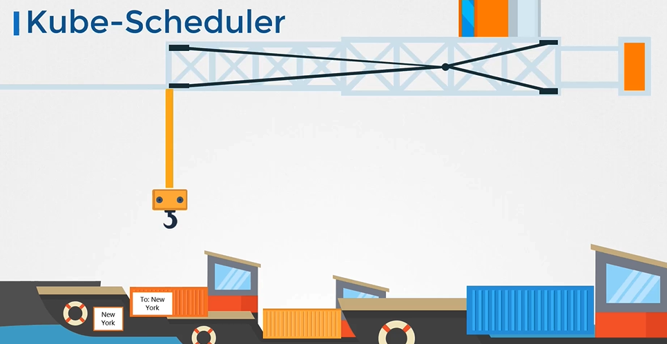

# Kube-Scheduler 소개

s

## Kube-Scheduler란?

Kube-Scheduler는 파드(Pods)를 적합한 노드(Node)에 스케줄링하는 책임을 집니다. 스케줄러는 파드가 어느 노드에 위치할지 결정하는 역할을 하지만, 실제로 파드를 노드에 배치하는 것은 아닙니다. 이 작업은 Kubelet이 수행합니다.

## 스케줄러의 작업 방식

1. **필터링 단계(Filtering Phase)**: 스케줄러는 CPU, 메모리 등 파드의 요구 사항에 맞지 않는 노드를 제외합니다.
2. **랭킹 단계(Ranking Phase)**: 남은 노드 중에서 최적의 노드를 선택하기 위해, 스케줄러는 우선순위 함수를 사용하여 노드에 점수를 매깁니다.

## 스케줄러의 중요성

- **리소스 요구 사항과 한계**: 다양한 파드의 리소스 요구 사항을 고려하여 최적의 노드를 선택합니다.
- **노드 선택 및 제약 사항**: 노드 셀렉터(Node Selectors), 테인트와 톨러레이션(Taints and Tolerations), 친화성 규칙(Affinity Rules) 등을 사용하여 스케줄링 결정을 내립니다.

## Kube-Scheduler 설치 및 확인 방법

- **Kube-Scheduler 설치**: Kubernetes 릴리스 페이지에서 kube-scheduler 바이너리를 다운로드하여 서비스로 실행합니다.
- **스케줄러 서버 옵션 확인**:

  - **kubeadm을 사용한 경우**: `kube-system` 네임스페이스에 파드로 배포되며, `/etc/kubernetes/manifests` 폴더 내의 파드 정의 파일에서 옵션을 확인할 수 있습니다.

  ```sh
  kubectl get pods -n kube-system
  ```

  - **수동 설정 경우**: 마스터 노드에서 프로세스를 나열하고 `kube-scheduler`를 검색하여 실행 중인 프로세스와 효과적인 옵션을 확인할 수 있습니다.

  ```sh
  wget https://storage.googleapis.com/kubernetes-release/release/v1.13.0/bin/linux/amd64/kube-scheduler
  cat /etc/kubernetes/manifests/kube-scheduler.yaml
  ```

:::tip
Kube-Scheduler는 파드를 적절한 노드에 스케줄링함으로써 리소스의 효율적 사용과 클러스터의 안정성을 유지하는 데 핵심적인 역할을 합니다. 이 과정에서 다양한 리소스 요구 사항, 노드의 특성 및 정책을 고려하여 최적의 결정을 내리게 됩니다.
:::

## K8s Reference Docs:

- https://kubernetes.io/docs/reference/command-line-tools-reference/kube-scheduler/
- https://kubernetes.io/docs/concepts/scheduling-eviction/kube-scheduler/
- https://kubernetes.io/docs/concepts/overview/components/
- https://kubernetes.io/docs/tasks/extend-kubernetes/configure-multiple-schedulers/
