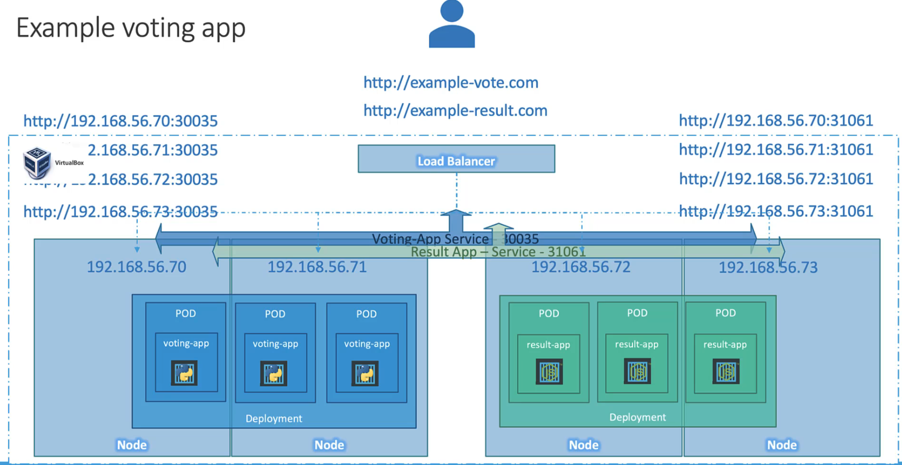

# Kubernetes LoadBalancer Service


Kubernetes에서 LoadBalancer Service는 외부 트래픽을 클러스터 내의 애플리케이션으로 분산시키는 데 사용됩니다. 이 Service 타입은 특히 클라우드 환경에서 유용하며, 클라우드 제공자가 제공하는 외부 로드 밸런서를 자동으로 프로비저닝하고 구성합니다.

## LoadBalancer Service의 주요 특징

- 외부에서 클러스터 내부의 특정 애플리케이션으로 직접 트래픽을 전송할 수 있게 합니다.
- 클라우드 제공자의 로드 밸런서와 통합되어, 고가용성과 분산 처리를 제공합니다.
- 클러스터 외부에 공개된 단일 진입점을 제공하여, 애플리케이션에 쉽게 접근할 수 있게 합니다.

## LoadBalancer Service 사용 사례

웹 애플리케이션을 Kubernetes 클러스터에 배포했을 때, 인터넷에서 이 애플리케이션에 접근할 수 있도록 하려면 LoadBalancer Service를 사용할 수 있습니다. 이 Service는 외부 로드 밸런서를 생성하고, 이 로드 밸런서를 통해 외부 트래픽을 클러스터 내의 포드로 안정적으로 분산시킵니다.

### YAML 파일 예시

LoadBalancer Service를 생성하기 위한 YAML 파일의 예시입니다.

```yaml
apiVersion: v1
kind: Service
metadata:
  name: my-webapp-loadbalancer
spec:
  type: LoadBalancer
  selector:
    app: my-webapp
  ports:
    - protocol: TCP
      port: 80
      targetPort: 80
```

이 YAML 정의는 `app=my-webapp` 레이블을 가진 포드로 트래픽을 전달하는 LoadBalancer Service를 생성합니다. 이 Service는 포트 `80`에서 수신 대기하고, 수신된 트래픽을 포드의 `80` 포트로 전달합니다.

### CLI 명령어 예시

YAML 파일을 생성하지 않고 직접 LoadBalancer Service를 생성하기 위한 `kubectl` CLI 명령어 예시입니다.

```bash
kubectl create service loadbalancer my-webapp-loadbalancer --tcp=80:80 --dry-run=client -o yaml > my-webapp-loadbalancer.yaml
```

이 명령어는 `my-webapp-loadbalancer`라는 이름의 LoadBalancer Service를 생성하되, 실제로 생성하는 대신 해당 Service의 YAML 정의를 `my-webapp-loadbalancer.yaml` 파일로 출력합니다.

## AWS에서의 ELB 유형지정

### ELB 유형 선택 시 고려사항

- CLB (Classic Load Balancer): 초기 ELB 유형으로, 기본적인 로드 밸런싱 기능을 제공합니다. Layer 4(TCP)와 Layer 7(HTTP/HTTPS) 트래픽 로드 밸런싱을 지원합니다. 단순한 사용 사례에 적합합니다. 특별히 어노테이션을 추가하지 않아도 기본적으로 CLB가 생성됩니다.

```yaml
apiVersion: v1
kind: Service
metadata:
  name: my-clb-service
spec:
  type: LoadBalancer
  selector:
    app: my-app
  ports:
    - protocol: TCP
      port: 80
      targetPort: 80
```

- ALB (Application Load Balancer): 보다 고급 HTTP/HTTPS 로드 밸런싱 기능을 제공합니다. 요청 수준에서의 라우팅, 호스트 기반 라우팅, 경로 기반 라우팅 등 고급 라우팅 옵션을 지원합니다. 현대적인 애플리케이션 아키텍처에 적합합니다. AWS에서 제공하는 ALB Ingress Controller를 Kubernetes 클러스터에 설치하고 사용해야 합니다.

```yaml
apiVersion: networking.k8s.io/v1
kind: Ingress
metadata:
  name: my-alb-ingress
  annotations:
    kubernetes.io/ingress.class: "alb"
    alb.ingress.kubernetes.io/scheme: internet-facing
spec:
  rules:
    - http:
        paths:
          - path: /*
            pathType: Prefix
            backend:
              service:
                name: my-service
                port:
                  number: 80
```

- NLB (Network Load Balancer): Layer 4에서 TCP 트래픽에 대한 성능과 확장성을 최적화합니다. 초저지연, 높은 처리량의 트래픽을 처리할 수 있으며, 정적 IP 주소 할당이 가능합니다.

```yaml
apiVersion: v1
kind: Service
metadata:
  name: my-service
  annotations:
    service.beta.kubernetes.io/aws-load-balancer-type: "nlb"
spec:
  type: LoadBalancer
  selector:
    app: my-app
  ports:
    - protocol: TCP
      port: 80
      targetPort: 80
```

## 요약

- LoadBalancer Service는 Kubernetes 클러스터 외부의 트래픽을 클러스터 내부의 애플리케이션으로 분산시키는 중요한 방법입니다.
- 클라우드 환경에서 자동으로 프로비저닝되는 외부 로드 밸런서를 통해 고가용성과 분산 처리를 제공합니다.
- YAML 파일과 `kubectl` CLI를 사용하여 Service를 쉽게 생성하고 관리할 수 있습니다.
