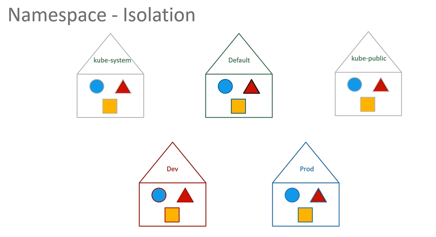
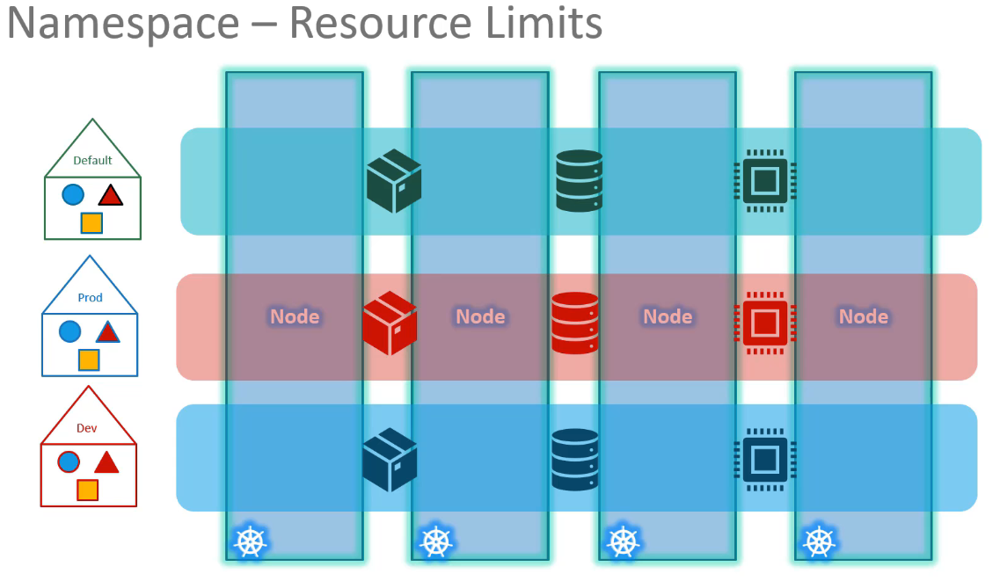
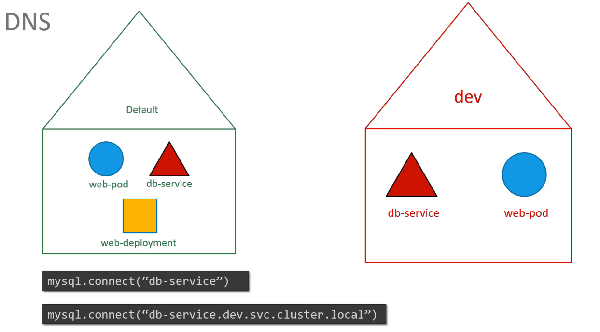
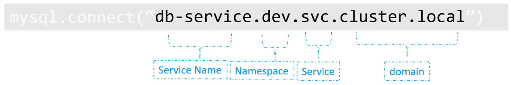
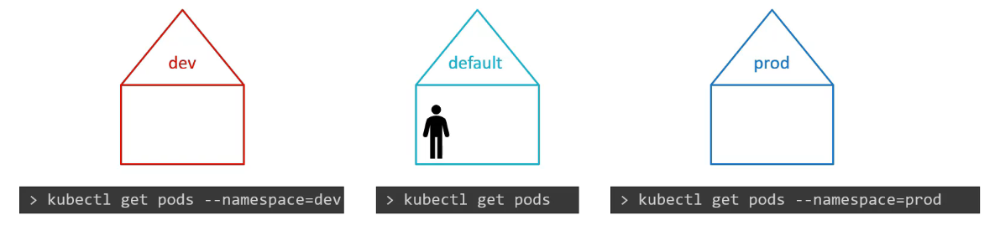

# Kubernetes 네임스페이스 요약


네임스페이스(Namespace)는 Kubernetes에서 격리된 환경을 제공합니다. 여러 네임스페이스를 사용함으로써, 서로 다른 사용자, 팀, 프로젝트의 리소스를 분리할 수 있습니다. 이는 마치 다른 집에 사는 두 명의 'Mark'를 구분하기 위해 성을 사용하는 것과 비슷합니다.

## 네임스페이스의 필요성



- **격리**: 네임스페이스는 리소스(예: Pods, Services)를 논리적으로 분리하여, 한 네임스페이스의 변경이 다른 네임스페이스에 영향을 주지 않도록 합니다.
- **리소스 관리**: 각 네임스페이스에 리소스 할당량(Quota)을 설정하여 리소스 사용을 제한할 수 있습니다.
- **접근 제어**: Role-Based Access Control(RBAC)을 사용하여, 네임스페이스별로 사용자의 권한을 관리할 수 있습니다.

## 기본 네임스페이스

Kubernetes는 클러스터 설치 시 `default`, `kube-system`, `kube-public` 등 기본 네임스페이스를 생성합니다.

- `default`: 사용자 정의 리소스가 기본적으로 생성되는 네임스페이스입니다.
- `kube-system`: Kubernetes 시스템이 사용하는 리소스가 위치하는 네임스페이스입니다.
- `kube-public`: 모든 사용자에게 공개된 리소스가 위치하는 네임스페이스입니다.

## 네임스페이스 사용 예시

### 네임스페이스 생성 CLI 명령어:



```yaml
apiVersion: v1
kind: Namespace
metatdata:
  name: dev
```

```sh
kubectl create -f <file 이름>
kubectl create namespace <네임스페이스 이름> # 명령어로 만들기
```

### 개발환경과 운영환경 분리

`dev`와 `prod` 네임스페이스를 생성할 수 있습니다.

리소스 조회 시 네임스페이스 지정:


```sh
# default namespace 변경
kubectl config set-context $(kubectl config current-context) --namespace=<네임스페이스 이름>

# 모든 네임스페이스 조회
kubectl get pods --all-namespaces
```

### 리소스를 특정 네임스페이스에 생성하는 YAML 파일 예시

```yaml
apiVersion: v1
kind: Pod
metadata:
  name: example-pod
  namespace: dev
  labels:
    app: myapp
    type: front-end
spec:
  containers:
    - name: example-container
      image: nginx
```

```sh
kubectl create -f <file이름> --namespce=<네임스페이스 이름>
```

이 YAML 파일은 `dev` 네임스페이스에 `nginx` 이미지를 사용하는 Pod를 생성합니다.

### 리소스를 할당하기 (Resoruce Quota)

```yaml
apiVersion: v1
kind: ResourceQuota
metadata:
  name: compute-quota
  namespace: dev
spec:
  hard:
    pods: "10"
    requests.cpu: "4"
    requests.memory: 5Gi
    limits.cpu: "10"
    limits.memory: 10Gi
```

## 네임스페이스 간 통신

네임스페이스 내의 리소스는 서로 간단한 이름을 사용하여 통신할 수 있지만, 다른 네임스페이스의 리소스와 통신할 때는 전체 도메인 이름을 사용해야 합니다.

예: `dbservice.dev.svc.cluster.local`

## 실습

네임스페이스를 사용하여 리소스를 관리하는 방법을 연습해 보세요. 네임스페이스를 생성하고, 특정 네임스페이스에 리소스를 배포하며, 네임스페이스별로 리소스를 조회하는 방법을 익혀보세요.

## K8s Reference Docs:

https://kubernetes.io/docs/concepts/overview/working-with-objects/namespaces/
https://kubernetes.io/docs/tasks/administer-cluster/namespaces-walkthrough/
https://kubernetes.io/docs/tasks/administer-cluster/namespaces/
https://kubernetes.io/docs/tasks/administer-cluster/manage-resources/quota-memory-cpu-namespace/
https://kubernetes.io/docs/tasks/access-application-cluster/list-all-running-container-images/
