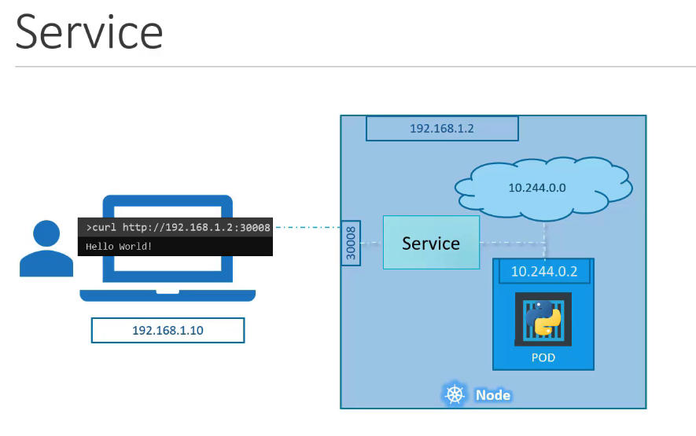
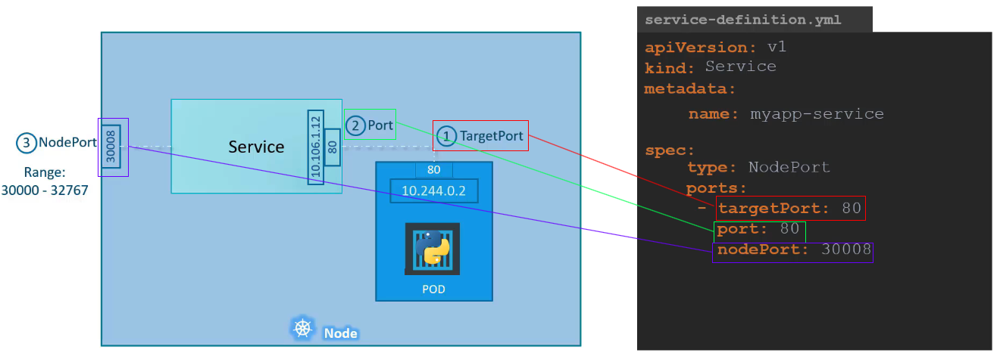
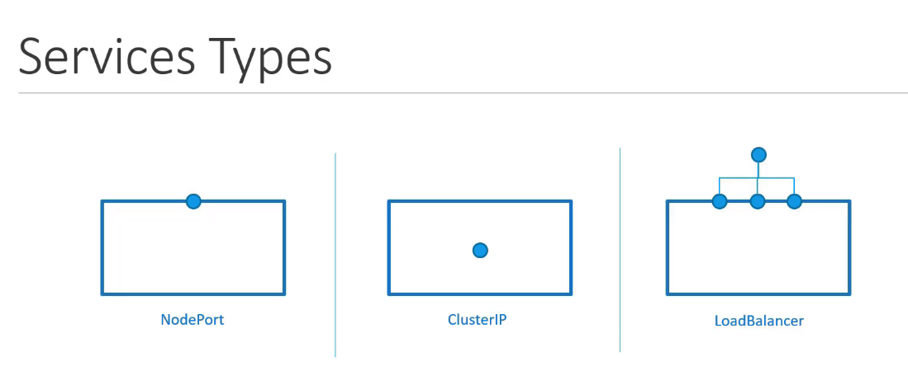

# NodePort

## NodePort Service를 통한 외부 접근



- Kubernetes 클러스터 내에 웹 애플리케이션을 실행하는 Pod가 있습니다.
- 사용자는 인터넷을 통해 이 웹 애플리케이션에 접근하려고 합니다.
- **문제**: Pod는 클러스터 내부 네트워크에 있으므로 외부에서 직접 접근할 수 없습니다.
- **해결책**: NodePort Service를 생성하여, 클러스터 외부에서 Node의 특정 포트로 요청을 보내면 이 요청이 내부 Pod의 웹 애플리케이션 포트로 전달되도록 합니다.

## NodePort Service 설명



1. Kubernetes Node의 IP가 `192.168.1.2`이고, 해당 Node에서 사용 가능한 포트는 `30008`입니다.
2. Pod 내부의 웹 애플리케이션은 포트 `80`에서 실행됩니다.
3. NodePort Service를 생성하여, 외부에서 `192.168.1.2:30008`로 요청을 보내면 내부 Pod의 포트 `80`으로 요청이 전달됩니다.
   :::tip
   targetPort를 지정하지 않으면 port와 동일하게 설정됩니다.  
   NodePort를 지정하지면 30000 - 32767 사이에 설정됩니다.  
   ports는 array. 여러개 mapping 가능합니다.  
   selector를 통해 어떤 pod가 service될지 알수 있습니다.
   :::

## Kubernetes Services 유형



1. **NodePort**: 내부 포트를 Node의 포트에 액세스 가능하게 함
2. **ClusterIP**: 클러스터 내에서 다른 서비스 간 통신을 가능하게 하는 가상 IP 생성
3. **LoadBalancer**: 지원되는 클라우드 제공자에서 애플리케이션의 LoadBalancer를 프로비저닝

## NodePort Service 예시

### NodePort Service YAML 정의

NodePort 서비스를 정의하는 YAML 파일 예시입니다. 이 예시에서는 웹 애플리케이션을 실행하는 포드를 외부에서 접근 가능하게 하는 NodePort 서비스를 생성합니다.

```yaml
apiVersion: v1
kind: Service
metadata:
  name: my-webapp-service
spec:
  type: NodePort
  selector:
    app: my-webapp
  ports:
    - protocol: TCP
      port: 80
      targetPort: 80
      nodePort: 30008
```

이 YAML 파일은 `my-webapp`이라는 레이블을 가진 포드들로 트래픽을 전달하는 NodePort 서비스를 정의합니다. 서비스는 클러스터 내의 모든 노드에서 `30008` 포트를 통해 접근할 수 있게 하며, 포드 내의 애플리케이션은 `80` 포트에서 실행됩니다.

### 서비스 생성 CLI 명령어

위의 YAML 파일을 사용하여 NodePort 서비스를 생성하는 CLI 명령어 예시입니다.

```bash
kubectl create service nodeport my-webapp-service --tcp=80:80 --node-port=30008 --dry-run=client -o yaml > my-webapp-service.yaml
```

이 명령어는 `my-webapp-service.yaml` 파일에 정의된 내용대로 쿠버네티스 클러스터에 NodePort 서비스를 생성합니다.

## NodePort Services 심층 분석

- 포드의 웹 서버에 대한 외부 액세스를 가능하게 하는 서비스 유형
- 포드, 서비스, 노드에 걸쳐 3개의 포트가 관련됨
- 서비스 정의 파일을 통해 생성되며, `type`, `ports`, `selector` 등의 필드를 포함

## K8s Reference Docs:

https://kubernetes.io/docs/tutorials/kubernetes-basics/expose/expose-intro/
