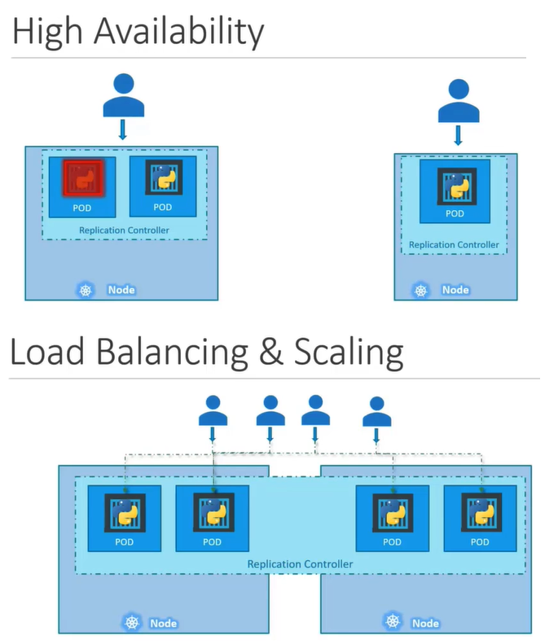

# Kubernetes 컨트롤러 소개


Kubernetes의 핵심 구성 요소인 컨트롤러에 대해 알아봅니다. 특히, 복제 컨트롤러(Replication Controller)에 초점을 맞춥니다.

## 컨트롤러란?

Kubernetes에서 컨트롤러는 오브젝트를 모니터링하고 적절히 반응하는 프로세스입니다. 컨트롤러는 Kubernetes의 '두뇌' 역할을 하며, 복제 컨트롤러는 다중 인스턴스의 Pod를 클러스터에서 실행하여 고가용성을 제공합니다.

## 복제 컨트롤러(Replication Controller)란?

- **목적**: 단일 Pod가 실패할 경우에도 애플리케이션에 대한 액세스를 유지하기 위해, 여러 인스턴스(복제본)의 Pod를 실행합니다.
- **기능**: 지정된 수의 Pod가 항상 실행되도록 보장합니다. 심지어 단일 Pod인 경우에도, 기존 Pod가 실패하면 자동으로 새 Pod를 생성합니다.

## Replica Controller와 Replica Set

- **Replication Controller**: 오래된 기술로, Replica Set으로 대체되고 있습니다.
- **Replica Set**: 권장되는 새로운 방법으로, 복제 컨트롤러와 유사한 목적을 가지나 세부 작동 방식에 차이가 있습니다.

### Replication Controller와 Replica Set의 차이점

- **API 버전**: Replication Controller는 `v1`에, Replica Set은 `apps/v1`에 지원됩니다.

- **Selector**: Replica Set은 반드시 `selector` 정의가 필요하며, 이는 Replica Set이 모니터링할 Pod를 식별하는 데 사용됩니다.

```yml
# replica controller
apiVersion: v1
kind: ReplicationController
metadata:
  name: myapp-rc
  labels:
    app: myapp
    type: front-end
spec:
  template:
    metadata:
      name: myapp-pod
      labels:
        app: myapp
        type: front-end
    spec:
      constainers:
        - name: nginx-container
          image: nginx
  replicas: 3
```

```yml
# replica set
apiVersion: apps/v1
kind: ReplicaSet
metadata:
  name: myapp-replicaset
  labels:
    app: myapp
    type: front-end
spec:
  template:
    metadata:
      name: myapp-pod
      labels:
        app: myapp
        type: front-end
    spec:
      constainers:
        - name: nginx-container
          image: nginx
  replicas: 3
  selector:
    matchLabels:
      type: front-end
```

## 복제 컨트롤러 및 Replica Set 생성

- YAML 정의 파일을 통해 Replication Controller 또는 Replica Set을 생성할 수 있습니다.
- 정의 파일은 `apiVersion`, `kind`, `metadata`, `spec` 섹션을 포함해야 합니다.

### 스케일링

복제 컨트롤러 또는 Replica Set을 스케일링하는 방법:

1. **정의 파일 수정**: 원하는 복제본 수로 `replicas` 값을 변경한 후, `kubectl apply`로 적용합니다.
2. **명령어를 통한 스케일링**: `kubectl scale` 명령어를 사용하여 복제본 수를 직접 변경할 수 있습니다.

## 주요 명령어

| 명령어                                            | 설명                                 |
| ------------------------------------------------- | ------------------------------------ |
| `kubectl create -f [파일명]`                      | YAML 파일을 사용해 리소스를 생성     |
| `kubectl get rc`                                  | 생성된 복제 컨트롤러 목록 보기       |
| `kubectl get rs`                                  | 생성된 Replica Set 목록 보기         |
| `kubectl delete [리소스] [이름]`                  | 리소스 삭제                          |
| `kubectl replace -f [파일명]`                     | 정의 파일을 사용하여 리소스 업데이트 |
| `kubectl scale --replicas=[수] -f [파일명]`       | 리소스의 복제본 수 변경 1            |
| `kubectl scale --replicas=[수] [type] [리소스명]` | 리소스의 복제본 수 변경 2            |

:::info
`kubectl scale --replicas=[수] [type] [리소스이름]`<br/>
type은 replicaset 혹은 replicacontroller
:::

컨트롤러는 Kubernetes에서 중요한 역할을 하며, 복제 컨트롤러 및 Replica Set을 통해 애플리케이션의 고가용성과 부하 분산을 구현할 수있습니다. 복제 컨트롤러와 Replica Set의 기본적인 구성과 기능, 그리고 이를 통해 Kubernetes 클러스터에서 Pod의 인스턴스를 관리하는 방법을 배웠습니다.

Replica Set을 사용하면 Pod의 복제본을 정의하고 관리할 수 있으며, 이를 통해 애플리케이션의 확장성과 장애 복구 능력을 향상시킬 수 있습니다. 또한, Replica Set은 셀렉터를 사용하여 관리 대상 Pod를 더욱 세밀하게 식별할 수 있습니다.

Kubernetes의 다양한 컨트롤러는 클러스터의 상태를 모니터링하고 원하는 상태를 유지하기 위해 필요한 조치를 취하는 핵심 구성요소입니다. 이러한 컨트롤러를 이해하고 사용하는 것은 Kubernetes를 효과적으로 운영하는 데 필수적입니다.

## K8s Reference Docs:

https://kubernetes.io/docs/concepts/workloads/controllers/replicaset/
https://kubernetes.io/docs/concepts/workloads/controllers/replicationcontroller/
