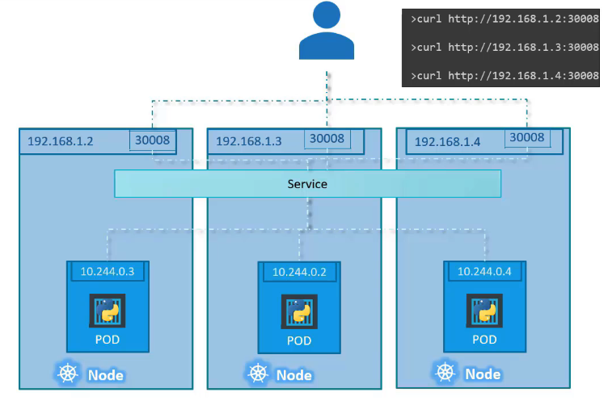

# Kubernetes Services

## Kubernetes Services란?

Kubernetes Services는 애플리케이션 내부 및 외부의 다양한 컴포넌트 간의 통신을 가능하게 합니다. 이를 통해 애플리케이션들을 서로 또는 사용자와 연결하는 데 도움이 됩니다.

### Services의 주요 기능

- **Frontend** 로드를 서빙하는 Pod 그룹, **Backend** 프로세스를 실행하는 그룹, 외부 데이터 소스에 연결하는 그룹 등 애플리케이션 내의 Pod 그룹 간 연결성 제공
- Frontend 애플리케이션을 최종 사용자에게 제공
- Backend와 Frontend Pods 간의 통신 지원
- 외부 데이터 소스와의 연결성 구축
- Microservices 간의 느슨한 결합을 가능하게 함

## Services의 Use Case

Kubernetes 네트워킹의 다양한 측면 중 외부 통신에 초점을 맞춥니다. Pod가 웹 애플리케이션을 실행할 때, 외부 사용자가 이 웹페이지에 어떻게 접근할 수 있는지 탐구합니다.

## 서비스와 Pod의 연결

- 서비스를 특정 Pod에 연결하기 위해 레이블과 셀렉터를 사용
- 서비스 정의 파일 내 `selector` 섹션을 통해 Pod를 식별

## 다중 Pod와의 연결

- 하나의 서비스가 여러 Pod를 자동으로 엔드포인트로 선택하여 외부 요청을 포워딩
- 로드밸런싱은 랜덤 알고리즘을 사용

## 요약

Kubernetes Services는 Pod의 추가 및 제거 시 자동으로 업데이트되며, 단일 노드, 단일 노드의 다중 Pod, 다중 노드의 다중 Pod 등 모든 경우에 동일하게 생성됩니다. Services는 일단 생성되면 일반적으로 추가 구성 변경 없이 유연하고 적응적입니다.

## K8s Reference Docs:

https://kubernetes.io/docs/concepts/services-networking/service/
