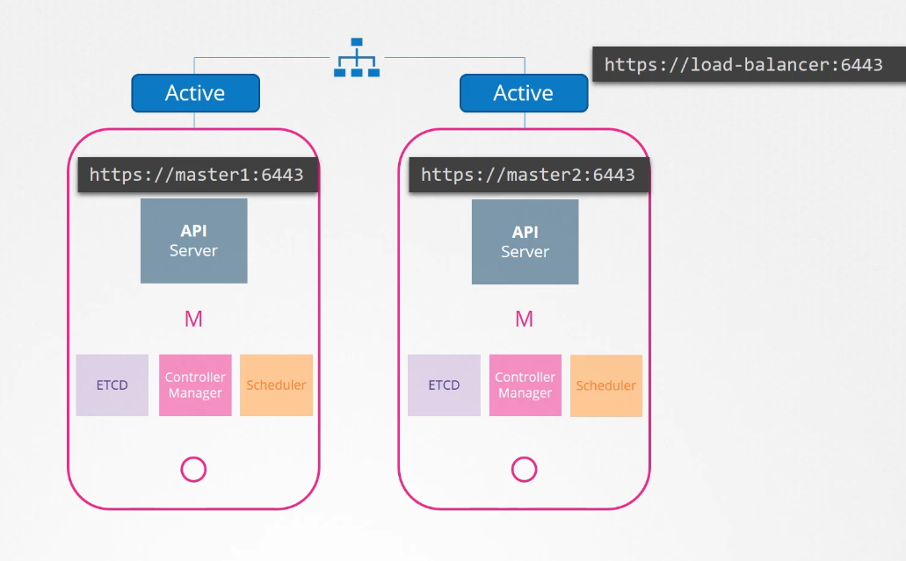
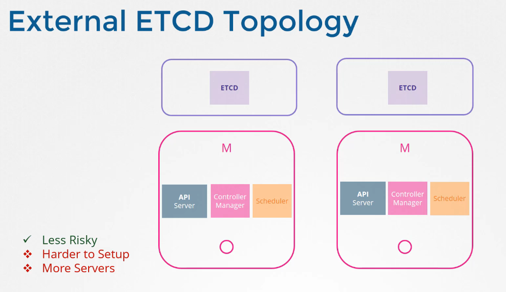
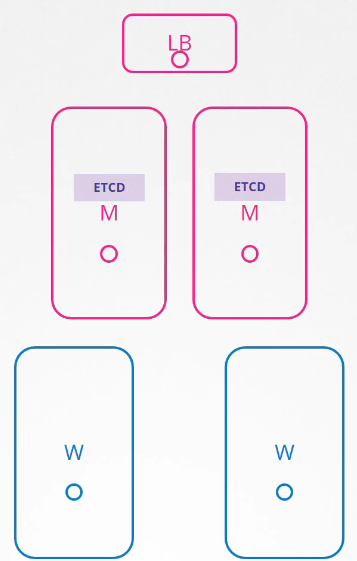

# Choosing a HA

클러스터의 마스터 노드가 다운되면 어떻게 될까요? 워커 노드와 컨테이너가 계속 작동하는 한 애플리케이션이 계속 실행되며 사용자는 문제가 발생하기 시작할 때까지 애플리케이션에 접근할 수 있습니다. 예를 들어, 워커 노드의 컨테이너나 포드가 충돌한다면, 이 포드가 복제 집합의 일부라면 복제 컨트롤러가 워커에게 새 포드를 로드하도록 지시해야 합니다. 그러나 마스터가 사용 불가능하고 마스터에 있는 컨트롤러와 스케줄러 또한 사용할 수 없습니다. 포드를 재생성하거나 노드에 스케줄할 수 없습니다.

이러한 이유로 프로덕션 환경에서는 여러 마스터 노드를 갖는 고가용성 구성을 고려해야 합니다. 고가용성 구성은 클러스터의 모든 구성 요소가 단일 장애 지점 없이 중복되도록 하는 것을 목표로 합니다.

## 고가용성 설정 이해하기

- **API 서버**: 여러 API 서버가 동시에 활성화되어 있을 수 있으며, 모든 클러스터 노드의 API 서버는 활성 활성 모드로 운영됩니다.
- **스케줄러와 컨트롤러 매니저**: 이들은 활성 대기 모드에서 운영되어야 하며, 리더 선출 과정을 통해 활성 리더가 결정됩니다.
- **etcd**: 고가용성을 위해 etcd는 클러스터에 분산될 수 있으며, API 서버는 etcd 인스턴스 리스트를 통해 etcd와 통신합니다.

### 마스터 노드에 로드 밸런서 설정

- API 서버 앞에 로드 밸런서(예: NGINX, HAProxy)를 구성하여 kube-control 유틸리티가 마스터 노드 중 하나로 요청을 보낼 수 있도록 합니다.

### 리더 선출 메커니즘

- 리더 선출은 Kubernetes 내에서 자동으로 수행되며, 이를 통해 스케줄러나 컨트롤러 매니저가 중복 작업을 수행하는 것을 방지합니다.

## etcd 설정

- etcd는 스택된 제어 평면 노드(topology) 또는 외부 etcd 서버를 사용하여 구성할 수 있습니다. 외부 etcd 설정은 더 안정적이지만 설정이 더 복잡합니다.

## 고가용성 클러스터의 구성

- 실제 클러스터 설정에서는 여러 마스터 노드를 구성하고, 필요에 따라 로드 밸런서를 통해 트래픽을 분산시킵니다. 이는 kube-config 파일에서 API 서버 주소를 로드 밸런서로 설정하여 관리할 수 있습니다.
