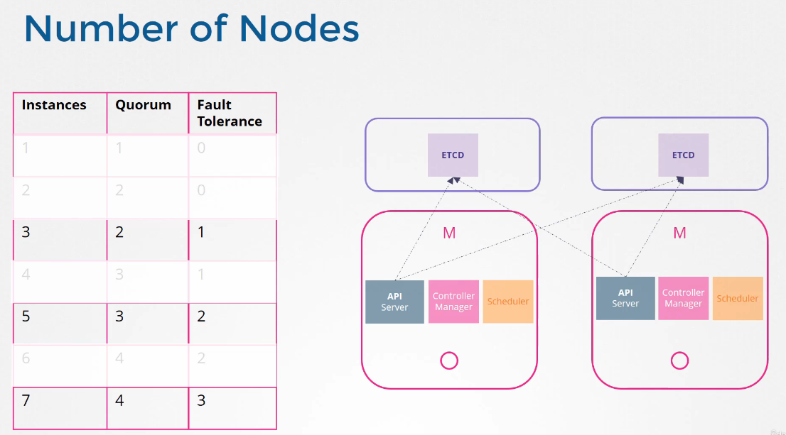
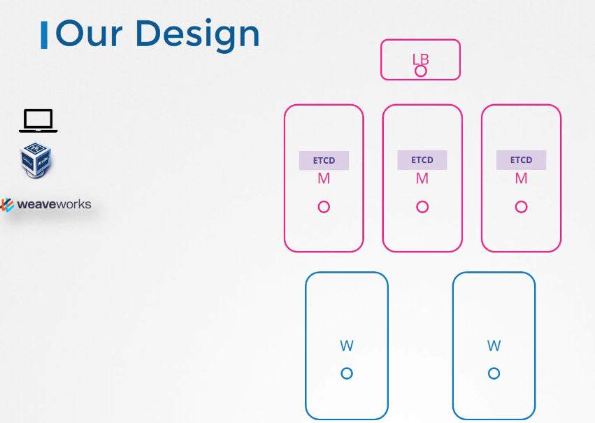

# ETCD in HA

쿠버네티스의 고가용성(High Availability, HA) 구성에서는 시스템의 모든 구성 요소가 중복되어 단일 장애 지점이 없도록 설계됩니다. 이는 마스터 노드, 워커 노드, 제어 평면 구성 요소 및 애플리케이션 포드 등 클러스터의 모든 부분에 적용됩니다.

## 고가용성(High Availability) 구성 이해하기

- **마스터 노드**: 프로덕션 환경에서는 다수의 마스터 노드를 사용하여 고가용성을 보장합니다.
- **etcd 클러스터**: etcd는 데이터 일관성을 유지하기 위해 raft 프로토콜을 사용하는 분산 키-값 저장소입니다.
- **API 서버**: 여러 API 서버가 활성-활성 모드로 운영되어, 하나의 API 서버에 장애가 발생해도 다른 서버가 요청을 처리할 수 있습니다.
- **스케줄러와 컨트롤러 매니저**: 이들은 리더 선출(leader election) 메커니즘을 통해 한 번에 하나만 활성화되어 운영됩니다.

### etcd의 고가용성 설정

etcd 클러스터는 일반적으로 3개 또는 5개의 노드로 구성됩니다. 클러스터의 노드 수가 홀수인 경우 네트워크 분할 시에도 더 높은 안정성을 제공합니다. etcd는 다음과 같이 설정될 수 있습니다:

1. **스택된 제어 평면 노드(topology)**: etcd가 마스터 노드와 함께 설치되어 관리가 용이하며 노드 수가 적습니다.
2. **외부 etcd 서버(topology)**: etcd를 별도의 서버에 설치하여 제어 평면의 장애가 etcd에 영향을 미치지 않도록 합니다. 이 구성은 더 복잡하지만 더 안정적입니다.

### 리더 선출 프로세스

- **리더 선출**: 컨트롤러 매니저와 스케줄러는 리더 선출을 통해 단일 활성 인스턴스가 클러스터를 관리하도록 합니다. 이는 중복 작업을 방지하고 효율성을 높입니다.

### etcd와 쿼럼

etcd 클러스터는 고가용성을 보장하기 위해 여러 노드에 걸쳐 데이터를 복제합니다. 클러스터 내의 모든 변경사항(데이터 쓰기)은 '쿼럼'에 의해 승인되어야 합니다. 쿼럼은 클러스터의 노드 중 과반수가 참여해야 하는 프로세스입니다.

#### 쿼럼의 중요성

쿼럼은 클러스터가 일관성 있는 상태를 유지하도록 하는 데 필수적입니다. 이는 etcd가 사용하는 Raft 합의 알고리즘의 핵심 원칙 중 하나입니다.

#### 쿼럼 계산 방법

쿼럼의 크기는 `(노드 수 / 2) + 1`로 계산됩니다. 예를 들어, 3개의 노드를 가진 클러스터에서는 쿼럼 크기가 2가 됩니다. 이는 클러스터의 상태를 변경하기 위해 적어도 2개의 노드가 동의해야 함을 의미합니다.

#### 쿼럼과 클러스터 장애

etcd 클러스터에서 쿼럼이 충족되지 않으면, 새로운 데이터를 쓰거나 클러스터의 상태를 변경할 수 없습니다. 이는 클러스터가 분할된 상태에서 일부 노드만 작동 가능한 상황에서도 중요합니다. 예를 들어, 5개 노드의 클러스터가 있고, 네트워크 이슈로 2개 노드만 접근 가능한 경우, 쿼럼이 충족되지 않아 클러스터는 쓰기 작업을 수행할 수 없습니다.

### 로드 밸런서를 통한 API 서버 접근

- **로드 밸런서**: 클라이언트 요청을 여러 마스터 노드에 분산시켜 고가용성을 제공합니다. NGINX, HAProxy 등을 사용할 수 있습니다.

