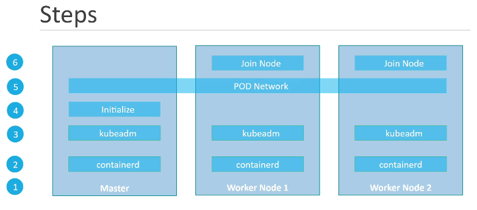

# Introduction - Kubeadm

## 순서

1. [container runtime containerD 설치](https://kubernetes.io/docs/setup/production-environment/tools/kubeadm/install-kubeadm/#installing-runtime)
   - [Install and configure prerequisites](https://kubernetes.io/docs/setup/production-environment/container-runtimes/#install-and-configure-prerequisites)
   - [Getting started with containerd](https://github.com/containerd/containerd/blob/main/docs/getting-started.md#option-2-from-apt-get-or-dnf)
   - [Ubuntu install using th apt repository](https://docs.docker.com/engine/install/ubuntu/#install-using-the-repository)
     - 마지막에 docker만 설치한다.
   - master, worcker 모두 설치
2. [cgroup drivers](https://kubernetes.io/docs/setup/production-environment/container-runtimes/#cgroup-drivers)
   - `ps -p 1` 명령어로 cgroupfs 또는 systemd인지 확인
   - [systemd일 경우](https://kubernetes.io/docs/setup/production-environment/container-runtimes/#containerd)
     - vi로 파일내용을 모두 지우고 입력
     - master, worcker 모두 설치
3. [Installing kubeadm, kubelet and kubectl](https://kubernetes.io/docs/setup/production-environment/tools/kubeadm/install-kubeadm/#installing-kubeadm-kubelet-and-kubectl)
   - master, worcker 모두 설치
4. [Initializing your control-plane node](https://kubernetes.io/docs/setup/production-environment/tools/kubeadm/create-cluster-kubeadm/#initializing-your-control-plane-node)
   - `kubeadm init --pod-network-cidr=10.32.0.0/16 --apiserver-advertise-address={ip add를 통해 interface 확인}`
   - 실행 후 명령어 실행
   - master 만
5. [Networking and Network Policy](https://kubernetes.io/docs/concepts/cluster-administration/addons/#networking-and-network-policy)
   - 여기서는 weavenet 사용
   - 필요하다면 `kubectl edit ds weve-net -n kube-system`으로 `IPALLOC_RANGE` 수정
   - `4.`에서 `kubeadm join`으로 시작하는 명령어 worker에 실행

## referrence

https://kubernetes.io/docs/setup/production-environment/tools/kubeadm/install-kubeadm/ 
https://github.com/kodekloudhub/certified-kubernetes-administrator-course/blob/master/kubeadm-clusters/apple-silicon/docs/01-prerequisites.md
