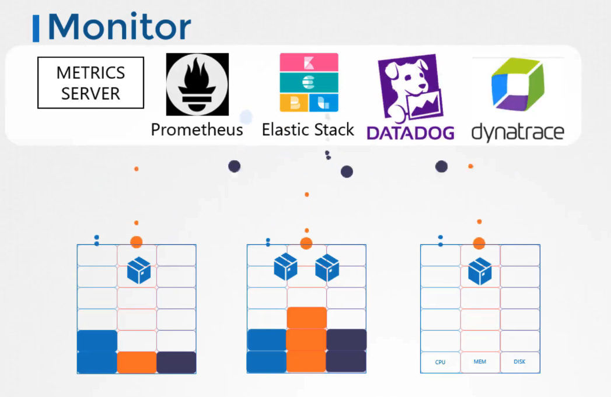

# 쿠버네티스 클러스터 모니터링

## 모니터링이란?

쿠버네티스 클러스터의 자원 사용량, 건강 상태 및 성능 지표를 실시간으로 관찰하고 분석하는 과정입니다. 여기에는 노드와 파드 레벨에서의 CPU, 메모리, 네트워크, 디스크 사용량 같은 성능 지표가 포함됩니다.

## 왜 중요한가?

- **노드 건강 상태**와 **성능 지표** 모니터링은 클러스터의 안정성과 효율성을 유지하는 데 필수적입니다.
- **파드 성능 지표**는 개별 애플리케이션의 건강과 성능을 모니터링하는 데 도움을 줍니다.

## 쿠버네티스 모니터링 솔루션



- 쿠버네티스는 기본적으로 완전한 모니터링 솔루션을 제공하지 않습니다.
- **Metrics Server**, **Prometheus**, **Elastic Stack**, **Datadog**, **Dynatrace**와 같은 다양한 오픈 소스 및 상용 솔루션을 사용할 수 있습니다.
- **Heapster**는 이제 사용되지 않으며, **Metrics Server**로 대체되었습니다.

## Metrics Server

- 쿠버네티스 클러스터당 하나의 Metrics Server를 가질 수 있습니다.
- 메트릭을 수집하여 메모리에 저장하지만, 디스크에는 저장하지 않아 역사적 성능 데이터를 볼 수 없습니다.

### minikube

```shell
# Minikube에서 Metrics Server 활성화
minikube addons enable metrics-server
```

### kubctl

```shell
# clone repo
git clone https://github.com/kubernetes-incubator/metrics-server.git

# deloy
kubectl create -f metric-server/deploy/1.8+/

# view cluster performance
kubectl top node

# view performance metrics of pd
kubectl top pod
```

## 성능 메트릭 보기

- **노드 메트릭 확인**: \`kubectl top node\` 명령어로 각 노드의 CPU와 메모리 사용량을 확인할 수 있습니다.
- **파드 메트릭 확인**: \`kubectl top pod\` 명령어로 파드의 성능 지표를 볼 수 있습니다.
