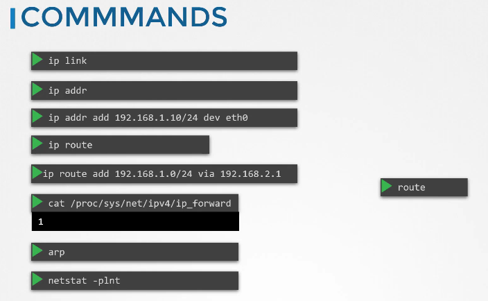

# 쿠버네티스 클러스터의 네트워크 구성

## 마스터 노드와 워커 노드의 네트워크 설정

쿠버네티스 클러스터를 구성할 때, 각 마스터 노드와 워커 노드는 최소 하나의 네트워크 인터페이스를 가지고 있어야 하며, 이 인터페이스에는 유일한 IP 주소가 설정되어야 합니다. 또한, 각 호스트는 고유한 호스트 이름과 MAC 주소를 가져야 합니다. VM을 복제하여 노드를 생성한 경우, 이러한 설정이 중복되지 않도록 주의해야 합니다.

### 필요한 포트 열기

쿠버네티스의 각 컴포넌트가 통신할 수 있도록 다음 포트들이 열려 있어야 합니다:

- **6443**: API 서버 접근을 위한 포트
- **10250**: 모든 노드에 있는 Kubelet이 사용하는 포트
- **10259**: Kube Scheduler
- **10257**: Kube Controller Manager
- **30000-32767**: 외부 서비스 접근을 위한 NodePort 서비스 범위
- **2379 & 2380**: ETCD 서버와 클라이언트 간 통신 포트

### 네트워크 보안 설정

네트워크를 설정할 때는 방화벽, IP 테이블 규칙, 클라우드 환경의 네트워크 보안 그룹 설정을 포함하여, 위 포트들이 올바르게 열려 있는지 확인해야 합니다. 설정이 올바르게 적용되지 않았다면, 클러스터의 네트워킹 문제가 발생할 수 있습니다.

## 실습 세션

이제 실습 세션으로 넘어가서 기존 환경에서 네트워크 설정을 직접 확인해 보겠습니다. 다음 명령어들을 사용하여 네트워크 인터페이스, IP 주소, 호스트 이름, 포트 등의 정보를 확인할 수 있습니다.

```bash
# 네트워크 인터페이스와 IP 주소 확인
ip addr show

# 시스템의 호스트 이름 확인
hostname

# 특정 포트의 네트워크 상태 확인
sudo netstat -tulpn | grep LISTEN
```



## References Docs

https://kubernetes.io/docs/setup/production-environment/tools/kubeadm/install-kubeadm/#check-required-ports<br/>
https://kubernetes.io/docs/concepts/cluster-administration/networking/
