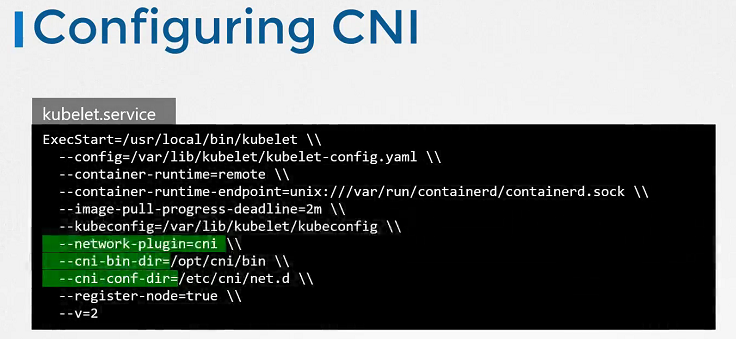

# 쿠버네티스에서 CNI 구성하기

## CNI의 역할과 설정

쿠버네티스 클러스터에서 CNI는 컨테이너 네트워크를 구성하고 관리하는 중요한 역할을 합니다. 각 노드에서 실행되는 kubelet 서비스는 CNI 플러그인을 호출하여 포드에 네트워크 네임스페이스를 할당하고 적절한 네트워크에 연결합니다.

### kubelet에서 CNI 설정 확인하기



kubelet의 설정 파일이나 실행 중인 서비스에서 다음과 같은 CNI 관련 옵션을 확인할 수 있습니다:

- `--network-plugin=cni`: kubelet이 CNI를 사용하도록 설정합니다.
- `--cni-conf-dir`: CNI 구성 파일이 위치한 디렉토리를 지정합니다.
- `--cni-bin-dir`: CNI 플러그인 바이너리가 위치한 디렉토리를 지정합니다.

```bash
systemctl status kubelet.service

# kubelet의 CNI 관련 설정 확인
ps aux | grep kubelet
```

## CNI Plugin 확인

- 모든 지원 플러그인 확인

  ```sh
  ls /opt/cni/bin
  ```

- CNI 플러그인 확인
  ```sh
  ls /etc/cni/net.d
  ```

### CNI 구성 파일의 예시

CNI 구성 파일은 JSON 형식으로 작성되며, 네트워크 플러그인의 타입과 필요한 설정을 정의합니다. 예를 들어, 다음은 `bridge` 플러그인을 사용하는 간단한 CNI 구성의 예입니다:

```json
{
  "cniVersion": "0.3.1",
  "name": "k8s-pod-network",
  "type": "bridge",
  "bridge": "kube-bridge",
  "isGateway": true,
  "ipMasq": true,
  "ipam": {
    "type": "host-local",
    "subnet": "10.85.0.0/16"
  }
}
```

이 구성 파일은 `kube-bridge`라는 브리지 네트워크를 생성하고, IP 마스커레이딩을 활성화하여 포드 간의 통신과 외부 네트워크 연결을 관리합니다.

## References Docs

https://kubernetes.io/docs/reference/command-line-tools-reference/kubelet/
https://kubernetes.io/docs/concepts/extend-kubernetes/compute-storage-net/network-plugins/
