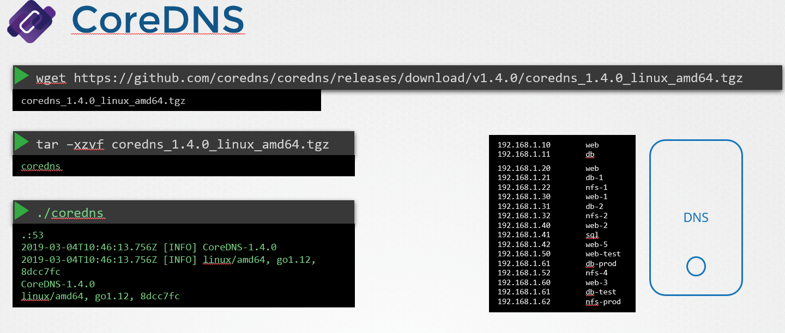
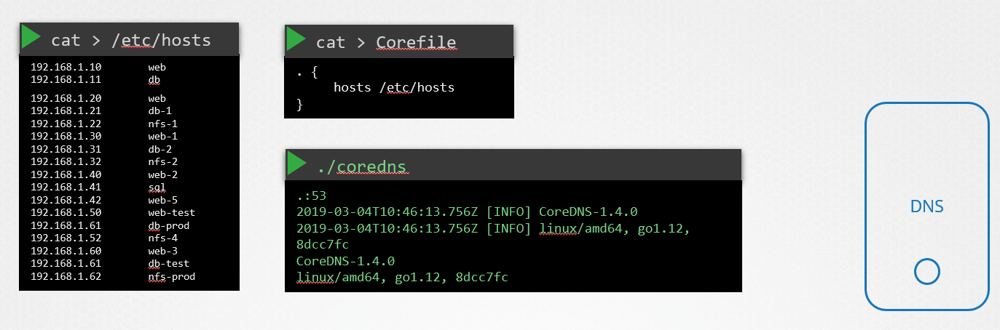

# CoreDNS 설정하기

## CoreDNS란 무엇인가?

CoreDNS는 고도로 플러그인화 가능한 DNS 서버로, 다양한 DNS 쿼리를 처리할 수 있습니다. Kubernetes, 클라우드 서비스 및 각종 IT 인프라에서 네임 리졸루션을 관리하는 데 사용됩니다. CoreDNS는 간단하면서도 강력한 설정 옵션을 제공하여, 사용자가 필요에 따라 DNS 서비스를 맞춤 설정할 수 있게 해줍니다.

### CoreDNS의 주요 특징

- **플러그인 기반 아키텍처**: 다양한 기능을 추가할 수 있는 플러그인 시스템을 제공합니다.
- **고성능**: 작고, 효율적이며, 동시에 여러 DNS 요청을 빠르게 처리할 수 있습니다.
- **유연성**: 단순한 도메인 네임 리졸루션에서부터 복잡한 네트워킹 규칙에 이르기까지 다양한 시나리오에 대응할 수 있습니다.

## CoreDNS 설치하기

CoreDNS는 다양한 방법으로 설치할 수 있습니다. 여기서는 전통적인 방법인 바이너리 다운로드를 통해 설치하는 과정을 안내합니다.

### 다운로드 및 설치



1. CoreDNS의 최신 버전을 다운로드합니다. 다운로드는 GitHub 릴리스 페이지에서 할 수 있습니다.

   ```bash
   wget https://github.com/coredns/coredns/releases/download/v1.8.3/coredns_1.8.3_linux_amd64.tgz
   ```

2. 다운로드 받은 파일을 압축 해제합니다.

   ```bash
   tar -xvzf coredns_1.8.3_linux_amd64.tgz
   ```

3. 압축 해제된 디렉토리에서 CoreDNS 실행 파일을 찾을 수 있습니다.

### CoreDNS 실행

CoreDNS를 실행하려면 다음 명령어를 사용합니다.

```bash
./coredns
```

이 명령은 CoreDNS를 시작하고, 기본적으로 53번 포트에서 DNS 요청을 수신하도록 설정합니다.

## CoreDNS 구성하기


CoreDNS는 `Corefile`을 통해 구성됩니다. 이 파일에서 DNS 쿼리 처리 방법을 정의할 수 있습니다.

```bash
cat > /etc/hosts
192.168.1.10    web
192.168.1.11    db
192.168.1.15    web-1
192.168.1.16    db-1
192.168.1.21    web-2
192.168.1.22    db-2
```

### Corefile 예시

```
cat > Corefile
. {
	hosts   /etc/hosts
}
```

```
.:53 {
    hosts {
        192.168.1.10 hostA
        192.168.1.11 hostB
        fallthrough
    }
    cache
    forward . 8.8.8.8
}
```

이 구성은 로컬 호스트 파일을 사용하여 특정 IP에 대한 요청을 처리하고, 캐시를 활성화하며, 알려지지 않은 모든 요청을 Google의 DNS 서버(`8.8.8.8`)로 전달합니다.

## 결론

CoreDNS를 사용하면 네트워크 환경에서 DNS 서버를 효과적으로 관리하고, 다양한 네트워크 요구 사항에 맞춰 DNS 서비스를 제공할 수 있습니다. 다음 강의에서는 CoreDNS를 사용한 고급 DNS 서비스 구성 방법을 배울 예정

## referrence

https://github.com/kubernetes/dns/blob/master/docs/specification.md<br/>
https://coredns.io/plugins/kubernetes/
