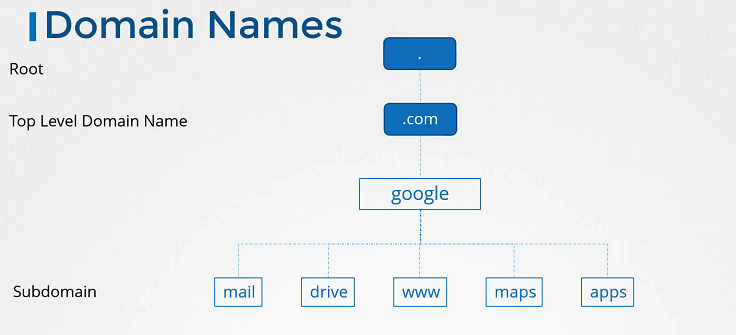
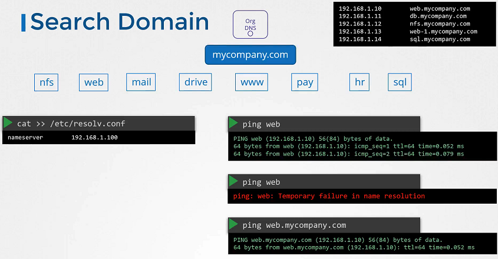

# DNS (Domain Name System) 이해하기

## DNS란 무엇인가?

DNS는 인터넷에서 도메인 이름을 숫자로 된 인터넷 프로토콜(IP) 주소로 매핑하는 시스템입니다. 예를 들어, www.example.com이라는 도메인 이름을 입력할 때, DNS 서버는 이를 해당 서버의 IP 주소인 93.184.216.34로 변환하여 컴퓨터가 해당 서버와 통신할 수 있도록 도와줍니다.

### DNS의 필요성

컴퓨터는 숫자로 된 주소를 사용하여 서로를 식별하고 통신합니다. 하지만 사람들에게는 이러한 숫자들을 기억하는 것이 어렵기 때문에, DNS는 기억하기 쉬운 도메인 이름을 IP 주소로 변환하는 역할을 합니다.

### DNS 작동 방식

1. 사용자가 웹 브라우저에 URL을 입력합니다.
2. 입력된 도메인 이름은 사용자의 로컬 DNS 서버로 전송됩니다.
3. 로컬 DNS 서버는 도메인 이름에 해당하는 IP 주소를 조회합니다.
   - IP 주소가 캐시에 있으면 바로 사용자에게 반환됩니다.
   - 캐시에 없는 경우, 더 상위의 DNS 서버에 조회를 요청합니다.
4. DNS 조회 과정을 거쳐 IP 주소가 발견되면, 최종 IP 주소가 사용자의 컴퓨터로 반환됩니다.
5. 사용자의 컴퓨터는 이 IP 주소를 사용하여 해당 서버에 연결합니다.

### DNS 구성 요소



- **도메인 이름**: 사용자가 기억하고 입력하기 쉬운 웹 사이트 주소(예: www.google.com).
- **DNS 서버**: 도메인 이름을 IP 주소로 변환하는 서버.
- **레코드**: DNS 서버에 저장된 데이터. 주요 레코드 유형에는 A(주소 레코드), AAAA(IPv6 주소 레코드), CNAME(별칭 레코드) 등이 있습니다.

## 실습과 예제


이론을 마친 후, 실제 환경에서 DNS 설정을 확인하고 수정하는 방법을 실습합니다. 예를 들어, `/etc/hosts` 파일을 수정하여 로컬 컴퓨터에서 특정 도메인 이름을 특정 IP 주소로 해석하도록 설정할 수 있습니다.

```bash
# /etc/hosts 파일에 다음 엔트리를 추가하여 로컬 DNS 해석을 설정
192.168.1.11 db
```

이 설정은 시스템에 `db`라는 도메인 이름으로 `192.168.1.11` IP 주소를 사용하도록 지시합니다. 이렇게 하면 `ping db`를 실행할 때 `192.168.1.11`로 핑을 보낼 수 있습니다.

## DNS의 역할 확장

DNS 설정이 실제 네트워크 환경에서 어떻게 적용되는지를 예로 들어 설명하겠습니다. 가정한 시나리오에서 두 대의 컴퓨터, A와 B가 있으며, 각각 IP 주소 `192.168.1.10`과 `192.168.1.11`이 할당되어 있습니다. 컴퓨터 B에는 데이터베이스 서비스가 있고, 이를 `db`라는 이름으로 접근하고 싶다고 가정해 봅시다.

### DNS 사용의 이점

IP 주소 대신 `db`라는 이름을 사용하면, 사용자는 해당 서비스에 접근하기 위해 IP를 기억할 필요 없이, 직관적인 이름을 사용하여 접근할 수 있습니다. 이는 특히 IP 주소가 변경될 경우, DNS 레코드만 업데이트하면 되므로 관리가 훨씬 간편해집니다.

### /etc/hosts 파일 설정

초기 설정으로, 컴퓨터 A의 `/etc/hosts` 파일에 다음과 같은 항목을 추가하여 `db`라는 이름을 컴퓨터 B의 IP 주소에 매핑할 수 있습니다.

```bash
192.168.1.11 db
```

이제 `ping db` 명령을 실행하면 컴퓨터 A는 `db`라는 이름으로 컴퓨터 B의 IP 주소 `192.168.1.11`로 핑을 보냅니다.

### DNS 서버로의 전환

네트워크가 확장되면서 `/etc/hosts` 파일을 각 시스템마다 관리하는 것이 비효율적이 되었을 때, 중앙 집중식 DNS 서버를 사용하는 것이 이상적입니다. DNS 서버 설정은 `/etc/resolv.conf` 파일을 통해 이루어집니다.

#### DNS 서버 설정 예시

DNS 서버의 IP가 `192.168.1.100`일 때, 각 호스트의 `/etc/resolv.conf` 파일에 다음과 같이 추가합니다.

```bash
nameserver 192.168.1.100
```

이제 모든 이름 해석 요청은 중앙 DNS 서버로 전송되어 처리됩니다. 이 방식은 IP 주소가 변경되거나 새 서비스가 추가되었을 때 DNS 레코드만 갱신하면 모든 클라이언트가 새 정보를 자동으로 인지할 수 있게 해 줍니다.

## 결론

DNS는 인터넷의 핵심 부분으로, 도메인 이름과 IP 주소의 매핑을 관리합니다. 이를 통해 사용자는 URL을 통해 쉽게 웹사이트에 접근할 수 있으며, 시스템 관리자는 네트워크 트래픽을 효율적으로 관리할 수 있습니다.
DNS는 네트워크 내에서 이름 해석을 통해 자원에 접근하는 방법을 제공합니다. 이를 통해 사용자는 IP 주소를 직접 기억하거나 입력할 필요 없이, 친숙한 도메인 이름을 사용하여 네트워크 자원을 쉽게 찾을 수 있습니다. `/etc/hosts` 파일로 시작하여 필요에 따라 DNS 서버로 전환함으로써 더 큰 네트워크 환경에서도 효과적으로 이름 해석 기능을 확장할 수 있습니다.
