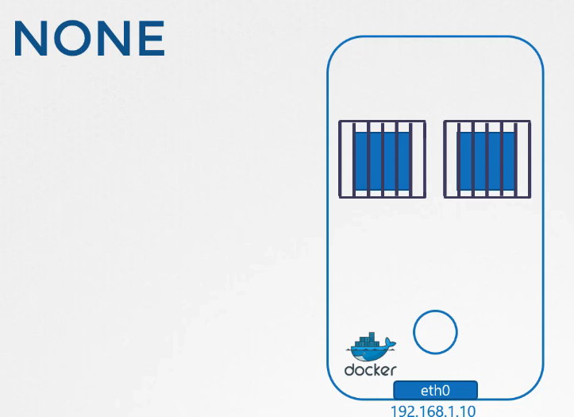
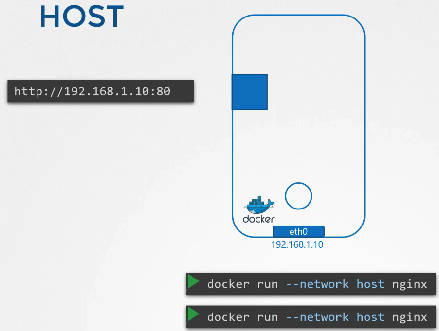
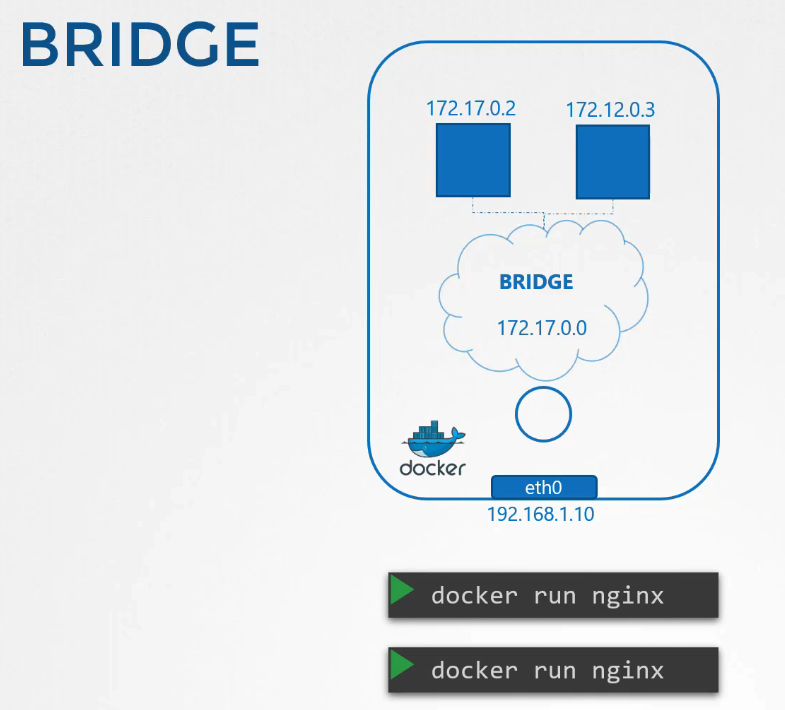

# Docker에서의 네트워킹 이해

## Docker 네트워크 옵션

Docker에서 컨테이너를 실행할 때 다음과 같은 네트워크 옵션을 선택할 수 있습니다:

1. **None Network**: 이 옵션을 선택하면 컨테이너는 어떠한 네트워크에도 연결되지 않습니다. 컨테이너는 외부 세계와의 통신이 불가능하며, 외부로부터 접근도 받지 않습니다.
   
2. **Host Network**: 호스트 네트워크 옵션을 사용하면 컨테이너가 호스트의 네트워크에 직접 연결됩니다. 이 경우, 네트워크 격리가 없어 컨테이너는 호스트와 동일한 IP와 포트를 공유합니다.
   
3. **Bridge Network**: 이것은 Docker의 기본 네트워크 모드로, Docker 호스트 내부에 가상의 프라이빗 네트워크를 생성합니다. 모든 컨테이너는 이 내부 네트워크에 연결되며, 서로 통신이 가능합니다.
   

### 브리지 네트워크 상세 분석

Docker가 설치되면 기본적으로 'bridge'라는 이름의 내부 프라이빗 네트워크를 생성합니다. 이 네트워크는 호스트 상에서 `docker0`라는 인터페이스로 표현됩니다. 이 네트워크는 컨테이너가 서로 및 호스트와 통신할 수 있는 가상의 스위치 역할을 합니다.

```bash
# Docker 네트워크 목록 확인
docker network ls

# 호스트에서 네트워크 인터페이스 확인
ip link show
```

컨테이너가 생성될 때, Docker는 네트워크 네임스페이스를 생성하고, 가상 이더넷 케이블을 통해 컨테이너를 브리지 네트워크에 연결합니다. 이 과정에서 각 컨테이너는 고유의 IP 주소를 할당받으며, 이 주소는 브리지 네트워크의 주소 범위 내에서 설정됩니다.

### 포트 매핑과 외부 접근

컨테이너가 내부 네트워크에 격리되어 있을 때, 외부에서 컨테이너의 애플리케이션에 접근하기 위해서는 포트 매핑이 필요합니다. Docker는 호스트의 특정 포트를 컨테이너의 포트에 매핑하는 기능을 제공하여, 외부 사용자가 호스트의 IP와 매핑된 포트를 통해 컨테이너에 접근할 수 있도록 합니다.

```bash
# 컨테이너 실행 시 포트 매핑 설정
docker run -p 8080:80 nginx
```

이 명령은 Docker 호스트의 8080 포트를 컨테이너의 80 포트에 매핑합니다. 이를 통해 외부 사용자는 호스트의 IP 주소와 8080 포트를 사용하여 컨테이너의 웹 서비스에 접근할 수 있습니다.

## References docs

https://docs.docker.com/network/
https://linux.die.net/man/8/iptables
https://linux.die.net/man/8/ip
