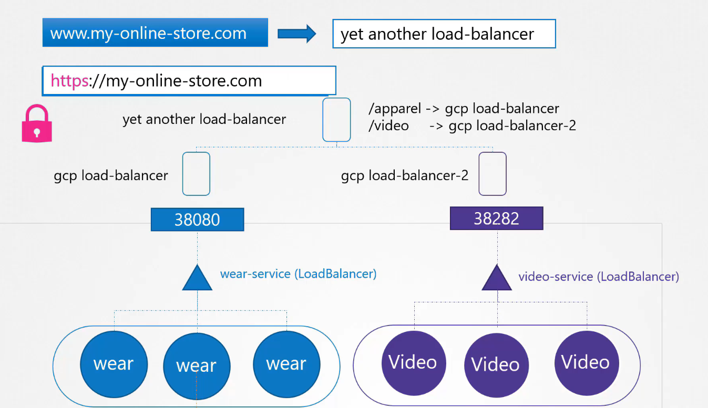
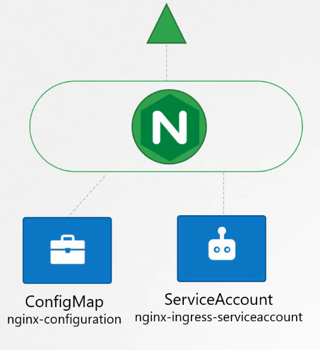
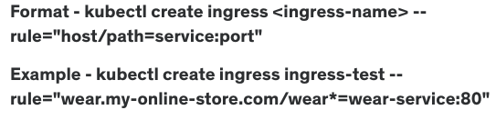

# 쿠버네티스에서의 인그레스(Ingress)



## 인그레스 소개

쿠버네티스의 인그레스는 클러스터 외부에서 오는 요청을 클러스터 내의 서비스로 라우팅하는 객체입니다. 인그레스는 보다 세밀한 HTTP/HTTPS 라우팅 규칙을 설정할 수 있게 해줍니다.

## 서비스와 인그레스의 차이

- **서비스(Service)**: 특정 포드의 집합에 대한 접근을 제공하며, 내부 로드밸런싱을 수행합니다.
- **인그레스(Ingress)**: 외부 요청을 받아서 여러 서비스로 라우팅하는 규칙을 정의합니다. URL 경로, 도메인 이름 등에 따라 트래픽을 다른 서비스로 분배할 수 있습니다.

## 인그레스의 주요 기능

1. **URL 기반 라우팅**: 다른 URL 경로에 따라 다른 서비스로 요청을 라우팅합니다.
2. **도메인 기반 라우팅**: 요청의 호스트 이름에 따라 요청을 라우팅합니다.
3. **SSL/TLS 종료**: HTTPS 트래픽을 처리하고 SSL/TLS 인증서를 관리합니다.

## 인그레스 컨트롤러

인그레스 리소스를 처리하려면 인그레스 컨트롤러가 필요합니다. Nginx, Traefik 등 다양한 인그레스 컨트롤러가 있습니다.

## Nginx 인그레스 컨트롤러



### ConfigMap

```yaml
kind: ConfigMap
apiVersion: v1
metadata:
  name: nginx-configuration
```

### Deployment

```yaml
apiVersion: apps/v1
kind: Deployment
metadata:
  name: ingress-controller
spec:
  replicas: 1
  selector:
    matchLabels:
      name: nginx-ingress
  template:
    metadata:
      labels:
        name: nginx-ingress
    spec:
      serviceAccountName: ingress-serviceaccount
      containers:
        - name: nginx-ingress-controller
          image: quay.io/kubernetes-ingress-controller/nginx-ingress-controller:0.21.0
          args:
            - /nginx-ingress-controller
            - --configmap=$(POD_NAMESPACE)/nginx-configuration
          env:
            - name: POD_NAME
              valueFrom:
                fieldRef:
                  fieldPath: metadata.name
            - name: POD_NAMESPACE
              valueFrom:
                fieldRef:
                  fieldPath: metadata.namespace
          ports:
            - name: http
              containerPort: 80
            - name: https
              containerPort: 443
                  number: 80
```

### Service Account

```yaml
apiVersion: v1
kind: ServiceAccount
metadata:
  name: nginx-ingress-serviceaccount
```

### Service Type - NodePort

```yaml
# service-Nodeport.yaml

apiVersion: v1
kind: Service
metadata:
  name: ingress
spec:
  type: NodePort
  ports:
    - port: 80
      targetPort: 80
      protocol: TCP
      name: http
    - port: 443
      targetPort: 443
      protocol: TCP
      name: https
  selector:
    name: nginx-ingress
```

## Nginx 인그레스 리소

### ingress-wear.yaml

```yaml
apiVersion: extensions/v1beta1
kind: Ingress
metadata:
  name: ingress-wear
spec:
  backend:
    serviceName: wear-service
    servicePort: 80
```

### Rules

#### 1 Rule and 2 Paths.

```yaml
apiVersion: extensions/v1beta1
kind: Ingress
metadata:
  name: ingress-wear-watch
spec:
  rules:
    - http:
        paths:
          - path: /wear
            backend:
              serviceName: wear-service
              servicePort: 80
          - path: /watch
            backend:
              serviceName: watch-service
              servicePort: 80
```

#### 2 Rules and 1 Path each.

```yaml
# Ingress-wear-watch.yaml

apiVersion: extensions/v1beta1
kind: Ingress
metadata:
  name: ingress-wear-watch
spec:
  rules:
    - host: wear.my-online-store.com
      http:
        paths:
          - backend:
              serviceName: wear-service
              servicePort: 80
    - host: watch.my-online-store.com
      http:
        paths:
          - backend:
              serviceName: watch-service
              servicePort: 80
```



## 인그레스(Ingress) - `rewrite-target` 옵션

### URL 재작성이 필요한 이유

쿠버네티스 클러스터 내에서 인그레스를 사용할 때, 특정 URL 경로로 오는 요청을 백엔드 서비스로 정확히 라우팅하려면 경로 재작성이 필요할 수 있습니다. 예를 들어, 사용자가 입력한 URL의 특정 부분을 제거하거나 변경해야 할 때 `rewrite-target` 옵션을 사용합니다.

### `rewrite-target` 옵션의 기능

- **기본 동작**: 인그레스에 설정된 경로(`/watch`, `/wear` 등)를 백엔드 서비스에 그대로 전달하면, 백엔드 애플리케이션에서 해당 경로를 처리할 수 없어 404 오류가 발생할 수 있습니다.
- **경로 재작성**: 요청을 받을 때 URL의 일부를 다른 값으로 치환하여 백엔드 서비스로 전달합니다. 이렇게 하면 애플리케이션이 요구하는 URL 형식에 맞춰 요청을 처리할 수 있습니다.

### 예시: NGINX 인그레스 컨트롤러의 `rewrite-target` 설정

다음은 `/watch`와 `/wear` 경로로 들어온 요청을 각각의 서비스로 전달하기 위해 `rewrite-target`을 사용하는 설정 예시입니다.

```yaml
apiVersion: networking.k8s.io/v1
kind: Ingress
metadata:
  name: simple-rewrite
  annotations:
    nginx.ingress.kubernetes.io/rewrite-target: /
spec:
  rules:
    - http:
        paths:
          - path: /watch
            pathType: Prefix
            backend:
              service:
                name: watch-service
                port:
                  number: 80
          - path: /wear
            pathType: Prefix
            backend:
              service:
                name: wear-service
                port:
                  number: 80
```

이 설정은 `/watch` 또는 `/wear` 경로로 들어온 요청을 각각 `watch-service` 및 `wear-service`로 전달하되, 실제 요청에서는 이 경로를 제거합니다.

## 고급 설정: 정규 표현식 사용

```yaml
apiVersion: networking.k8s.io/v1
kind: Ingress
metadata:
  name: advanced-rewrite
  annotations:
    nginx.ingress.kubernetes.io/rewrite-target: /$2
spec:
  rules:
    - host: rewrite.example.com
      http:
        paths:
          - path: /something(/|$)(.*)
            pathType: ImplementationSpecific
            backend:
              service:
                name: http-svc
                port:
                  number: 80
```

이 예제는 `/something`으로 시작하는 모든 요청을 받아서 실제로는 `/` 경로로 전달되는 `http-svc` 서비스로 리다이렉트합니다. URL의 나머지 부분은 그대로 유지됩니다.

## 결론

인그레스는 외부 트래픽을 효과적으로 관리하고 보다 복잡한 트래픽 라우팅과 로드 밸런싱을 가능하게 하는 쿠버네티스의 강력한 도구입니다. 이 강의를 통해 인그레스의 구성과 활용 방법을 이해하고, 클러스터 내 트래픽 관리를 최적화할 수 있습니다.

## References Docs

https://kubernetes.io/docs/concepts/services-networking/ingress/<br/>
https://kubernetes.io/docs/concepts/services-networking/ingress/#path-types<br/>
https://kubernetes.io/docs/concepts/services-networking/ingress-controllers/<br/>
https://thenewstack.io/kubernetes-ingress-for-beginners/<br/>
https://kubernetes.github.io/ingress-nginx/examples/<br/>
https://kubernetes.github.io/ingress-nginx/examples/rewrite/
