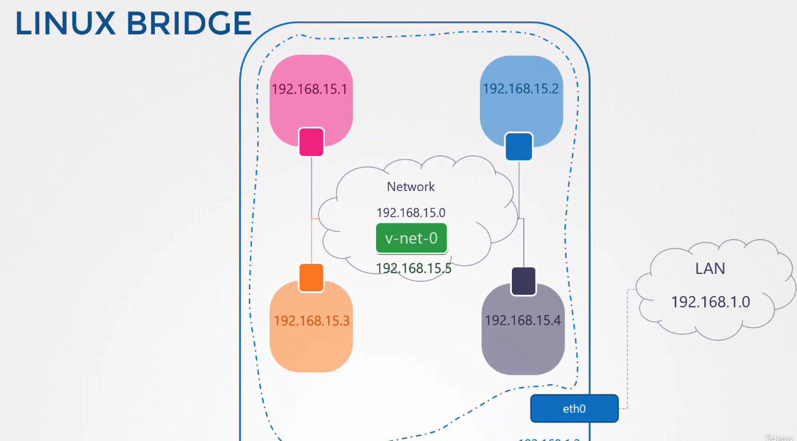
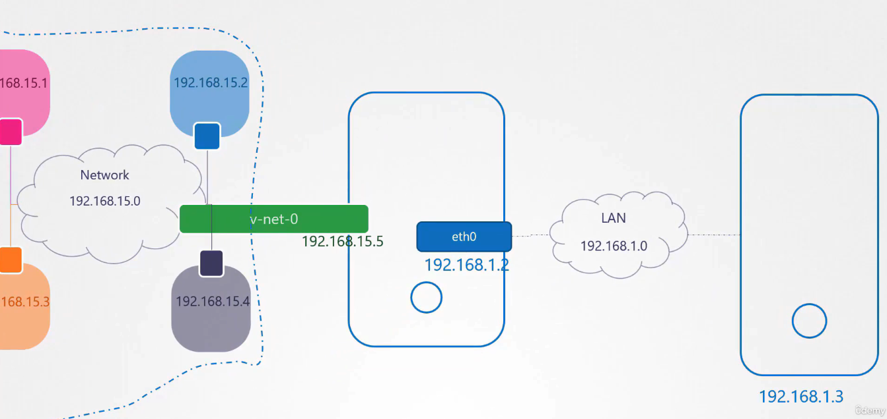

# 리눅스의 네트워크 네임스페이스(Network Namespaces)



## 네임스페이스란?

네임스페이스는 리눅스 시스템에서 프로세스 또는 리소스 그룹을 격리하여 운영하는 방법을 제공합니다. 이는 각 애플리케이션이나 사용자 그룹이 시스템의 다른 부분과 독립적으로 작동할 수 있도록 해줍니다. 네트워크 네임스페이스는 이러한 격리의 한 형태로, 네트워크 리소스(예: IP 주소, 라우팅 테이블)를 격리된 환경에서 운영할 수 있게 합니다.

### 네임스페이스의 비유

네임스페이스를 이해하는 한 가지 방법은 집과 방의 비유를 사용하는 것입니다. 집이 하나의 컴퓨터 시스템이라면, 각 방은 하나의 네임스페이스입니다. 각 방에는 개별적인 공간이 있고, 방 안의 사람들은 다른 방의 활동을 볼 수 없습니다. 이는 각 프로세스가 자신만의 공간에서 독립적으로 작동할 수 있음을 의미합니다.

### 네트워크 네임스페이스의 활용

네트워크 네임스페이스는 주로 컨테이너와 같은 가상화 환경에서 네트워크 리소스를 격리하는 데 사용됩니다. 이를 통해 각 컨테이너는 독립된 네트워크 인터페이스, IP 주소, 라우팅 테이블을 가질 수 있으며, 서로 간 또는 호스트와의 네트워크 충돌 없이 작동할 수 있습니다.

## ARP 및 라우팅 테이블 (ARP and Routing Table)

ARP (Address Resolution Protocol): 네트워크에서 IP 주소를 물리적 MAC 주소로 변환하는 프로토콜입니다. 이 프로토콜은 IP 네트워크 세그먼트에서 호스트의 IP 주소를 해당 호스트의 물리적 주소로 매핑하는 데 사용됩니다.  
라우팅 테이블: IP 패킷이 목적지로 전달되어야 하는 경로를 정의하는 정보를 저장합니다. 라우터나 컴퓨터가 네트워크에서 데이터를 전송할 때 최적의 경로를 결정하기 위해 이 테이블을 사용합니다.

## 가상 케이블 (Virtual Cable)

가상 케이블은 두 네트워크 네임스페이스 또는 두 가상 머신 사이의 연결을 시뮬레이션하는 데 사용되는 가상의 네트워크 연결 매체입니다. 이는 소프트웨어적으로 구현되어 물리적인 연결 없이 두 네트워크 인터페이스 간의 데이터 전송을 가능하게 합니다.

## 리눅스 브리지 (Linux Bridge)

리눅스 브리지는 여러 네트워크 인터페이스를 하나의 논리적인 브리지 인터페이스로 결합할 수 있는 소프트웨어 기반의 네트워크 브리지입니다. 이를 통해 여러 네트워크 세그먼트를 연결하여 하나의 네트워크처럼 작동하도록 만들 수 있습니다. 또한, 가상 머신들 사이의 네트워크 트래픽을 관리하고, 가상 스위치 역할을 하여 데이터를 전달합니다.

## 네트워크 네임스페이스 구성하기

네임스페이스를 사용하여 간단한 네트워크 환경을 구성하는 단계를 안내합니다. 아래의 명령어를 사용하여 두 개의 네임스페이스를 생성하고, 이들 간의 연결을 설정합니다.

### 네트워크 네임스페이스 생성 및 사용

#### 1. 네트워크 네임스페이스 생성

네트워크 네임스페이스를 생성하는 첫 단계입니다. 여기서는 두 개의 네임스페이스 'red'와 'blue'를 만듭니다.

```bash
ip netns add red
ip netns add blue
```

#### 2. 네임스페이스 목록 확인

생성된 네트워크 네임스페이스를 확인합니다.

```bash
ip netns
```

#### 3. 네트워크 네임스페이스 내 인터페이스 확인

각 네임스페이스에서 사용 가능한 네트워크 인터페이스를 확인합니다. 초기 상태에서는 'lo' (루프백) 인터페이스만 존재합니다.

```bash
ip netns exec red ip link
ip netns exec blue ip link
```

### 가상 케이블 생성 및 설정

#### 4. 가상 케이블 생성

두 네임스페이스 간의 가상 연결을 위한 가상 이더넷 쌍(veth pair)을 생성합니다.

```bash
ip link add veth-red type veth peer name veth-blue
```

#### 5. 네임스페이스에 가상 케이블 연결

생성된 각 가상 인터페이스를 해당 네임스페이스에 할당합니다.

```bash
ip link set veth-red netns red
ip link set veth-blue netns blue
```

#### 6. IP 주소 할당 및 인터페이스 활성화

각 네임스페이스의 가상 인터페이스에 IP 주소를 할당하고 인터페이스를 활성화합니다.

```bash
ip -n red addr add 192.168.15.1/24 dev veth-red
ip -n blue addr add 192.168.15.2/24 dev veth-blue
ip -n red link set veth-red up
ip -n blue link set veth-blue up
```

#### 7. 연결성 확인

두 네임스페이스 간의 연결을 테스트합니다.

```bash
ip netns exec red ping 192.168.15.2
```

#### 리눅스 브리지 생성 및 구성

8. 브리지 인터페이스 생성
   호스트 시스템에 브리지 인터페이스를 생성합니다.

```bash
ip link add v-net-0 type bridge
ip link set dev v-net-0 up
```

#### 9. 브리지와 네임스페이스 연결

네임스페이스와 브리지를 연결하기 위해 또 다른 가상 이더넷 쌍을 생성하고 브리지에 연결합니다.

```bash
ip link add veth-red-br type veth peer name veth-red
ip link add veth-blue-br type veth peer name veth-blue
ip link set veth-red netns red
ip link set veth-blue netns blue
ip link set veth-red-br master v-net-0
ip link set veth-blue-br master v-net-0
ip link set dev veth-red-br up
ip link set dev veth-blue-br up
```

#### 10. 추가 IP 설정 및 테스트

브리지에 IP 주소를 할당하고, 네임스페이스 간의 연결을 다시 테스트합니다.

```bash
ip addr add 192.168.15.5/24 dev v-net-0
ip netns exec blue ping 192.168.15.1
```

#### 11. 라우팅 및 NAT 설정

브리지를 통한 외부 연결성을 확보하기 위해 라우팅 및 NAT 규칙을 설정합니다.

```bash
ip netns exec blue ip route add default via 192.168.15.5
iptables -t nat -A POSTROUTING -s 192.168.15.0/24 -j MASQUERADE
ip netns exec blue ping 8.8.8.8
```

## 결론

네트워크 네임스페이스는 리눅스 시스템에서 매우 유용한 도구로, 특히 컨테이너 기술과 함께 사용될 때 강력한 네트워크 격리와 관리 기능을 제공합니다. 이 기능을 통해 보다 안전하고 효율적인 시스템 운영이 가능해집니다.
