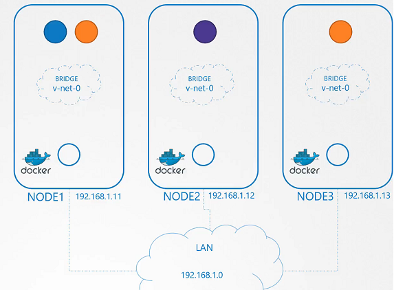
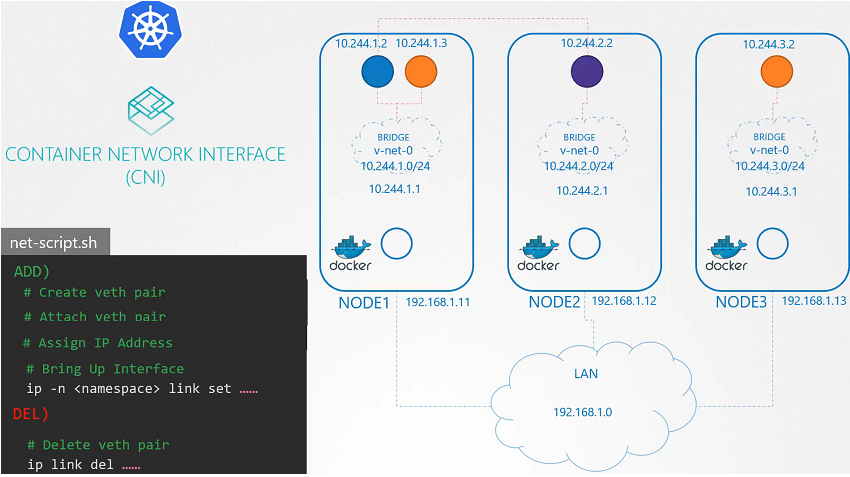

# 쿠버네티스 포드 네트워킹

## 포드 네트워킹의 필수 요건

쿠버네티스는 다음과 같은 포드 네트워킹 요구 사항을 제시합니다:

- **고유한 IP 주소 할당**: 각 포드는 클러스터 내에서 고유한 IP 주소를 가져야 합니다.
- **포드 간 통신**: 동일 노드에 있는 포드뿐만 아니라 다른 노드에 있는 포드와도 통신할 수 있어야 합니다.
- **NAT 없이 통신**: 포드는 네트워크 주소 변환(NAT) 없이 서로 통신할 수 있어야 합니다.

## 네트워킹 솔루션 구현

네트워크 솔루션을 구현하는 방법은 여러 가지가 있으며, 우리는 이 강의에서 다음과 같은 방법을 사용해 볼 것입니다:

1. **브리지 네트워크 생성**: 각 노드에 브리지 네트워크를 생성하고, 이를 통해 포드를 연결합니다.
2. **IP 주소 할당**: 브리지 네트워크에 포드가 연결될 때 자동으로 IP 주소를 할당받도록 합니다.
3. **라우팅 설정**: 포드가 다른 노드의 포드와 통신할 수 있도록 적절한 라우팅 규칙을 설정합니다.

## 예시

### 1. bridge network를 각 노드에 추가

```bash
# node01
ip link add v-net-0 type bridge

# node02
ip link add v-net-0 type bridge

# node03
ip link add v-net-0 type bridge
```

### 2. 활성화

```bash
# node01
ip addr add 10.244.1.1/24 dev v-net-0

# node02
ip addr add 10.244.2.1/24 dev v-net-0

# node03
ip addr add 10.244.3.1/24 dev v-net-0
```



### 3. routing

```bash
# node01
ip route add 10.244.2.2 via 192.168.1.12
ip route add 10.244.3.2 via 192.168.1.13

# node02
ip route add 10.244.1.2 via 192.168.1.11
ip route add 10.244.3.2 via 192.168.1.13

# node03
ip route add 10.244.1.2 via 192.168.1.11
ip route add 10.244.2.2 via 192.168.1.12
```

## CNI 플러그인과의 통합

쿠버네티스 클러스터는 Container Network Interface(CNI) 플러그인을 사용하여 네트워킹 솔루션을 자동화합니다. CNI 플러그인은 포드가 생성될 때 자동으로 네트워크 설정을 처리하므로, 네트워크 관련 작업을 수동으로 실행할 필요가 없습니다.


## 결론

쿠버네티스 포드 네트워킹은 클러스터 내부 및 외부에서 서비스에 접근할 수 있는 기반을 제공합니다. 올바른 네트워킹 솔루션을 선택하고 구현하는 것은 클러스터의 효율적인 운영에 매우 중요합니다.

## References Docs

https://kubernetes.io/docs/concepts/workloads/pods/
