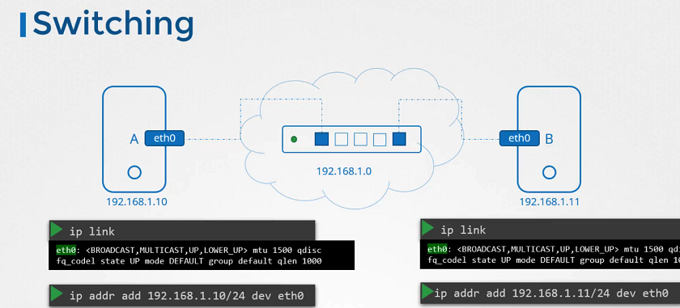
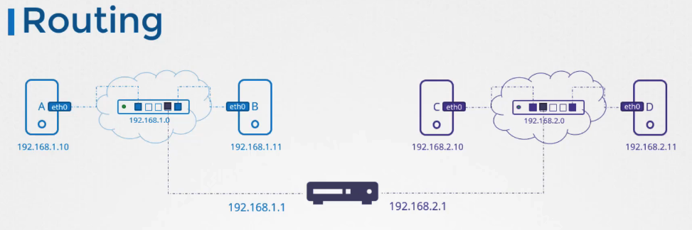
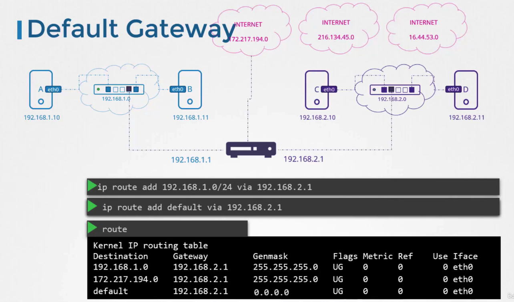

# 네트워킹 기초

네트워킹은 데이터를 전송하는 방법을 다루며, 기본적으로 여러 네트워크 기기 간의 통신을 가능하게 합니다. 이번 강의에서는 리눅스 기반 시스템에서 네트워킹을 설정하고 구성하는 방법을 배웁니다.

## 스위칭(Switching)

스위칭은 네트워크 내에서 데이터 패킷을 한 장치에서 다른 장치로 전달하는 과정입니다. 스위치는 여러 장치를 연결하고, 데이터가 목적지에 정확하게 도달할 수 있도록 합니다. 각 장치는 스위치에 연결되어 있으며, 스위치는 데이터 패킷의 목적지 주소를 읽고 해당 장치로 데이터를 전송합니다.

### 스위치의 작업 예시


두 대의 컴퓨터가 하나의 스위치에 연결되어 있을 때, 컴퓨터 A가 컴퓨터 B로 데이터를 보내고 싶다면:

1. 컴퓨터 A는 데이터 패킷에 B의 주소를 포함시켜 스위치로 보냅니다.
2. 스위치는 패킷을 받고, 주소를 확인한 후 컴퓨터 B로 패킷을 전송합니다.

## 리눅스에서의 네트워크 인터페이스 확인

네트워크 인터페이스를 확인하기 위해 사용하는 명령어는 다음과 같습니다.

```bash
ip link
```

이 명령어를 사용하면 시스템에 구성된 모든 네트워크 인터페이스 목록을 볼 수 있습니다. 예를 들어, `eth0` 인터페이스는 주로 첫 번째 이더넷 연결에 사용됩니다.

## IP 주소 할당

IP 주소를 인터페이스에 할당하기 위해 사용하는 명령어는 다음과 같습니다.

```bash
ip addr add 192.168.1.11/24 dev eth0
```

이 명령어는 `eth0` 인터페이스에 `192.168.1.11` 주소를 할당합니다.

## 라우팅(Routing)


라우팅은 다른 네트워크로 데이터 패킷을 전송하는 과정입니다. 라우터는 두 개 이상의 네트워크를 연결하고, 데이터가 한 네트워크에서 다른 네트워크로 효율적으로 이동할 수 있도록 합니다. 라우터는 데이터 패킷의 목적지 IP 주소를 기반으로 최적의 경로를 결정합니다.

### 라우터의 작업 예시

두 개의 서로 다른 네트워크에 연결된 라우터가 있을 때, 네트워크 A의 컴퓨터가 네트워크 B의 컴퓨터로 데이터를 보내고자 한다면:

1. 컴퓨터 A는 데이터 패킷을 라우터로 보냅니다.
2. 라우터는 패킷의 목적지 주소를 확인하고, 네트워크 B로 데이터를 전송하는 최적의 경로를 결정합니다.
3. 데이터는 라우터를 통해 네트워크 B의 목적지 컴퓨터로 전송됩니다.

## 라우팅 설정

네트워크 간의 통신을 가능하게 하기 위해 라우터를 설정하고, 시스템이 다른 네트워크로 패킷을 보낼 수 있도록 라우팅을 구성해야 합니다. 기본 게이트웨이를 설정하는 명령어는 다음과 같습니다.

```bash
ip route add default via 192.168.1.1
```

이 명령어는 모든 외부 통신을 `192.168.1.1` 게이트웨이를 통해 라우팅하도록 설정합니다.

## 리눅스 시스템을 라우터로 설정

리눅스 시스템에서 패킷 포워딩을 활성화하려면, IP 포워딩을 활성화해야 합니다. IP 포워딩을 활성화하는 명령어는 다음과 같습니다.

```bash
echo 1 > /proc/sys/net/ipv4/ip_forward
```

이 설정은 시스템이 라우터로 기능하게 하여, 한 네트워크 인터페이스에서 받은 패킷을 다른 인터페이스로 전달할 수 있게 합니다.

## 게이트웨이란?


네트워크에서 게이트웨이는 한 네트워크에서 다른 네트워크로 데이터를 전송할 수 있는 경로를 제공합니다. 예를 들어, 로컬 네트워크의 컴퓨터가 인터넷에 접속하려면, 게이트웨이를 통해야 합니다. 게이트웨이는 데이터를 올바른 목적지로 라우팅하는 역할을 하며, 주로 라우터가 이 기능을 수행합니다.

### 게이트웨이 설정 예시

리눅스 시스템에서 게이트웨이를 설정하는 방법은 다음과 같습니다. 아래의 명령어는 시스템이 `192.168.1.1` 주소를 가진 게이트웨이를 통해 외부 네트워크와 통신할 수 있도록 라우트를 추가합니다.

```bash
sudo ip route add default via 192.168.1.1
```

이 명령은 모든 목적지 주소가 `192.168.1.1`을 통해 라우팅될 것이라는 기본 경로를 설정합니다. 이는 시스템이 지정된 게이트웨이를 통해 인터넷이나 다른 네트워크로 데이터를 보낼 수 있게 합니다.

## 게이트웨이 확인

현재 시스템의 라우팅 테이블을 확인하여 게이트웨이 설정을 검토할 수 있습니다. 이는 다음 명령어로 확인할 수 있습니다.

```bash
ip route show
```

이 명령은 시스템의 라우팅 테이블을 표시하며, 여기서 설정된 게이트웨이와 각 네트워크 대상에 대한 라우트를 볼 수 있습니다.

## 게이트웨이의 중요성

게이트웨이는 네트워크의 출입구 역할을 하기 때문에 보안에 매우 중요합니다. 모든 외부 통신이 게이트웨이를 통과하므로, 게이트웨이는 네트워크 보안의 첫 번째 방어선으로도 작용합니다. 적절한 게이트웨이 보안 설정과 모니터링은 네트워크를 보호하는 데 필수적입니다.
