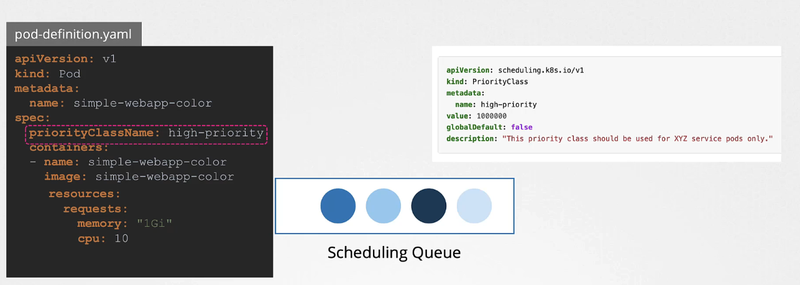
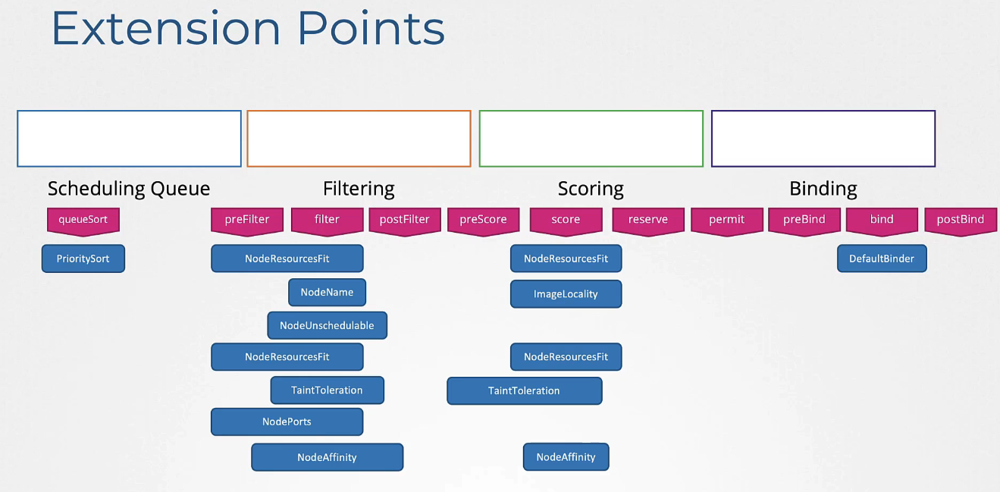

# Configuring Kubernetes Schedulers

# 쿠버네티스 스케줄러와 스케줄러 프로파일

쿠버네티스의 스케줄러는 `Pod`을 클러스터 내의 적합한 노드(Node)에 할당하는 역할을 합니다. 이 과정은 몇 가지 주요 단계로 구성됩니다: **스케줄링 큐(Scheduling Queue)**, **필터링(Filtering)**, **스코어링(Scoring)**, 그리고 **바인딩(Binding)**.

## 스케줄링 큐(Scheduling Queue)

Pod가 생성될 때, 스케줄링 대기열에 들어가며, 여기서 Pod는 설정된 우선순위에 따라 정렬됩니다. 우선순위를 설정하려면 우선순위 클래스(PriorityClass)를 생성해야 합니다.



## 필터링(Filtering)

이 단계에서는 Pod를 실행할 수 없는 노드를 제거합니다. 예를 들어, 필요한 CPU 리소스가 부족한 노드는 이 단계에서 제외됩니다.

- Node Resources Fit plugin이 파드에 필요한 자원을 가진 노드를 식별하고, 그렇지 않은 노드를 필터링합니다.
- 파드 스펙에 노드 이름이 명시되어 있을 때 이를 확인하고 이 이름과 일치하지 않는 모든 노드를 필터링하는 노드 이름 플러그인(Node Name plugin)이 있습니다.
- unschedulable 플래그가 true로 설정된 노드를 필터링하는 노드 스케줄 불가 플러그인(Node Unschedulable plugin)이 있습니다. 이는 노드에 drain 또는 cordon 명령을 실행했을 때 사용됩니다.

## 스코어링(Scoring)

남은 노드는 다양한 기준에 따라 점수를 받게 되며, 가장 높은 점수를 받은 노드에 Pod가 할당됩니다. 리소스 분배, 이미지 위치 등이 고려될 수 있습니다.

- 파드 의해 사용되는 컨테이너 이미지를 이미 가지고 있는 노드에 높은 점수를에 부여하는 이미지 로컬리티 플러그인(Image Locality plugin)이 있습니다.

## 바인딩(Binding)

최종적으로, 선택된 노드에 Pod가 바인딩됩니다.

- 기본 바인더 플러그인(Default Binder plugin)이 바인딩 메커니즘을 제공합니다.

## Extention Points



## 스케줄러 프로파일(Scheduler Profiles)

쿠버네티스는 스케줄러의 동작을 커스터마이즈할 수 있는 스케줄러 프로파일을 제공합니다. 다양한 스케줄링 요구사항을 충족시키기 위해, 여러 프로파일을 설정하여 각각 다른 스케줄링 로직을 적용할 수 있습니다.

스케줄러 프로파일은 스케줄러 구성 파일에서 다음과 같이 설정할 수 있습니다

```yaml
apiVersion: kubescheduler.config.k8s.io/v1beta1
kind: KubeSchedulerConfiguration
profiles:
  - schedulerName: default-scheduler
  - schedulerName: custom-scheduler-1
    plugins:
      filter:
        disabled:
          - name: NodeUnschedulable
          - name: TaintToleration
```
