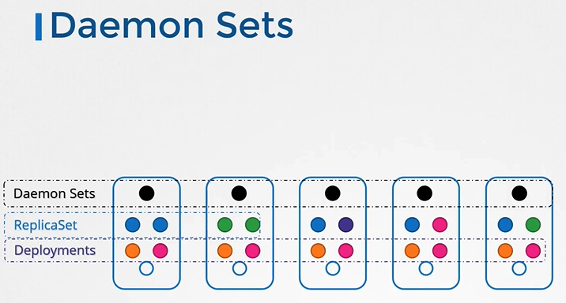
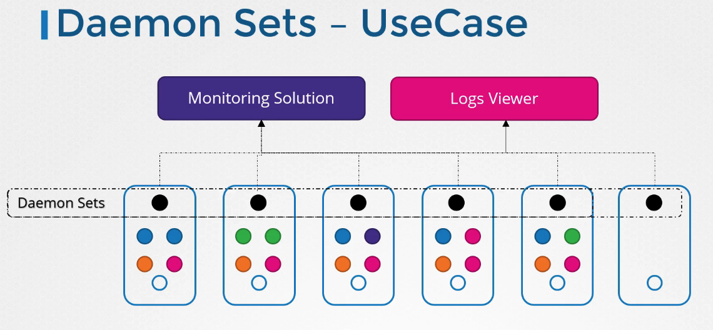
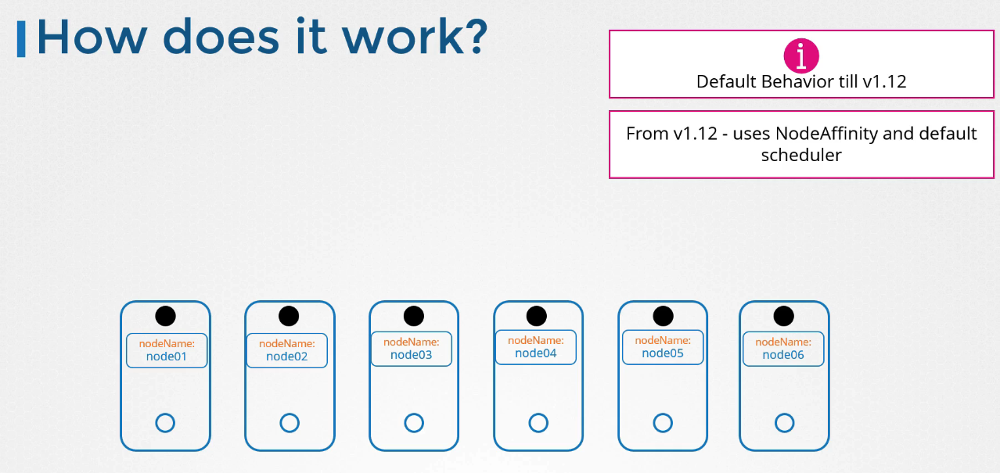

# DaemonSet 소개


DaemonSet은 쿠버네티스에서 각 노드에 Pod를 하나씩 배포하는 데 사용됩니다. 클러스터에 새로운 노드가 추가되면 DaemonSet은 자동으로 해당 노드에 Pod의 사본을 추가합니다. 노드가 제거되면 해당 노드의 Pod도 자동으로 제거됩니다.

## DaemonSet 사용 사례

s

- 모든 노드에서 실행해야 하는 **모니터링 에이전트나 로그 수집기** 같은 애플리케이션을 배포할 때
- 클러스터의 각 노드에 필요한 **kube-proxy** 컴포넌트를 배포할 때
- 네트워킹 솔루션과 같이 각 노드에 **에이전트**를 배포해야 할 때

## DaemonSet 정의

DaemonSet을 생성하는 것은 ReplicaSet 생성 과정과 유사합니다. 가장 큰 차이점은 `kind`가 `DaemonSet`으로 설정된다는 점입니다.

```yaml
apiVersion: apps/v1
kind: DaemonSet
metadata:
  name: monitoring-daemon
spec:
  selector:
    matchLabels:
      app: monitoring-agent
  template:
    metadata:
      labels:
        app: monitoring-agent
    spec:
      containers:
        - name: monitoring-agent
          image: monitoring-agent:latest
```

```sh
kubectl get daemonsets -A
```

## DaemonSet 동작 방식


쿠버네티스 1.12 버전부터 DaemonSet은 기본 스케줄러와 노드 친화성 규칙을 사용하여 노드에 Pod를 스케줄링합니다. 이는 각 노드에 Pod가 하나씩 있는지를 보장합니다.

DaemonSet을 사용하면 클러스터의 노드 변경에 따라 자동으로 Pod를 추가하거나 제거할 수 있어, 노드별 필수 애플리케이션의 관리가 훨씬 간편해집니다.

이제 실습 테스트로 이동하여 DaemonSet을 직접 사용해 보세요.

## K8s Reference Docs

https://kubernetes.io/docs/concepts/workloads/controllers/daemonset/#writing-a-daemonset-spec
