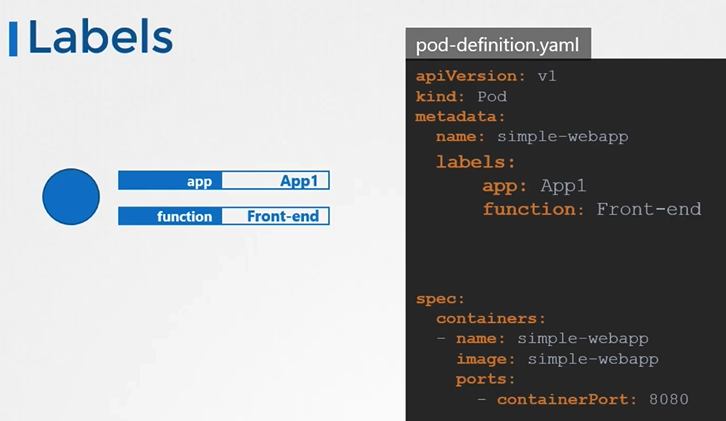
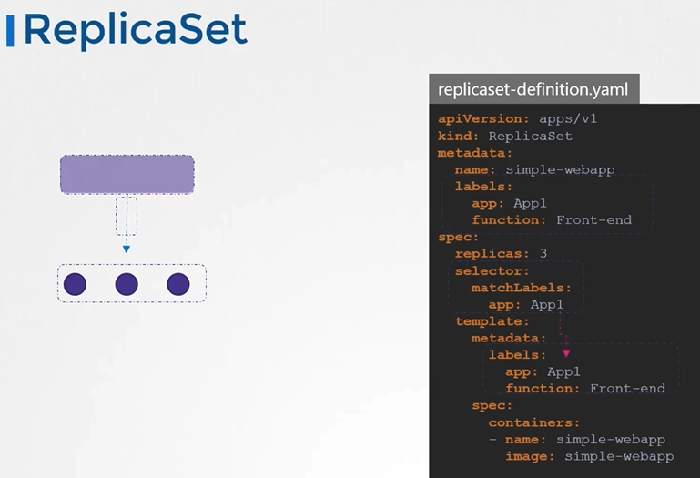
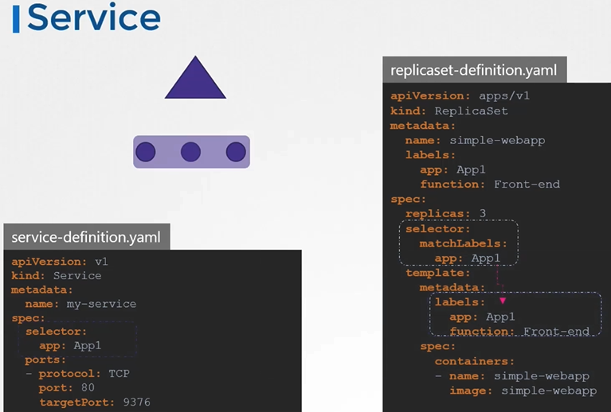
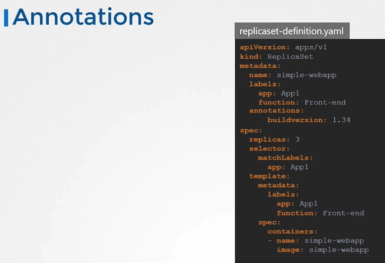

# 쿠버네티스의 label과 selector

쿠버네티스에서 라벨(labels)과 선택자(selectors)는 객체를 그룹화하고 필터링하는 표준 방법입니다. label은 각 항목에 부착된 속성으로, selector를 사용해 이러한 항목들을 필터링할 수 있습니다.

## label과 selector 사용법

label은 key-value 쌍으로, 각 쿠버네티스 객체에 붙여집니다. 예를 들어, 특정 애플리케이션, 환경, 버전 등으로 객체를 분류할 수 있습니다. selector를 사용하면 이 label을 기반으로 객체를 선택하고 필터링할 수 있습니다.

### Pod에 label 추가하기

Pod 정의 파일에 `metadata` 섹션 아래 `labels`를 추가하여 label을 지정합니다.

```yaml
apiVersion: v1
kind: Pod
metadata:
  name: simple-webapp
  labels:
    app: App1
    function: Front-end
spec:
  containers:
    - name: simple-webapp
      image: simple-webapp
      ports:
        - containerPort: 8080
```



### selector로 Pod 선택하기

`kubectl get pods` 명령어와 함께 `-l` 또는 `--selector` 옵션을 사용하여 label로 Pod를 필터링할 수 있습니다.

```sh
kubectl get pods -l app=myapp,function=frontend
kubectl get pods --selector app=App1
kubectl get pods --selector app=App1 --no-headers | wc -l # 갯수세기
```

### replicaset 및 service에서 label 사용하기

replicaset이나 service를 정의할 때, `selector` 필드를 사용하여 관리할 Pod들을 지정합니다. 이 selector는 Pod의 label과 일치해야 합니다.

```yaml
apiVersion: apps/v1
kind: ReplicaSet
metadata:
  name: simple-webapp
  labels:
    app: App1
    function: Front-end
spec:
  replicas: 3
  selector:
    matchLabels:
      app: App1
  template:
    metadata:
      labels:
        app: App1
        function: Front-end
    spec:
      containers:
        - name: simple-webapp
          image: simple-webapp
```



```yaml
apiVersion: v1
kind: Service
metadata:
  name: my-service
spec:
  selector:
    app: App1
  ports:
    - protocol: TCP
      port: 80
      targetPort: 9376
```



## 주석(Annotations)

주석은 label과 비슷하지만, 객체를 선택하기 위한 목적이 아닌 추가 정보를 제공하기 위해 사용됩니다. 예를 들어, 빌드 정보, 이메일 주소 등이 있습니다.

```yaml
apiVersion: apps/v1
kind: ReplicaSet
metadata:
  name: simple-webapp
  labels:
    app: App1
    function: Front-end
  annotations:
    buildversion: 1.34
spec:
  replicas: 3
  selector:
    matchLabels:
      app: App1
template:
  metadata:
    labels:
      app: App1
      function: Front-end
  spec:
    containers:
      - name: simple-webapp
        image: simple-webapp
```



## K8s Reference Docs:

https://kubernetes.io/docs/concepts/overview/working-with-objects/labels/
