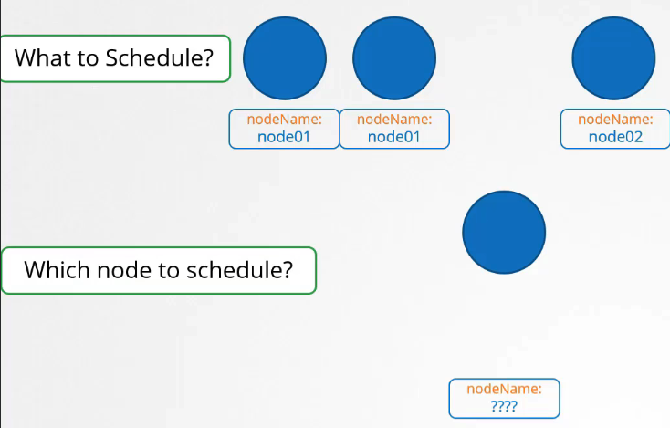

# 수동으로 Pod를 노드에 스케줄링하기

## 어떻게 scheduling이 작동하는가?

1. 모든 pod에는 기본적으로 설정되지 않은 nodeName이라는 필드가 있다. 일반적으로 manifest file을 생성할 때 이 필드를 지정하지 않으면 쿠버네티스가 자동으로 추가합니다.
   

## scheduling이 없으면?

1. **Pod 정의 파일에 NodeName 지정**: Pod 생성 시, Pod 정의 파일 내에 `nodeName` 필드를 명시적으로 설정함으로써 특정 노드에 Pod를 할당할 수 있습니다.

   예를 들어, `nginx-pod.yaml` 파일을 생성하고 다음과 같이 작성합니다:

```yaml
apiVersion: v1
kind: Pod
metadata:
name: nginx
labels:
  name: nginx
spec:
containers:
  - name: nginx
    image: nginx
    ports:
      - containerPort: 8080
nodeName: node02
```

2. **pod은 이미 생성되었는데 node에 할당하고 싶으면?**: 이미 생성된 Pod를 특정 노드에 할당하고자 할 때는, 바인딩 객체를 생성하고 Pod의 바인딩 API에 POST 요청을 보내는 방법이 사용됩니다. 이 방법은 실제 스케줄러가 수행하는 작업을 모방합니다.

```yml
apiVersion: v1
kind: Binding
metadata:
  name: nginx
target:
  apiVersion: v1
  kind: Node
  name: node02
```

```yml
apiVersion: v1
kind: Binding
metadata:
  name: nginx
target:
  apiVersion: v1
  kind: Node
```

바인딩 객체 예시(JSON 형식):

```json
{
  "apiVersion": "v1",
  "kind": "Binding",
  "metadata": {
    "name": "nginx"
  },
  "target": {
    "apiVersion": "v1",
    "kind": "Node",
    "name": "node02"
  }
}
```

이 JSON 데이터를 Pod의 바인딩 API에 POST 요청으로 보내면, 해당 Pod는 지정된 노드에 스케줄링됩니다.

## 실습

```sh
kubectl create -f nginx.yaml
kubectl replace --force -f nginx.yaml
```

## K8s Reference Docs:

https://kubernetes.io/docs/reference/using-api/api-concepts/
https://kubernetes.io/docs/concepts/scheduling-eviction/assign-pod-node/#nodename
