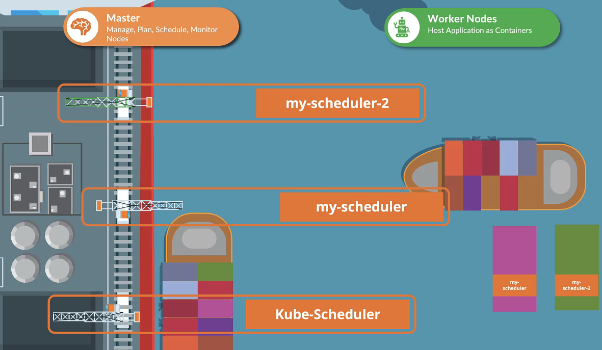
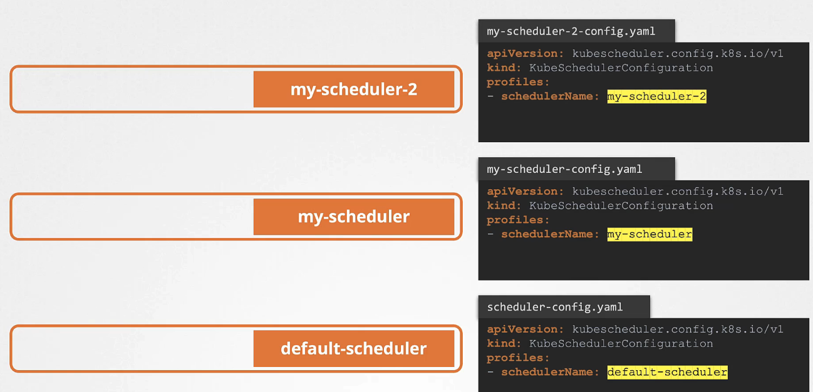
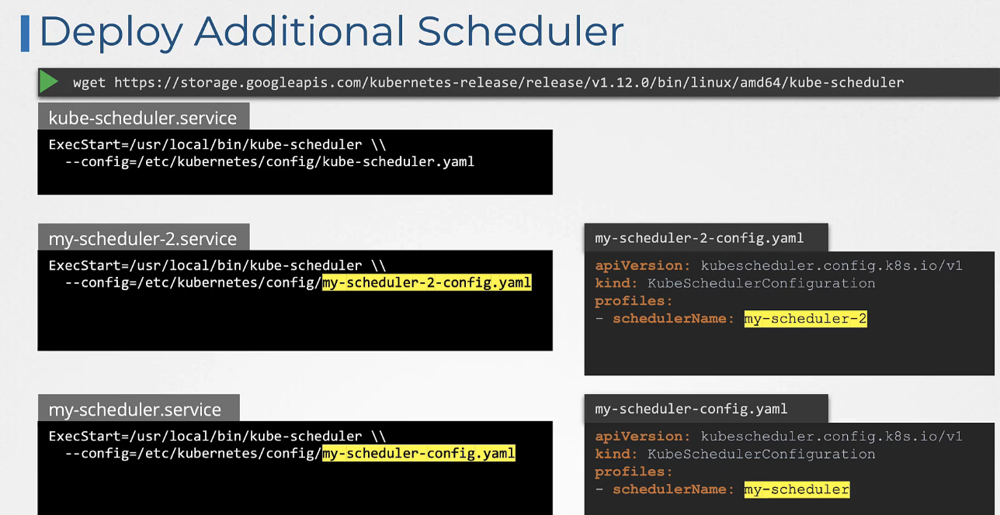
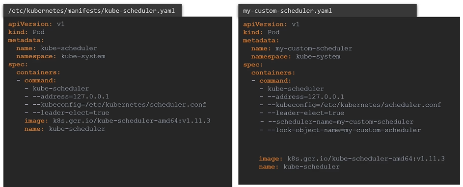

# Multiple Schedulers 배포하기


쿠버네티스 클러스터는 하나 이상의 스케줄러를 지원하여, 특정 파드에 대해 특수한 스케줄링 요구 사항을 충족시킬 수 있습니다. 기본 스케줄러 외에도 사용자 정의 스케줄러를 클러스터에 추가할 수 있습니다.

## 사용자 정의 스케줄러 생성

사용자 정의 스케줄러는 쿠버네티스의 확장성을 활용하여 특정 스케줄링 로직을 구현할 수 있습니다. 이를 위해 사용자 정의 스케줄러 프로그램을 작성하고, 이를 클러스터에 배포할 수 있습니다.

### 스케줄러 구성


각 스케줄러는 고유한 이름을 가져야 합니다. 기본 스케줄러의 이름은 `default-scheduler`입니다. 사용자 정의 스케줄러를 추가할 때는 다른 이름을 지정해야 합니다.

### 스케줄러 배포 방법

1. **바이너리로 배포**: 쿠버네티스 스케줄러 바이너리를 사용하여 직접 실행할 수 있습니다.
   

```sh
wget https://storage.googleapis.com/kubernetes-release/release/v1.12.0/bin/linux/amd64/kube-scheduler
```

2. **파드로 배포**: 사용자 정의 스케줄러를 파드로 패키징하여 클러스터 내에서 실행할 수 있습니다.
   
   :::tip
   여러 마스터 노드에서 각 실행되는 스케줄러에 리더 선정을 위해 `-leader-elect` 옵션을 사용할 수 있다. 여러 마스터 노드에 동일한 스케줄러가 실행 중일 때 반드시 1개만 리더로 활성화될 수 있도록 한다.
   :::

3. 추가 스케줄러의 구성 설정을 저장 및 관리를 위한 ConfigMap 생성

```sh
kubectl create configmap my-scheduler-config --from-file=./my-config-scheduler.yaml -n kube-system
```

4. 스케줄러 생성

```sh
kubectl create -f my-custom-scheduler.yaml
```

## scheduler 확인

```sh
kubectl get pods -n kube-system
```

### 파드에 스케줄러 지정

파드를 생성할 때 `schedulerName` 필드를 사용하여 특정 스케줄러를 지정할 수 있습니다.

```yaml
apiVersion: v1
kind: Pod
metadata:
  name: my-custom-scheduled-pod
spec:
  containers:
    - name: my-container
      image: my-image
  schedulerName: my-custom-scheduler
```

## event 확인

```sh
kubectl get events -o wide
```

## schedeuler log 확인

```sh
kubectl log my-custom-scheduler -n kube-system
```

## 스케줄러 관찰하기

클러스터에 파드가 성공적으로 스케줄링되었는지 확인하기 위해 kubectl get pods 명령어를 사용합니다. 스케줄링 문제가 발생한 경우, `kubectl describe pod <pod-name>` 명령어를 사용하여 문제를 진단할 수 있습니다.

## 정리

다중 스케줄러를 사용하면 쿠버네티스 클러스터의 스케줄링 로직을 더 세밀하게 제어할 수 있습니다. 사용자 정의 스케줄러를 통해 특정 애플리케이션의 요구사항에 맞는 스케줄링 전략을 구현할 수 있습니다.

Multiple Schedulers를 쿠버네티스 클러스터에 배포하는 기본적인 방법과 사용자 정의 스케줄러를 파드에 지정하는 방법을 포함하고 있습니다. 이를 통해 클러스터의 유연성과 파드 스케줄링의 정밀도를 높일 수 있습니다.

## K8s Reference Docs

https://kubernetes.io/docs/tasks/extend-kubernetes/configure-multiple-schedulers/
