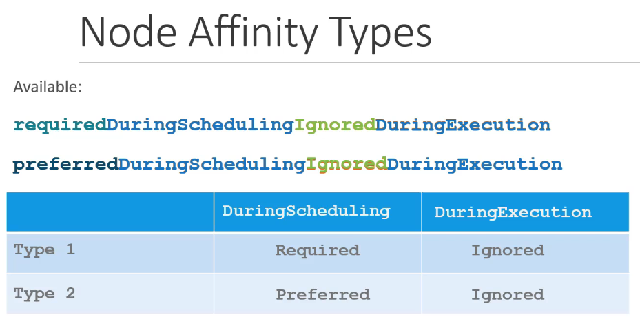
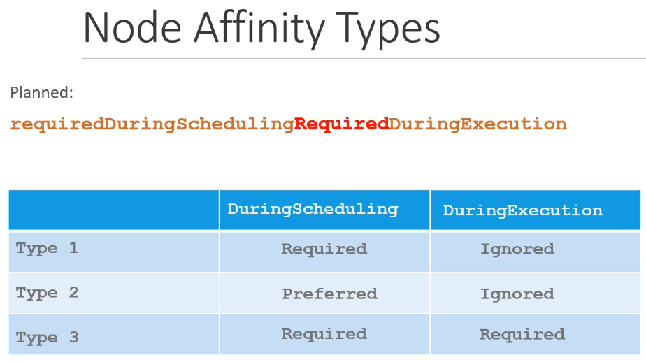

# 노드 친화성(Node Affinity)

노드 친화성은 Pod를 특정 노드에 스케줄링하기 위한 조건을 정의하는 방법입니다. 이 기능은 복잡한 스케줄링 요구 사항을 만족시킬 수 있습니다.

## 노드 친화성의 필요성

노드 셀렉터(Node Selectors)를 사용하여 간단한 스케줄링 요구를 해결할 수 있지만, "OR" 또는 "NOT"과 같은 복잡한 표현을 제공할 수 없습니다. 노드 친화성은 이러한 고급 요구 사항을 충족시키기 위해 설계되었습니다.

## 노드 친화성 설정 방법

Pod 정의에 노드 친화성을 추가하려면, `affinity` 항목 아래에 `nodeAffinity`를 구성합니다.

### 예시: 큰 노드에 Pod 스케줄링

```yaml
apiVersion: v1
kind: Pod
metadata:
  name: my-large-pod
spec:
  containers:
    - name: my-container
      image: my-image
  affinity:
    nodeAffinity:
      requiredDuringSchedulingIgnoredDuringExecution:
        nodeSelectorTerms:
          - matchExpressions:
              - key: size
                operator: In
                values:
                  - large
                  - medium
```

이 설정은 `size` 라벨이 `large`와 `medium` 노드에만 Pod가 스케줄링되도록 합니다.

### Node Affinity Types

#### Available



- **requiredDuringSchedulingIgnoredDuringExecution**
  - 설명: Pod가 처음 스케줄링될 때 노드 친화성 규칙을 반드시 만족해야 합니다. 만약 규칙을 만족하는 노드가 없으면, Pod는 스케줄링되지 않습니다. 한번 Pod가 스케줄링되고 나면, 실행 중에 노드의 속성이 변경되어도 Pod는 해당 노드에서 계속 실행됩니다.
  - 시나리오: Pod가 특정 리소스나 속성을 가진 노드에서만 실행되어야 할 때 사용합니다. 예를 들어, GPU나 특정 지역의 노드가 필요한 경우입니다.
- **preferredDuringSchedulingIgnoredDuringExecution**
  - 설명: 스케줄러가 노드 친화성 규칙을 만족하는 노드를 우선적으로 고려하도록 합니다. 하지만, 규칙을 만족하는 노드가 없을 경우 다른 노드에 Pod를 스케줄링할 수 있습니다. 실행 중에 노드의 속성이 변경되어도 Pod는 영향을 받지 않습니다.
  - 시나리오: Pod의 스케줄링에 있어서 노드 친화성 규칙을 선호하지만, 꼭 필수는 아닌 경우에 사용합니다. 예를 들어, 성능이 더 좋은 노드에서 실행되길 원하지만, 리소스가 부족할 때는 다른 노드에서도 실행될 수 있어야 하는 경우입니다.

#### Planned



- **requiredDuringSchedulingRequiredDuringExecution**
  - 설명: 처음 스케줄링될 때뿐만 아니라 실행 중에도 노드 친화성 규칙을 계속 만족해야 합니다. 노드의 속성이 변경되어 규칙을 더 이상 만족하지 않으면, Pod는 해당 노드에서 추방됩니다.
  - 시나리오: Pod가 특정 리소스나 속성을 가진 노드에서만 계속해서 실행되어야 할 때 사용됩니다. 예를 들어, 보안이나 규제 준수상 특정 노드에서만 실행되어야 하는 경우입니다.
- preferredDuringSchedulingRequiredDuringExecution
  - 설명: 스케줄링 시 노드 친화성 규칙을 선호하되, 실행 중에는 규칙을 만족해야 하는 형태입니다. 즉, 스케줄링 시에는 규칙을 만족하는 노드가 없다면 다른 노드에 스케줄링할 수 있지만, 실행 중에는 규칙을 만족해야 하며, 그렇지 않을 경우 Pod는 추방됩니다.
  - 시나리오: 스케줄링의 유연성과 실행 중의 엄격한 규칙 준수 사이의 균형을 필요로 하는 경우에 유용할 수 있습니다.

### operator

| <center>operator</center> | <center>description</center>                                                                         |
| :-----------------------: | :--------------------------------------------------------------------------------------------------- |
|            In             | 지정된 값 중 하나와 일치하는 노드에 스케줄링합니다.                                                  |
|           NotIn           | 지정된 값과 일치하지 않는 노드에 스케줄링합니다.                                                     |
|          Exists           | 지정된 키가 라벨에 존재하는 경우 노드에 스케줄링합니다. 이때 values 리스트는 지정하지 않습니다.      |
|       DoesNotExist        | 지정된 키가 라벨에 존재하지 않는 경우 노드에 스케줄링합니다. 이때 values 리스트는 지정하지 않습니다. |
|            Gt             | 지정된 키의 값이 지정된 값보다 큰 노드에 스케줄링합니다.                                             |
|            Lt             | 지정된 키의 값이 지정된 값보다 작은 노드에 스케줄링합니다.                                           |

## 실습

노드에 라벨을 추가하고, Pod 정의에 노드 친화성 규칙을 설정해 실습해 보세요. 이를 통해 노드 친화성이 어떻게 작동하는지 이해할 수 있습니다.

```sh
kubectl label nodes <노드 이름> size=large
```

노드 친화성은 쿠버네티스에서 더 세밀한 스케줄링 제어를 가능하게 하며, 특정 리소스 요구를 가진 워크로드를 위한 노드 선택에 유용합니다.

## K8s Reference Docs

https://kubernetes.io/docs/tasks/configure-pod-container/assign-pods-nodes-using-node-affinity/
https://kubernetes.io/blog/2017/03/advanced-scheduling-in-kubernetes/
