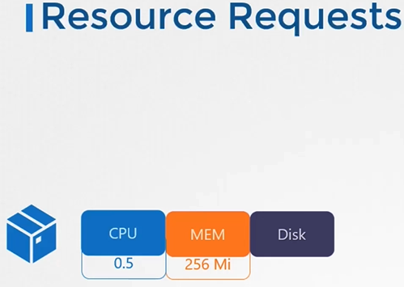
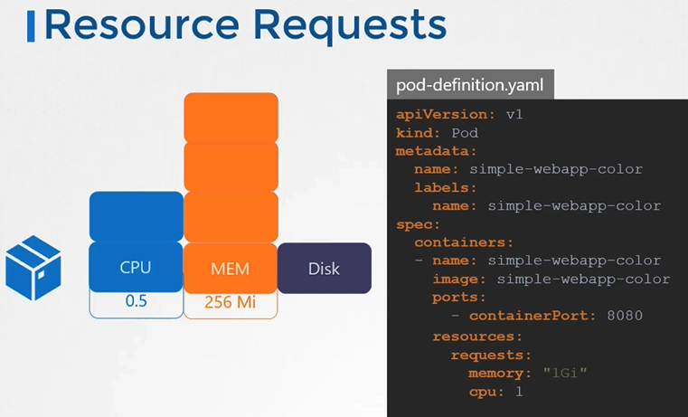
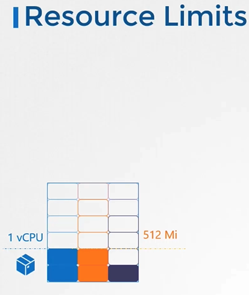
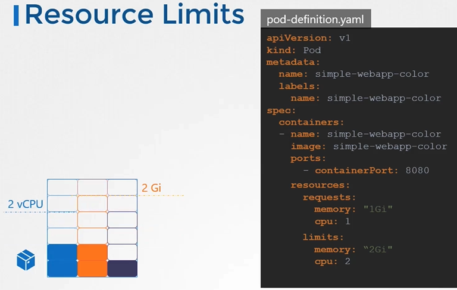
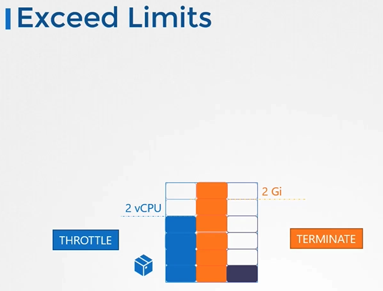
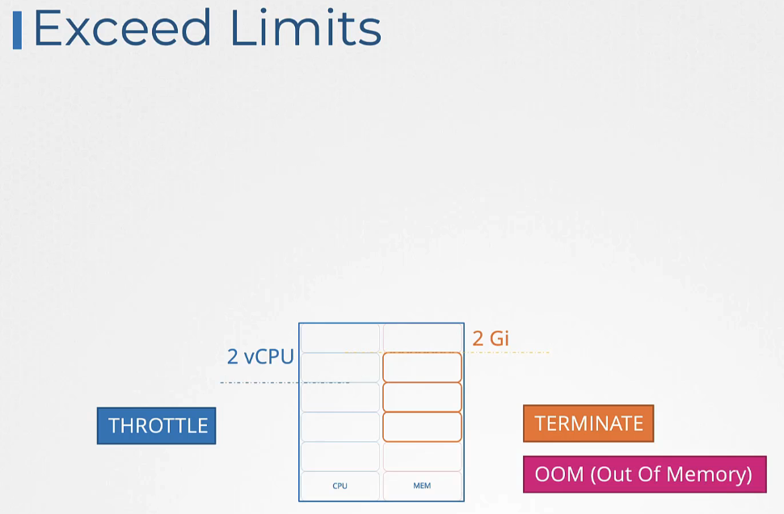
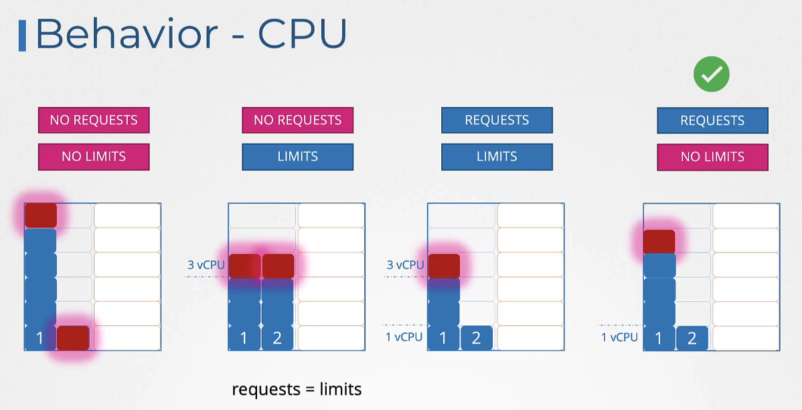
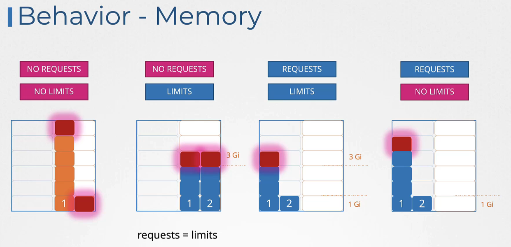
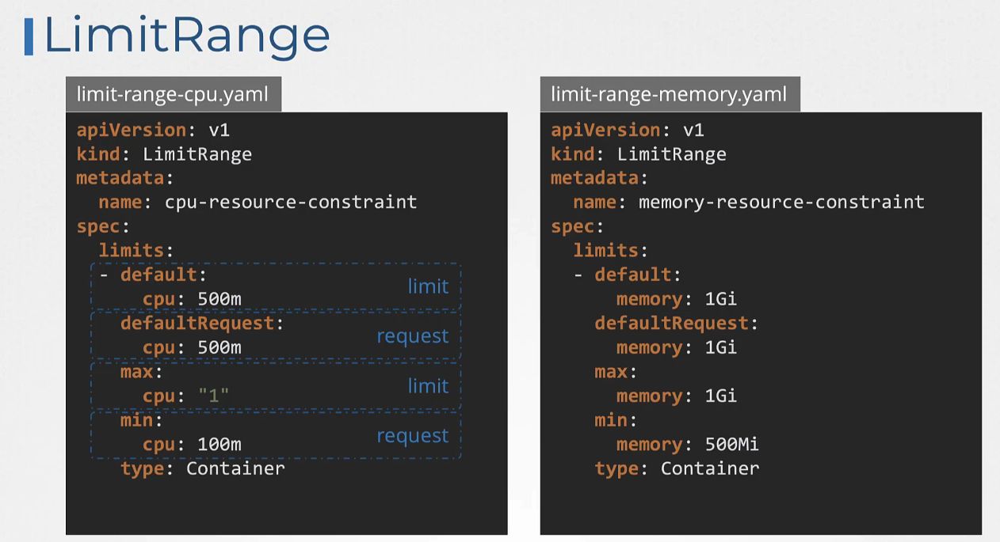

# Pod 리소스 요구사항과 스케줄링

쿠버네티스의 각 노드는 제한된 CPU와 메모리 리소스를 가집니다. Pod를 생성할 때, 이 Pod가 필요로 하는 리소스 양을 지정할 수 있으며, 쿠버네티스 스케줄러는 이 정보를 활용해 Pod를 적절한 노드에 배치합니다.

## 리소스 요구사항 정의

Pod 정의 파일에서 `resources` 섹션을 통해 CPU와 메모리 요구사항을 지정할 수 있습니다.

### 리소스 요청 (`Requests`)


리소스 요청은 Pod가 시작할 때 최소한으로 필요한 리소스 양을 나타냅니다.

```yaml
apiVersion: v1
kind: Pod
metadata:
  name: simple-webapp-color
  labels:
    name: simple-webapp-color
spec:
  containers:
    - name: simple-webapp-color
      image: simple-webapp-color
      ports:
        - containerPort: 8080
      resources:
        requests:
          memory: "1Gi"
          cpu: "1"
```



### 리소스 제한 (`Limits`)


리소스 제한은 Pod가 사용할 수 있는 최대 리소스 양을 지정합니다.

```yaml
apiVersion: v1
kind: Pod
metadata:
  name: simple-webapp-color
  labels:
    name: simple-webapp-color
spec:
  containers:
    - name: simple-webapp-color
      image: simple-webapp-color
      ports:
        - containerPort: 8080
      resources:
        requests:
          memory: "1Gi"
          cpu: "1"
        limits:
          memory: "2Gi"
          cpu: "2"
```



### limit가 넘어가면




## 리소스의 시나리오




## 리소스 요청과 제한이 없는 경우

Pod 정의에 리소스 요청(requests)과 리소스 제한(limits)이 명시적으로 설정되지 않은 경우, 해당 Pod는 무제한 리소스를 사용할 수 있게 됩니다. 이는 Pod가 필요로 하는 만큼의 CPU와 메모리를 사용할 수 있다는 것을 의미하지만, 이는 다른 Pod의 성능에 영향을 줄 수 있으므로 권장되지 않습니다.

## 리미트 레인지 (LimitRange)


리미트 레인지는 네임스페이스에서 Pod 또는 컨테이너가 생성될 때 적용될 기본 리소스 요청과 제한을 정의할 수 있게 해줍니다.

### 리미트 레인지 예시

```yaml
apiVersion: v1
kind: LimitRange
metadata:
  name: cpu-resource-constraint
spec:
  limits:
    - default:
        cpu: 500m
        memory: 256Mi
      defaultRequest:
        cpu: 500m
        memory: 256Mi
      max:
        cpu: "1"
      min:
        cpu: 100m
      type: Container
```

이 정의는 컨테이너가 지정하지 않은 경우 CPU 500m 및 메모리 256Mi를 기본 요청과 제한으로 설정합니다.

## 리소스 쿼터 (Resource Quota)

리소스 쿼터를 사용하면 네임스페이스 수준에서 리소스 사용량에 대한 상한선을 설정할 수 있습니다. 이를 통해 네임스페이스 내의 모든 Pod가 소비할 수 있는 총 리소스 양을 제한할 수 있습니다.

### 리소스 쿼터 예시

```yaml
apiVersion: v1
kind: ResourceQuota
metadata:
  name: cpu-and-memory-quota
spec:
  hard:
    requests.cpu: 4
    requests.memory: 4Gi
    limits.cpu: 10
    limits.memory: 10Gi
```

이 리소스 쿼터는 네임스페이스 내에서 요청된 총 CPU를 4개로, 요청된 총 메모리를 4Gi로 제한합니다. 또한, 컨테이너의 CPU 및 메모리 사용량 상한선을 각각 10개와 10Gi로 설정합니다.

## 스케줄러의 역할

쿠버네티스 스케줄러는 Pod의 리소스 요구량과 노드의 사용 가능 리소스를 비교하여 최적의 노드를 선택합니다. 모든 노드가 요구사항을 충족하지 못하면, Pod는 대기 상태에 머무릅니다.

## 리소스 제한의 중요성

적절한 리소스 요청과 제한 설정은 클러스터의 건강한 운영을 위해 중요합니다. 리소스 제한 없이 Pod가 과도한 리소스를 소비하면 다른 Pod의 성능에 영향을 줄 수 있습니다.

## 리미트 레인지와 리소스 쿼터

- **LimitRange**: 네임스페이스별로 Pod의 리소스 요청과 제한에 대한 기본값 및 최소/최대값을 설정합니다.
- **ResourceQuota**: 네임스페이스에서 사용할 수 있는 리소스의 총량에 대한 상한선을 정의합니다.

## K8s Reference Docs:

https://kubernetes.io/docs/concepts/configuration/manage-resources-containers/
