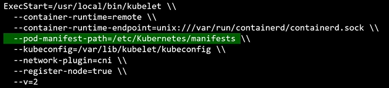
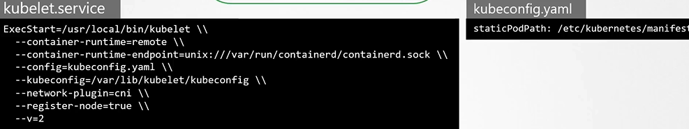
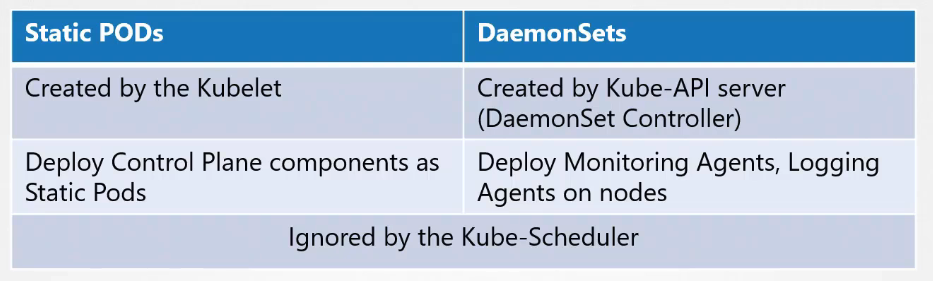
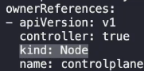

# Static Pod 소개

Static Pod는 kubelet이 직접 관리하는 Pod입니다. 쿠버네티스 클러스터의 다른 구성요소가 없어도, kubelet이 설치된 노드에서 독립적으로 Pod를 실행할 수 있습니다.

## Static Pod의 특징과 용도

- **자동 생성**: 새 노드에 kubelet이 설치되면, 지정된 디렉토리에 있는 Pod 정의에 따라 Static Pod가 자동으로 생성됩니다.
- **자체 복구**: Pod 실행에 실패하면 kubelet이 자동으로 재시작을 시도합니다.
- **클러스터 컨트롤 플레인 배포**: API 서버, ETCD, 스케줄러와 같은 컨트롤 플레인 구성요소를 Static Pod로 배포할 수 있습니다.
- **단점**: 복제 세트(replica sets)나 배포(deployments), 서비스(services)를 생성할 수는 없습니다.

## Static Pod 설정 방법

kubelet 설정에서 `--pod-manifest-path` 옵션을 통해 Static Pod 정의 파일을 읽을 디렉토리를 지정합니다. 이 디렉토리에 Pod 정의 파일을 배치하면, kubelet이 이를 주기적으로 검사하여 Pod를 생성합니다.

```sh
kubelet --pod-manifest-path=/etc/kubernetes/manifests
```



`grep -i staticpod /var/lib/kubelet/config.yaml`

## Static Pod와 DaemonSet 비교



- **DaemonSet**: API 서버를 통해 관리되며, 클러스터의 모든 노드에 Pod의 인스턴스를 배포합니다.
- **Static Pod**: kubelet에 의해 직접 관리되며, 클러스터의 다른 구성요소 없이도 작동합니다.

## Static Pod 생성 및 관리

1. **Pod 정의 파일 준비**: `my-static-pod.yaml` 파일에 Pod 정의를 작성합니다.
2. **정의 파일 배치**: kubelet이 검사하는 디렉토리(`/etc/kubernetes/manifests`)에 파일을 배치합니다.
3. **Pod 상태 확인**: Static Pod가 생성되었는지 확인하기 위해 `docker ps` 명령어를 사용합니다. 클러스터가 있다면 `kubectl get pods -A` 명령어로도 확인할 수 있습니다. 이름이 `controlplane`이 된 것이 static pod 입니다. `kubectl describe`로 확인할 시 아래를 확인해보세요.
   

Static Pod는 쿠버네티스 클러스터의 초기 구성과 관리를 단순화하는 중요한 역할을 합니다. 특히, 클러스터의 컨트롤 플레인 구성요소를 Pod로 운영하는데 유용하게 사용됩니다.

:::details 다른 노드에 static pod이 있을경우
`kubectl get pods --all-namespaces -o wide`로 검색하여 노드이름 또는 내부 아이피 확인  
`ssh <노드이름>`으로 접속  
`ps -ef | grep /usr/bin/kubelet` 으로 운영중인 정보 확인  
`grep -i staticpod /var/lib/kubelet/config.yaml`으로 static 폴더위치 확인
:::

## K8s Reference Docs

https://kubernetes.io/docs/tasks/configure-pod-container/static-pod/
