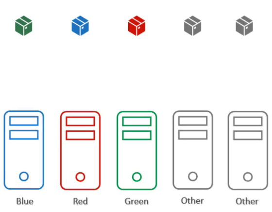
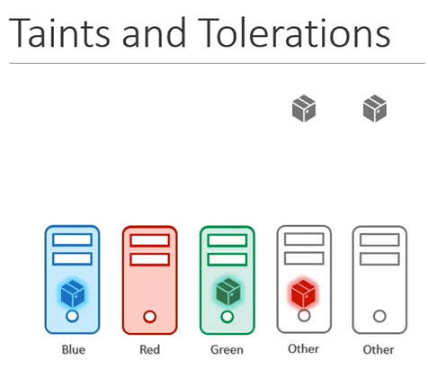
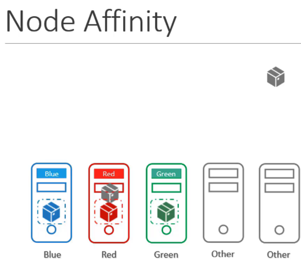
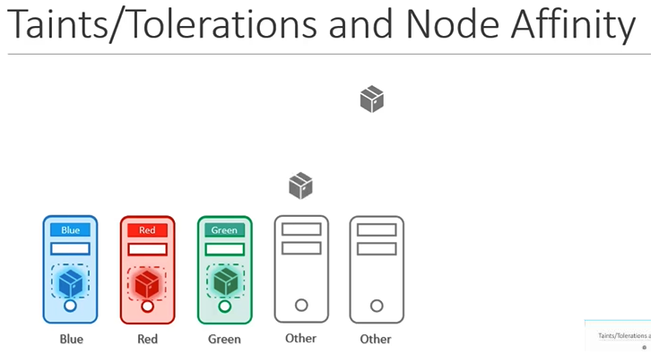

# 테인트, 톨러레이션 및 노드 친화성을 이용한 스케줄링

쿠버네티스 클러스터에서 다양한 팀이 공유하는 상황에서, 특정 노드에 특정 Pod만을 스케줄링하려면 어떻게 해야 할까요? 이를 위해 테인트와 톨러레이션, 노드 친화성을 활용할 수 있습니다.

## 문제 상황



- 3개의 노드(파란색, 빨간색, 초록색)와 3개의 Pod(파란색, 빨간색, 초록색)가 있습니다.
- 파란색 Pod는 파란색 노드에, 빨간색 Pod는 빨간색 노드에, 초록색 Pod는 초록색 노드에 배치하려고 합니다.
- 다른 Pod들이 우리의 노드에 배치되지 않도록 하고, 우리의 Pod들이 다른 팀의 노드에 배치되지 않도록 해야 합니다.

## 해결 방법

### taints와 tolerations 사용



1. **노드에 테인트 적용**: 각 노드에 색상에 맞는 테인트를 적용합니다.

   ```sh
   kubectl taint nodes node1 color=blue:NoSchedule
   kubectl taint nodes node2 color=red:NoSchedule
   kubectl taint nodes node3 color=green:NoSchedule
   ```

2. **Pod에 톨러레이션 추가**: 각 Pod 정의에 색상에 맞는 톨러레이션을 추가합니다.

   ```yaml
   tolerations:
     - key: "color"
       operator: "Equal"
       value: "blue"
       effect: "NoSchedule"
   ```

taints와 tolerations는 pod가 원하는 node에 scheduling 되는 것을 보장하지 않는다.

### node affinity 사용



1. **노드에 라벨 추가**: 각 노드에 색상에 맞는 라벨을 추가합니다.

   ```sh
   kubectl label nodes node1 color=blue
   kubectl label nodes node2 color=red
   kubectl label nodes node3 color=green
   ```

2. **Pod에 node affinity 추가**: 각 Pod 정의에 색상에 맞는 노드 친화성을 추가합니다.

   ```yaml
   affinity:
     nodeAffinity:
       requiredDuringSchedulingIgnoredDuringExecution:
         nodeSelectorTerms:
           - matchExpressions:
               - key: color
                 operator: In
                 values:
                   - blue
   ```

   node affinity는 다른 pod가 원하는 node만 배치되는 것을 보장하지 않는다.

## 결합된 접근 방식


최적의 결과를 위해 테인트와 톨러레이션을 사용하여 다른 Pod들이 우리 노드에 배치되지 않도록 하고, 노드 친화성을 사용하여 우리 Pod들이 올바른 노드에 배치되도록 합니다. 이 접근 방식을 통해 특정 Pod들을 특정 노드에 완벽하게 할당할 수 있습니다.

## K8s Reference Docs:

https://kubernetes.io/docs/concepts/scheduling-eviction/taint-and-toleration/
https://kubernetes.io/docs/tasks/configure-pod-container/assign-pods-nodes-using-node-affinity/
