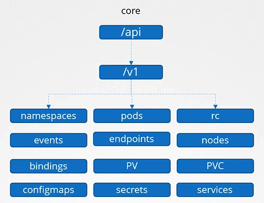
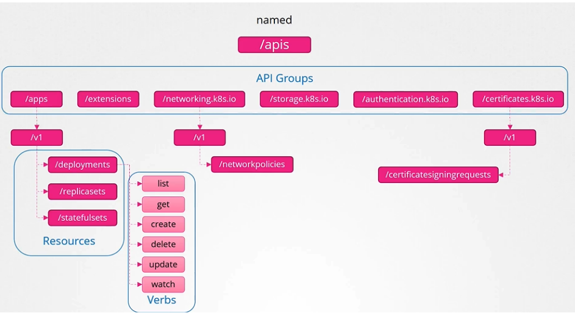
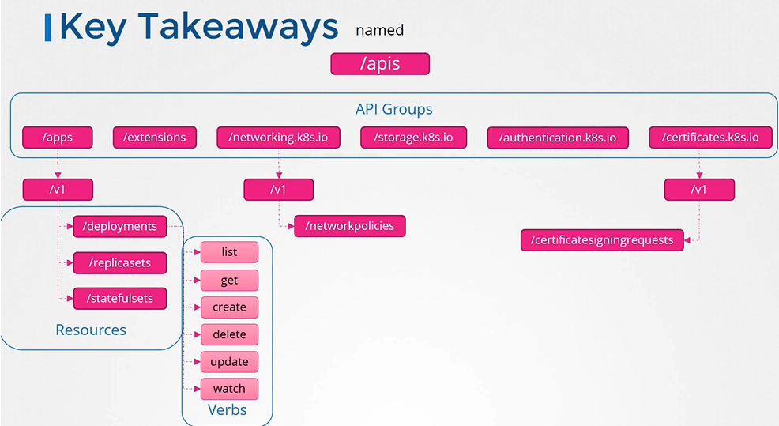

# 쿠버네티스 API 그룹 이해하기

쿠버네티스의 API 서버를 통해 클러스터와 상호작용할 때, 다양한 API 그룹을 사용합니다. 이들은 쿠버네티스 클러스터의 다양한 기능을 구분하여 관리하기 위해 존재합니다.

## API 그룹의 개요

- **Core Group**: 쿠버네티스의 핵심 기능을 담당하는 API 그룹입니다. 예를 들어, Pods, Services, Nodes 등이 여기에 속합니다.
  
- **Named Groups**: 보다 구조화된 방식으로 새로운 기능이 추가될 때 사용됩니다. 예를 들어, Apps, Networking, Storage 등의 그룹이 있습니다.
  

## API 그룹 사용하기

1. **API 그룹 확인**: 클러스터에 접속하여 사용 가능한 API 그룹을 확인합니다.

   ```bash
   curl https://<kube-apiserver-address>:6443
   ```

2. **인증서를 이용한 API 접근**: `kubectl proxy`를 사용하여 API 서버에 안전하게 접속합니다. 이는 kubeconfig 파일에 저장된 인증서를 사용합니다.

   ```bash
   kubectl proxy
   curl http://localhost:8001 -k
   ```

   이후 로컬 포트 8001을 통해 API에 접근할 수 있습니다.

3. **API 리소스 확인**: 각 API 그룹 내의 리소스를 확인합니다.
   ```bash
   kubectl api-resources
   ```

## 중요 포인트



- 각 API 그룹은 클러스터의 다양한 기능을 관리합니다.
- `kubectl`을 통해 API 서버와의 상호작용 시 kubeconfig 파일이 중요한 역할을 합니다.
- API 그룹을 통해 클러스터의 리소스를 효과적으로 관리하고, 필요한 인증을 처리할 수 있습니다.

## K8s Reference Docs

https://kubernetes.io/docs/concepts/overview/kubernetes-api/
https://kubernetes.io/docs/reference/using-api/api-concepts/
https://kubernetes.io/docs/tasks/extend-kubernetes/http-proxy-access-api/
