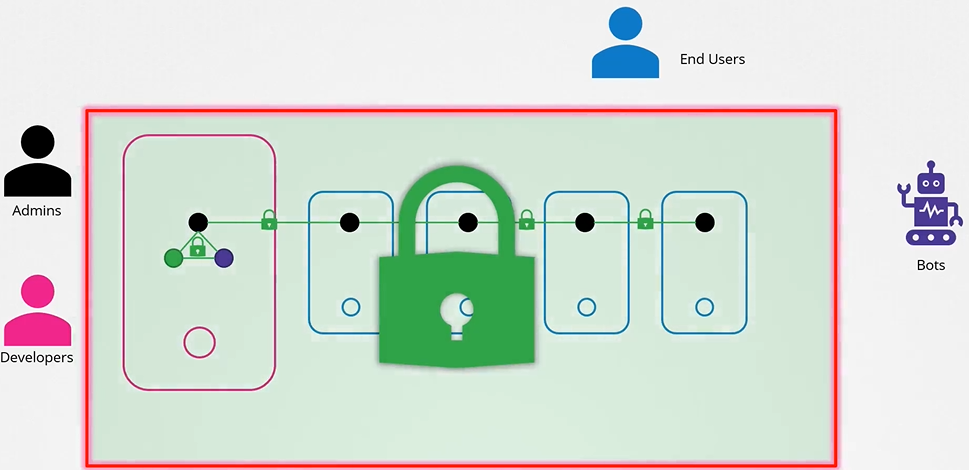
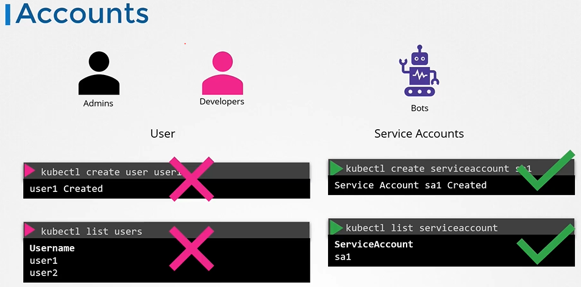
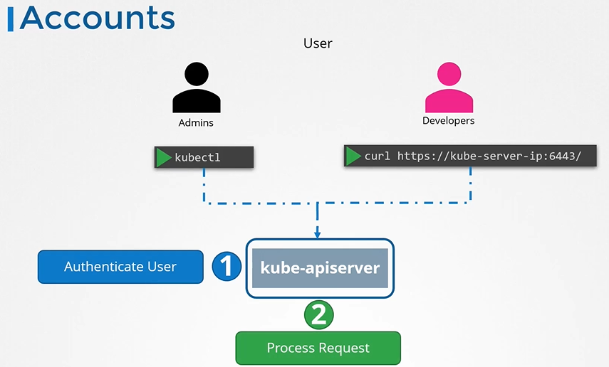
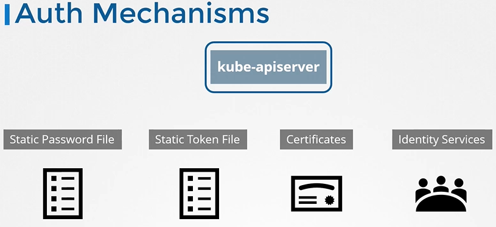

# 쿠버네티스 클러스터 인증



쿠버네티스 클러스터는 다양한 노드와 컴포넌트로 구성되며, 이러한 환경에서 보안은 매우 중요합니다. 인증은 클러스터에 접근할 수 있는 사용자를 식별하는 과정입니다.

## 사용자 유형



- **인간 사용자**: 관리자와 개발자 같은 사람들.
- **로봇 사용자**: 다른 프로세스나 서비스, 애플리케이션 등.

## 인증 메커니즘


쿠버네티스는 다음과 같은 다양한 인증 메커니즘을 지원합니다

- 정적 파일을 사용한 사용자명과 비밀번호
- 정적 토큰 파일
- 인증서를 사용한 인증
- LDAP, Kerberos와 같은 제3의 인증 서비스

### 정적 비밀번호 및 토큰 파일

가장 간단한 인증 방법으로, 사용자명, 비밀번호 또는 토큰을 포함한 CSV 파일을 사용합니다.

#### 사용자 생성 예시

```
# CSV 파일 포맷: password,username,userid,group
"mypassword","myuser","1234","mygroup"
```

이 파일을 Kube API 서버에 전달하면, 해당 사용자로 클러스터에 접근할 수 있습니다.

#### API 서버에 파일 전달

Kube API 서버 시작 옵션에 파일 경로를 지정합니다. 예를 들어, `--basic-auth-file=userdetails.csv` 옵션을 사용할 수 있습니다.

### CURL을 사용한 API 접근 예시

```bash
curl -v -k -u "myuser:mypassword" https://<api-server-address>/api/v1/nodes
```

### 정적 토큰 파일 사용

비밀번호 대신 토큰을 사용할 수도 있습니다. 토큰을 사용하여 API에 요청을 인증하는 방법은 다음과 같습니다.

```bash
curl -v -k -H "Authorization: Bearer <your-token>" https://<api-server-address>/api/v1/nodes
```

## 주의사항

정적 파일에 사용자명, 비밀번호, 토큰을 저장하는 방식은 보안에 취약하므로 권장되지 않습니다. 이 방법은 인증 기본 개념을 이해하는 데는 유용하지만, 실제 프로덕션 환경에서는 더 안전한 인증 방법을 사용해야 합니다.

## K8s Reference Docs

https://kubernetes.io/docs/reference/access-authn-authz/authentication/

## 쿠버네티스에서 기본 인증 설정하기 (1.19 버전부터 사용 중단)

:::details 쿠버네티스에서 기본 인증 설정하기 (1.19 버전부터 사용 중단)

#### 개요

이 가이드는 학습 목적으로만 사용되며, 프로덕션 환경에서는 권장되지 않습니다. 기본 인증은 쿠버네티스 1.19 버전에서 사용 중단되었고, 그 이후 버전에서는 제거되었습니다.
<br/><br/>

#### 사용자 파일 생성

사용자 상세 정보를 포함한 파일을 로컬에 `/tmp/users/user-details.csv` 위치에 생성합니다.

```
# 사용자 파일 내용
password123,user1,u0001
password123,user2,u0002
password123,user3,u0003
password123,user4,u0004
password123,user5,u0005
```

<br/>

#### kube-apiserver 설정 수정

1. kubeadm에 의해 구성된 kube-apiserver 정적 파드를 수정하여 사용자 상세 정보를 전달합니다. 파일 위치는 `/etc/kubernetes/manifests/kube-apiserver.yaml` 입니다.

```yaml
apiVersion: v1
kind: Pod
metadata:
  name: kube-apiserver
  namespace: kube-system
spec:
  containers:
  - command:
    - kube-apiserver
    <content-hidden>
    image: k8s.gcr.io/kube-apiserver-amd64:v1.11.3
    name: kube-apiserver
    volumeMounts:
    - mountPath: /tmp/users
      name: usr-details
      readOnly: true
  volumes:
  - hostPath:
      path: /tmp/users
      type: DirectoryOrCreate
    name: usr-details
```

2. kube-apiserver 시작 옵션에 기본 인증 파일을 포함합니다.

```yaml
apiVersion: v1
kind: Pod
metadata:
  creationTimestamp: null
  name: kube-apiserver
  namespace: kube-system
spec:
  containers:
  - command:
    - kube-apiserver
    - --authorization-mode=Node,RBAC
    <content-hidden>
    - --basic-auth-file=/tmp/users/user-details.csv
```

<br/>

#### 필요한 역할 및 역할 바인딩 생성

```yaml
kind: Role
apiVersion: rbac.authorization.k8s.io/v1
metadata:
  namespace: default
  name: pod-reader
rules:
  - apiGroups: [""]
    resources: ["pods"]
    verbs: ["get", "watch", "list"]

---
kind: RoleBinding
apiVersion: rbac.authorization.k8s.io/v1
metadata:
  name: read-pods
  namespace: default
subjects:
  - kind: User
    name: user1
    apiGroup: rbac.authorization.k8s.io
roleRef:
  kind: Role
  name: pod-reader
  apiGroup: rbac.authorization.k8s.io
```

이 설정을 완료한 후, 사용자 자격 증명을 사용하여 kube-api 서버에 인증할 수 있습니다.

```bash
curl -v -k https://localhost:6443/api/v1/pods -u "user1:password123"
```

<br/>

#### 주의사항

이 인증 방법은 사용자명, 비밀번호, 토큰을 평문으로 저장하기 때문에 보안에 취약합니다. 따라서 실제 프로덕션 환경에서는 사용하지 않아야 합니다.
:::
